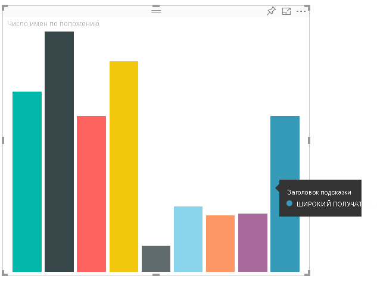
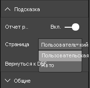

# <a name="tooltips-in-power-bi-visuals"></a><span data-ttu-id="49f67-103">Подсказки в визуальных элементах Power BI</span><span class="sxs-lookup"><span data-stu-id="49f67-103">Tooltips in Power BI visuals</span></span>

<span data-ttu-id="49f67-104">Теперь в визуальных элементах можно использовать поддержку подсказок Power BI.</span><span class="sxs-lookup"><span data-stu-id="49f67-104">Visuals can now make use of Power BI tooltip support.</span></span> <span data-ttu-id="49f67-105">Подсказки Power BI поддерживают следующие взаимодействия:</span><span class="sxs-lookup"><span data-stu-id="49f67-105">Power BI tooltips handle the following interactions:</span></span>

* <span data-ttu-id="49f67-106">Отображение подсказки.</span><span class="sxs-lookup"><span data-stu-id="49f67-106">Show a tooltip.</span></span>
* <span data-ttu-id="49f67-107">Скрытие подсказки.</span><span class="sxs-lookup"><span data-stu-id="49f67-107">Hide a tooltip.</span></span>
* <span data-ttu-id="49f67-108">Перемещение подсказки.</span><span class="sxs-lookup"><span data-stu-id="49f67-108">Move a tooltip.</span></span>

<span data-ttu-id="49f67-109">Подсказки могут отображать текстовый элемент с заголовком, значением с заданным цветом и непрозрачностью по указанному набору координат.</span><span class="sxs-lookup"><span data-stu-id="49f67-109">Tooltips can display a textual element with a title, a value in a given color, and opacity at a specified set of coordinates.</span></span> <span data-ttu-id="49f67-110">Эти данные предоставляются для API, и узел Power BI отрисовывает их так же, как и подсказки для собственных визуальных элементов.</span><span class="sxs-lookup"><span data-stu-id="49f67-110">This data is provided to the API, and the Power BI host renders it the same way it renders tooltips for native visuals.</span></span>

<span data-ttu-id="49f67-111">На следующем рисунке показана подсказка на образце линейчатой диаграммы:</span><span class="sxs-lookup"><span data-stu-id="49f67-111">A tooltip in a sample bar chart is shown in the following image:</span></span>



<span data-ttu-id="49f67-113">Приведенная выше подсказка демонстрирует категорию отдельной полосы и значение.</span><span class="sxs-lookup"><span data-stu-id="49f67-113">The preceding tooltip image illustrates a single bar category and value.</span></span> <span data-ttu-id="49f67-114">Подсказка может быть расширена и отображать несколько значений.</span><span class="sxs-lookup"><span data-stu-id="49f67-114">You can extend a single tooltip to display multiple values.</span></span>

## <a name="manage-tooltips"></a><span data-ttu-id="49f67-115">Управление подсказками</span><span class="sxs-lookup"><span data-stu-id="49f67-115">Manage tooltips</span></span>

<span data-ttu-id="49f67-116">Для управления подсказками служит интерфейс ITooltipService.</span><span class="sxs-lookup"><span data-stu-id="49f67-116">The interface through which you manage tooltips is the "ITooltipService."</span></span> <span data-ttu-id="49f67-117">Он используется для уведомления узла о том, что необходимо отобразить, удалить или переместить подсказку.</span><span class="sxs-lookup"><span data-stu-id="49f67-117">It's used to notify the host that a tooltip needs to be displayed, removed, or moved.</span></span>

```typescript
    interface ITooltipService {
        enabled(): boolean;
        show(options: TooltipShowOptions): void;
        move(options: TooltipMoveOptions): void;
        hide(options: TooltipHideOptions): void;
    }
```

<span data-ttu-id="49f67-118">Вашему визуальному элементу необходимо прослушивать события мыши внутри себя и по мере необходимости вызвать делегаты `show()`, `move()` и `hide()` с соответствующим содержимым, заполненным в объекты `Tooltip****Options`.</span><span class="sxs-lookup"><span data-stu-id="49f67-118">Your visual needs to listen to the mouse events within your visual and call the `show()`, `move()`, and `hide()` delegates, as needed, with the appropriate content populated in the `Tooltip****Options` objects.</span></span>
<span data-ttu-id="49f67-119">`TooltipShowOptions` и `TooltipHideOptions`, в свою очередь, определяют, что нужно отображать и что делать при таких событиях.</span><span class="sxs-lookup"><span data-stu-id="49f67-119">`TooltipShowOptions` and `TooltipHideOptions` would in turn define what to display and how to behave in these events.</span></span>

<span data-ttu-id="49f67-120">Так как вызов этих методов будет включать в себя пользовательские события, такие как перемещение мыши или касание, рекомендуется создать прослушиватели для таких событий, которые, в свою очередь, будут вызывать члены `TooltipService`.</span><span class="sxs-lookup"><span data-stu-id="49f67-120">Because calling these methods involves user events such as mouse moves and touch events, it's a good idea to create listeners for these events, which would in turn invoke the `TooltipService` members.</span></span>
<span data-ttu-id="49f67-121">Наш пример агрегируется в классе `TooltipServiceWrapper`.</span><span class="sxs-lookup"><span data-stu-id="49f67-121">Our sample aggregates in a class called `TooltipServiceWrapper`.</span></span>

### <a name="the-tooltipservicewrapper-class"></a><span data-ttu-id="49f67-122">Класс TooltipServiceWrapper</span><span class="sxs-lookup"><span data-stu-id="49f67-122">The TooltipServiceWrapper class</span></span>

<span data-ttu-id="49f67-123">Основное назначение этого класса заключается в том, чтобы разместить экземпляр `TooltipService`, прослушивать события мыши D3 для соответствующих элементов, а затем выполнять вызовы элементов `show()` и `hide()` по мере необходимости.</span><span class="sxs-lookup"><span data-stu-id="49f67-123">The basic idea behind this class is to hold the instance of the `TooltipService`, listen to D3 mouse events over relevant elements, and then make the calls to `show()` and `hide()` the elements when needed.</span></span>

<span data-ttu-id="49f67-124">Этот класс хранит и контролирует все соответствующие состояния и логику для этих событий, в основном нацеленных на взаимодействие с базовым кодом D3.</span><span class="sxs-lookup"><span data-stu-id="49f67-124">The class holds and manages any relevant state and logic for these events, which are mostly geared at interfacing with the underlying D3 code.</span></span> <span data-ttu-id="49f67-125">Взаимодействие и преобразование D3 выходит за рамки этой статьи.</span><span class="sxs-lookup"><span data-stu-id="49f67-125">The D3 interfacing and conversion is out of scope for this article.</span></span>

<span data-ttu-id="49f67-126">Полный пример кода см. в [репозитории визуальных элементов SampleBarChart](https://github.com/Microsoft/PowerBI-visuals-sampleBarChart/commit/981b021612d7b333adffe9f723ab27783c76fb14).</span><span class="sxs-lookup"><span data-stu-id="49f67-126">You can find the full sample code in [SampleBarChart visual repository](https://github.com/Microsoft/PowerBI-visuals-sampleBarChart/commit/981b021612d7b333adffe9f723ab27783c76fb14).</span></span>

### <a name="create-tooltipservicewrapper"></a><span data-ttu-id="49f67-127">Создание класса TooltipServiceWrapper</span><span class="sxs-lookup"><span data-stu-id="49f67-127">Create TooltipServiceWrapper</span></span>

<span data-ttu-id="49f67-128">Конструктор линейчатой диаграммы теперь имеет член `TooltipServiceWrapper`, экземпляр которого создается в конструкторе с экземпляром `tooltipService` узла.</span><span class="sxs-lookup"><span data-stu-id="49f67-128">The bar chart constructor now has a `TooltipServiceWrapper` member, which is instantiated in the constructor with the host `tooltipService` instance.</span></span>

```typescript
        private tooltipServiceWrapper: ITooltipServiceWrapper;

        this.tooltipServiceWrapper = createTooltipServiceWrapper(this.host.tooltipService, options.element);
```

<span data-ttu-id="49f67-129">Класс `TooltipServiceWrapper` содержит экземпляр `tooltipService`, а также корневой элемент D3 параметров визуального элемента и сенсорного управления.</span><span class="sxs-lookup"><span data-stu-id="49f67-129">The `TooltipServiceWrapper` class holds the `tooltipService` instance, also as the root D3 element of the visual and touch parameters.</span></span>

```typescript
    class TooltipServiceWrapper implements ITooltipServiceWrapper {
        private handleTouchTimeoutId: number;
        private visualHostTooltipService: ITooltipService;
        private rootElement: Element;
        private handleTouchDelay: number;

        constructor(tooltipService: ITooltipService, rootElement: Element, handleTouchDelay: number) {
            this.visualHostTooltipService = tooltipService;
            this.handleTouchDelay = handleTouchDelay;
            this.rootElement = rootElement;
        }
        .
        .
        .
    }
```

<span data-ttu-id="49f67-130">Единственной точкой входа для регистрации прослушивателей событий для этого класса является метод `addTooltip`.</span><span class="sxs-lookup"><span data-stu-id="49f67-130">The single entry point for this class to register event listeners is the `addTooltip` method.</span></span>

### <a name="the-addtooltip-method"></a><span data-ttu-id="49f67-131">Метод addTooltip</span><span class="sxs-lookup"><span data-stu-id="49f67-131">The addTooltip method</span></span>

```typescript
        public addTooltip<T>(
            selection: d3.Selection<Element>,
            getTooltipInfoDelegate: (args: TooltipEventArgs<T>) => VisualTooltipDataItem[],
            getDataPointIdentity: (args: TooltipEventArgs<T>) => ISelectionId,
            reloadTooltipDataOnMouseMove?: boolean): void {

            if (!selection || !this.visualHostTooltipService.enabled()) {
                return;
            }
        ...
        ...
        }
```

* <span data-ttu-id="49f67-132">**selection: d3.Selection<Element>**: Элементы d3, по которым обрабатываются подсказки.</span><span class="sxs-lookup"><span data-stu-id="49f67-132">**selection: d3.Selection<Element>**: The d3 elements over which tooltips are handled.</span></span>

* <span data-ttu-id="49f67-133">**getTooltipInfoDelegate: (args: TooltipEventArgs<T>) => VisualTooltipDataItem[]**: Делегат для заполнения содержимого подсказки (отображаемых данных) в соответствии с контекстом.</span><span class="sxs-lookup"><span data-stu-id="49f67-133">**getTooltipInfoDelegate: (args: TooltipEventArgs<T>) => VisualTooltipDataItem[]**: The delegate for populating the tooltip content (what to display) per context.</span></span>

* <span data-ttu-id="49f67-134">**getDataPointIdentity: (args: TooltipEventArgs<T>) => ISelectionId**: Делегат для получения идентификатора точки данных (в этом примере не используется).</span><span class="sxs-lookup"><span data-stu-id="49f67-134">**getDataPointIdentity: (args: TooltipEventArgs<T>) => ISelectionId**: The delegate for retrieving the data point ID (unused in this sample).</span></span> 

* <span data-ttu-id="49f67-135">**reloadTooltipDataOnMouseMove? boolean**: Логическое значение, указывающее, следует ли обновлять данные подсказки во время события MouseMove (в этом примере не используется).</span><span class="sxs-lookup"><span data-stu-id="49f67-135">**reloadTooltipDataOnMouseMove? boolean**: A Boolean that indicates whether to refresh the tooltip data during a MouseMove event (unused in this sample).</span></span>

<span data-ttu-id="49f67-136">Как видите, `addTooltip` завершает работу без действий, если `tooltipService` отключен или нет фактического выбора.</span><span class="sxs-lookup"><span data-stu-id="49f67-136">As you can see, `addTooltip` exits with no action if the `tooltipService` is disabled or there's no real selection.</span></span>

### <a name="call-the-show-method-to-display-a-tooltip"></a><span data-ttu-id="49f67-137">Вызов метода show для отображения подсказки</span><span class="sxs-lookup"><span data-stu-id="49f67-137">Call the show method to display a tooltip</span></span>

<span data-ttu-id="49f67-138">Далее метод `addTooltip` прослушивает событие D3 `mouseover`, как показано в следующем коде:</span><span class="sxs-lookup"><span data-stu-id="49f67-138">The `addTooltip` method next listens to the D3 `mouseover` event, as shown in the following code:</span></span>

```typescript
        ...
        ...
        selection.on("mouseover.tooltip", () => {
            // Ignore mouseover while handling touch events
            if (!this.canDisplayTooltip(d3.event))
                return;

            let tooltipEventArgs = this.makeTooltipEventArgs<T>(rootNode, true, false);
            if (!tooltipEventArgs)
                return;

            let tooltipInfo = getTooltipInfoDelegate(tooltipEventArgs);
            if (tooltipInfo == null)
                return;

            let selectionId = getDataPointIdentity(tooltipEventArgs);

            this.visualHostTooltipService.show({
                coordinates: tooltipEventArgs.coordinates,
                isTouchEvent: false,
                dataItems: tooltipInfo,
                identities: selectionId ? [selectionId] : [],
            });
        });
```

* <span data-ttu-id="49f67-139">**makeTooltipEventArgs**: Извлекает контекст из выбранных элементов D3 в tooltipEventArgs.</span><span class="sxs-lookup"><span data-stu-id="49f67-139">**makeTooltipEventArgs**: Extracts the context from the D3 selected elements into a tooltipEventArgs.</span></span> <span data-ttu-id="49f67-140">Также он вычисляет координаты.</span><span class="sxs-lookup"><span data-stu-id="49f67-140">It calculates the coordinates as well.</span></span>

* <span data-ttu-id="49f67-141">**getTooltipInfoDelegate**: Формирует содержимое подсказки из tooltipEventArgs.</span><span class="sxs-lookup"><span data-stu-id="49f67-141">**getTooltipInfoDelegate**: It then builds the tooltip content from the tooltipEventArgs.</span></span> <span data-ttu-id="49f67-142">Это обратный вызов в класс BarChart, так как он является логикой визуального элемента.</span><span class="sxs-lookup"><span data-stu-id="49f67-142">It's a callback to the BarChart class, because it is the visual's logic.</span></span> <span data-ttu-id="49f67-143">Это реальное текстовое содержимое, отображаемое в подсказке.</span><span class="sxs-lookup"><span data-stu-id="49f67-143">It's the actual text content to display in the tooltip.</span></span>

* <span data-ttu-id="49f67-144">**getDataPointIdentity**: Не используется в этом примере.</span><span class="sxs-lookup"><span data-stu-id="49f67-144">**getDataPointIdentity**: Unused in this sample.</span></span>

* <span data-ttu-id="49f67-145">**this.visualHostTooltipService.show**: Вызов для отображения подсказки.</span><span class="sxs-lookup"><span data-stu-id="49f67-145">**this.visualHostTooltipService.show**: The call to display the tooltip.</span></span>  

<span data-ttu-id="49f67-146">Дополнительные сведения об обработке см. в примере для событий `mouseout` и `mousemove`.</span><span class="sxs-lookup"><span data-stu-id="49f67-146">Additional handling can be found in the sample for `mouseout` and `mousemove` events.</span></span>

<span data-ttu-id="49f67-147">Дополнительные сведения см. в [репозитории визуальных элементов SampleBarChart](https://github.com/Microsoft/PowerBI-visuals-sampleBarChart/commit/981b021612d7b333adffe9f723ab27783c76fb14).</span><span class="sxs-lookup"><span data-stu-id="49f67-147">For more information, see the [SampleBarChart visual repository](https://github.com/Microsoft/PowerBI-visuals-sampleBarChart/commit/981b021612d7b333adffe9f723ab27783c76fb14).</span></span>

### <a name="populate-the-tooltip-content-by-the-gettooltipdata-method"></a><span data-ttu-id="49f67-148">Заполнение содержимого подсказки с помощью метода getTooltipData</span><span class="sxs-lookup"><span data-stu-id="49f67-148">Populate the tooltip content by the getTooltipData method</span></span>

<span data-ttu-id="49f67-149">Был добавлен класс BarChart с членом `getTooltipData`, который просто извлекает `category`, `value` и `color` точки данных в элемент VisualTooltipDataItem[].</span><span class="sxs-lookup"><span data-stu-id="49f67-149">The BarChart class was added with a `getTooltipData` member, which simply extracts the `category`, `value`, and `color` of the data point into a VisualTooltipDataItem[] element.</span></span>

```typescript
        private static getTooltipData(value: any): VisualTooltipDataItem[] {
            return [{
                displayName: value.category,
                value: value.value.toString(),
                color: value.color,
                header: 'ToolTip Title'
            }];
        }
```

<span data-ttu-id="49f67-150">В приведенной выше реализации член `header` является константой, но может использоваться и для более сложных реализаций, требующих динамические значения.</span><span class="sxs-lookup"><span data-stu-id="49f67-150">In the preceding implementation, the `header` member is constant, but you can use it for more complex implementations, which require dynamic values.</span></span> <span data-ttu-id="49f67-151">Можно заполнить `VisualTooltipDataItem[]` сразу несколькими элементами, что приведет к добавлению нескольких строк в подсказку.</span><span class="sxs-lookup"><span data-stu-id="49f67-151">You can populate the `VisualTooltipDataItem[]` with more than one element, which adds multiple lines to the tooltip.</span></span> <span data-ttu-id="49f67-152">Это может пригодиться для таких визуальных элементов, как линейчатые диаграммы с накоплением, в которых подсказка может отображать данные из более чем одной точки данных.</span><span class="sxs-lookup"><span data-stu-id="49f67-152">It can be useful in visuals such as stacked bar charts where the tooltip may display data from more than a single data point.</span></span>

### <a name="call-the-addtooltip-method"></a><span data-ttu-id="49f67-153">Вызов метода addTooltip</span><span class="sxs-lookup"><span data-stu-id="49f67-153">Call the addTooltip method</span></span>

<span data-ttu-id="49f67-154">Завершающим этапом является вызов метода `addTooltip`, когда фактические данные могут измениться.</span><span class="sxs-lookup"><span data-stu-id="49f67-154">The final step is to call the `addTooltip` method when the actual data might change.</span></span> <span data-ttu-id="49f67-155">Этот вызов выполняется в методе `BarChart.update()`.</span><span class="sxs-lookup"><span data-stu-id="49f67-155">This call takes place in the `BarChart.update()` method.</span></span> <span data-ttu-id="49f67-156">Выполняется вызов для отслеживания выбора всех элементов "bar" с передачей только `BarChart.getTooltipData()`, как было указано выше.</span><span class="sxs-lookup"><span data-stu-id="49f67-156">A call is made to monitor the selection of all the 'bar' elements, passing only the `BarChart.getTooltipData()`, as mentioned previously.</span></span>

```typescript
        this.tooltipServiceWrapper.addTooltip(this.barContainer.selectAll('.bar'),
            (tooltipEvent: TooltipEventArgs<number>) => BarChart.getTooltipData(tooltipEvent.data),
            (tooltipEvent: TooltipEventArgs<number>) => null);
```

## <a name="add-report-page-tooltips"></a><span data-ttu-id="49f67-157">Добавление подсказок на страницу отчета</span><span class="sxs-lookup"><span data-stu-id="49f67-157">Add report page tooltips</span></span>

<span data-ttu-id="49f67-158">Чтобы добавить поддержку подсказок для страницы отчета, большинство изменений необходимо внести в файл *capabilities.json*.</span><span class="sxs-lookup"><span data-stu-id="49f67-158">To add report page tooltips support, you'll find most changes in the *capabilities.json* file.</span></span>

<span data-ttu-id="49f67-159">Пример схемы:</span><span class="sxs-lookup"><span data-stu-id="49f67-159">A sample schema is</span></span>

```json
{
    "tooltips": {
        "supportedTypes": {
            "default": true,
            "canvas": true
        },
        "roles": [
            "tooltips"
        ]
    }
}
```

<span data-ttu-id="49f67-160">Подсказки на страницах отчета можно определять в панели **Формат**.</span><span class="sxs-lookup"><span data-stu-id="49f67-160">You can define report page tooltips in the **Format** pane.</span></span>



* <span data-ttu-id="49f67-162">`supportedTypes` — это конфигурация подсказок, поддерживаемая визуальным элементом и отраженная в ячейке поля.</span><span class="sxs-lookup"><span data-stu-id="49f67-162">`supportedTypes`: The tooltip configuration that's supported by the visual and reflected in the fields well.</span></span> 
   * <span data-ttu-id="49f67-163">`default` — указывает, поддерживается ли автоматическая привязка подсказок с помощью поля данных.</span><span class="sxs-lookup"><span data-stu-id="49f67-163">`default`: Specifies whether the "automatic" tooltips binding via the data field is supported.</span></span> 
   * <span data-ttu-id="49f67-164">`canvas` — указывает, поддерживаются ли подсказки для страницы отчета.</span><span class="sxs-lookup"><span data-stu-id="49f67-164">`canvas`: Specifies whether the report page tooltips are supported.</span></span>

* <span data-ttu-id="49f67-165">`roles` — (необязательно) после определения указывает, какие роли данных привязаны к выбранному параметру подсказки в ячейке полей.</span><span class="sxs-lookup"><span data-stu-id="49f67-165">`roles`: (Optional) After it's defined, it instructs what data roles are bound to the selected tooltip option in the fields well.</span></span>

<span data-ttu-id="49f67-166">Дополнительные сведения см. в статье [Рекомендации по использованию всплывающих подсказок на странице отчета](https://powerbi.microsoft.com/blog/power-bi-desktop-march-2018-feature-summary/#tooltips).</span><span class="sxs-lookup"><span data-stu-id="49f67-166">For more information, see [Report page tooltips usage guidelines](https://powerbi.microsoft.com/blog/power-bi-desktop-march-2018-feature-summary/#tooltips).</span></span>

<span data-ttu-id="49f67-167">Чтобы отобразить подсказку на странице отчета после того, как узел Power BI вызывает `ITooltipService.Show(options: TooltipShowOptions)` или `ITooltipService.Move(options: TooltipMoveOptions)`, используется selectionId (свойство `identities` предшествующего аргумента `options`).</span><span class="sxs-lookup"><span data-stu-id="49f67-167">To display the report page tooltip, after the Power BI host calls `ITooltipService.Show(options: TooltipShowOptions)` or `ITooltipService.Move(options: TooltipMoveOptions)`, it consumes the selectionId (`identities` property of the preceding `options` argument).</span></span> <span data-ttu-id="49f67-168">SelectionId должно представлять выбранные данные (категорию, ряды и т. д.) элемента, на который наведен указатель мыши, получаемые подсказкой.</span><span class="sxs-lookup"><span data-stu-id="49f67-168">To be retrieved by the tooltip, SelectionId should represent the selected data (category, series, and so on) of the item you hovered over.</span></span>

<span data-ttu-id="49f67-169">Пример отправки selectionId в вызовы для отображения подсказки показан в следующем коде:</span><span class="sxs-lookup"><span data-stu-id="49f67-169">An example of sending the selectionId to tooltip display calls is shown in the following code:</span></span>

```typescript
    this.tooltipServiceWrapper.addTooltip(this.barContainer.selectAll('.bar'),
        (tooltipEvent: TooltipEventArgs<number>) => BarChart.getTooltipData(tooltipEvent.data),
        (tooltipEvent: TooltipEventArgs<number>) => tooltipEvent.data.selectionID);
```
