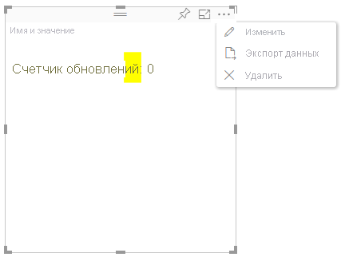

# Режим расширенного редактирования для визуальных элементов Power BIAdvanced edit mode in Power BI visuals

Если вы хотите использовать расширенные элементы управления пользовательского интерфейса для визуального элемента Power BI, примените режим расширенного редактирования.If you require advanced UI controls in your Power BI visual, you can take advantage of advanced edit mode. В режиме редактирования отчета нажмите кнопку **Изменить**, чтобы перейти в режим редактирования **Расширенный**.When you're in report editing mode, you select an **Edit** button to set the edit mode to **Advanced**. Визуальный элемент может использовать флаг `EditMode`, чтобы определить, нужно ли отображать такой элемент управления пользовательского интерфейса.The visual can use the `EditMode` flag to determine whether it should display this UI control.

По умолчанию визуальный элемент не поддерживает режим расширенного редактирования.By default, the visual doesn't support advanced edit mode. Если требуется другое поведение, вы можете явно задать его в файле *capabilities.json* визуального элемента с помощью свойства `advancedEditModeSupport`.If a different behavior is required, you can explicitly state this in the visual's *capabilities.json* file by setting the `advancedEditModeSupport` property.

Возможные значения:The possible values are:

- `0` — NotSupported`0` - NotSupported

- `1` — SupportedNoAction`1` - SupportedNoAction

- `2` — SupportedInFocus`2` - SupportedInFocus

## Вход в режим расширенного редактированияEnter advanced edit mode

Кнопка **Изменить** отображается в следующих случаях:An **Edit** button is displayed if:

* Свойству `advancedEditModeSupport` в файле *capabilities.json* присвоено значение `SupportedNoAction` или `SupportedInFocus`.The `advancedEditModeSupport` property is set in the *capabilities.json* file to either `SupportedNoAction` or `SupportedInFocus`.

* Визуальный элемент открыт в режиме редактирования отчета.The visual is viewed in report editing mode.

Если свойство `advancedEditModeSupport` в файле *capabilities.json* отсутствует или имеет значение `NotSupported`, кнопка **Изменить** не отображается.If `advancedEditModeSupport` property is missing from the *capabilities.json* file or set to `NotSupported`, the **Edit** button is not displayed.

Если нажать кнопку **Изменить**, визуальный элемент получает вызов update(), в котором элементу EditMode присвоено значение `Advanced`.When you select **Edit**, the visual gets an update() call with EditMode set to `Advanced`. В зависимости от заданного в файле *capabilities.json* значения выполняются следующие действия:Depending on the value that's set in the *capabilities.json* file, the following actions occur:

* `SupportedNoAction` — не требуется никаких дальнейших действий со стороны узла.`SupportedNoAction`: No further action is required by the host.
* `SupportedInFocus` — узел развертывает визуальный элемент в режим фокусировки.`SupportedInFocus`: The host pops out the visual into in focus mode.

## Выход из режима расширенного редактированияExit advanced edit mode

Кнопка **Назад к отчету** отображается в следующих случаях:The **Back to report** button is displayed if:

* Свойству `advancedEditModeSupport` в файле *capabilities.json* присвоено значение `SupportedInFocus`.The `advancedEditModeSupport` property is set in the *capabilities.json* file to `SupportedInFocus`.
