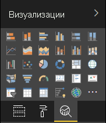

# <a name="the-analytics-pane-in-power-bi-visuals"></a><span data-ttu-id="152f8-103">Панель аналитики в визуальных элементах Power BI</span><span class="sxs-lookup"><span data-stu-id="152f8-103">The Analytics pane in Power BI visuals</span></span>

<span data-ttu-id="152f8-104">**Панель аналитики** была представлена для [собственных визуальных элементов](https://docs.microsoft.com/power-bi/desktop-analytics-pane) в ноябре 2018 г.</span><span class="sxs-lookup"><span data-stu-id="152f8-104">The **Analytics** pane was introduced for [native visuals](https://docs.microsoft.com/power-bi/desktop-analytics-pane) in November 2018.</span></span>
<span data-ttu-id="152f8-105">В этой статье описывается, каким образом пользовательские визуальные элементы с API версии 2.5.0 могут предоставлять свои свойства и управлять ими на **панели аналитики**.</span><span class="sxs-lookup"><span data-stu-id="152f8-105">This article discusses how Power BI visuals with API v2.5.0 can present and manage their properties in the **Analytics** pane.</span></span>



## <a name="manage-the-analytics-pane"></a><span data-ttu-id="152f8-107">Управление панелью "Аналитика"</span><span class="sxs-lookup"><span data-stu-id="152f8-107">Manage the Analytics pane</span></span>

<span data-ttu-id="152f8-108">Как и в случае со свойствами в [панели **Формат**](https://docs.microsoft.com/power-bi/developer/visuals/custom-visual-develop-tutorial-format-options), для управления панелью **Аналитика** необходимо определить объект в файле *capabilities.json* визуального элемента.</span><span class="sxs-lookup"><span data-stu-id="152f8-108">Just as you'd manage properties in the [**Format** pane](https://docs.microsoft.com/power-bi/developer/visuals/custom-visual-develop-tutorial-format-options), you manage the **Analytics** pane by defining an object in the visual's *capabilities.json* file.</span></span>

<span data-ttu-id="152f8-109">Отличия в случае с панелью **Аналитика** заключаются в следующем:</span><span class="sxs-lookup"><span data-stu-id="152f8-109">For the **Analytics** pane, the differences are as follows:</span></span>

* <span data-ttu-id="152f8-110">В определении объекта необходимо добавить поле **objectCategory** со значением 2.</span><span class="sxs-lookup"><span data-stu-id="152f8-110">Under the object's definition, you add an **objectCategory** field with a value of 2.</span></span>

    > [!NOTE]
    > <span data-ttu-id="152f8-111">Необязательное поле `objectCategory` было представлено в API версии 2.5.0.</span><span class="sxs-lookup"><span data-stu-id="152f8-111">The optional `objectCategory` field was introduced in API 2.5.0.</span></span> <span data-ttu-id="152f8-112">Оно определяет аспект визуального элемента, контролируемый объектом (1 — "Formatting" (Форматирование), 2 — "Analytics" (Аналитика)).</span><span class="sxs-lookup"><span data-stu-id="152f8-112">It defines the aspect of the visual that the object controls (1 = Formatting, 2 = Analytics).</span></span> <span data-ttu-id="152f8-113">Значение `Formatting` используется для элементов оформления, цветов, осей и меток.</span><span class="sxs-lookup"><span data-stu-id="152f8-113">`Formatting` is used for such elements as look and feel, colors, axes, and labels.</span></span> <span data-ttu-id="152f8-114">Значение `Analytics` используется для прогнозов, линий трендов, строк ссылок, фигур и т. д.</span><span class="sxs-lookup"><span data-stu-id="152f8-114">`Analytics` is used for such elements as forecasts, trendlines, reference lines, and shapes.</span></span>
    >
    > <span data-ttu-id="152f8-115">Если значение не указано, поле `objectCategory` по умолчанию будет иметь значение "Formatting".</span><span class="sxs-lookup"><span data-stu-id="152f8-115">If the value isn't specified, `objectCategory` defaults to "Formatting."</span></span>

* <span data-ttu-id="152f8-116">Объект должен иметь следующие два свойства:</span><span class="sxs-lookup"><span data-stu-id="152f8-116">The object must have the following two properties:</span></span>
    * <span data-ttu-id="152f8-117">Свойство `show` типа `bool` со значением по умолчанию `false`.</span><span class="sxs-lookup"><span data-stu-id="152f8-117">`show` of type `bool`, with a default value of `false`.</span></span>
    * <span data-ttu-id="152f8-118">Свойство `displayName` типа `text`.</span><span class="sxs-lookup"><span data-stu-id="152f8-118">`displayName` of type `text`.</span></span> <span data-ttu-id="152f8-119">Выбранное вами значение по умолчанию станет начальным отображаемым именем экземпляра.</span><span class="sxs-lookup"><span data-stu-id="152f8-119">The default value that you choose becomes the instance's initial display name.</span></span>

```json
{
  "objects": {
    "YourAnalyticsPropertiesCard": {
      "displayName": "Your analytics properties card's name",
      "objectCategory": 2,
      "properties": {
        "show": {
          "type": {
            "bool": true
          }
        },
        "displayName": {
          "type": {
            "text": true
          }
        },
      ... //any other properties for your Analytics card
      }
    }
  ...
  }
}
```

<span data-ttu-id="152f8-120">Другие свойства можно определить так же, как и для объектов **Формат**.</span><span class="sxs-lookup"><span data-stu-id="152f8-120">You can define other properties in the same way that you do for **Format** objects.</span></span> <span data-ttu-id="152f8-121">Кроме того, вы можете перечислять объекты так же, как и в панели **Формат**.</span><span class="sxs-lookup"><span data-stu-id="152f8-121">And you can enumerate objects just as you do in the **Format** pane.</span></span>

## <a name="known-limitations-and-issues-of-the-analytics-pane"></a><span data-ttu-id="152f8-122">Известные ограничения и проблемы, связанные с панелью аналитики</span><span class="sxs-lookup"><span data-stu-id="152f8-122">Known limitations and issues of the Analytics pane</span></span>

* <span data-ttu-id="152f8-123">В панели **Аналитика** по-прежнему не реализована поддержка нескольких экземпляров.</span><span class="sxs-lookup"><span data-stu-id="152f8-123">The **Analytics** pane has no multi-instance support yet.</span></span> <span data-ttu-id="152f8-124">Объекты не могут иметь [selector](https://microsoft.github.io/PowerBI-visuals/docs/concepts/objects-and-properties/#selector), отличный от static (то есть "selector": null), а визуальные элементы Power BI не могут иметь определенные пользователем множественные экземпляры карты.</span><span class="sxs-lookup"><span data-stu-id="152f8-124">Objects can't have a [selector](https://microsoft.github.io/PowerBI-visuals/docs/concepts/objects-and-properties/#selector) other than static (that is, "selector": null), and Power BI visuals can't have user-defined multiple instances of a card.</span></span>
* <span data-ttu-id="152f8-125">Свойства типа `integer` отображаются неправильно.</span><span class="sxs-lookup"><span data-stu-id="152f8-125">Properties of type `integer` aren't displayed correctly.</span></span> <span data-ttu-id="152f8-126">Чтобы обойти эту проблему, используйте тип `numeric`.</span><span class="sxs-lookup"><span data-stu-id="152f8-126">As a workaround, use type `numeric` instead.</span></span>

> [!NOTE]
> * <span data-ttu-id="152f8-127">Используйте панель **Аналитика** только для объектов, которые добавляют новые сведения или раскрывают новые аспекты представленной информации (например, динамические строки ссылок, которые иллюстрируют важные тренды).</span><span class="sxs-lookup"><span data-stu-id="152f8-127">Use the **Analytics** pane only for objects that add new information or shed new light on the presented information (for example, dynamic reference lines that illustrate important trends).</span></span>
> * <span data-ttu-id="152f8-128">Все параметры, определяющие внешний вид визуального элемента, например форматирование, должны находиться на панели **Форматирование**.</span><span class="sxs-lookup"><span data-stu-id="152f8-128">Any options that control the look and feel of the visual (that is, formatting) should be limited to the **Formatting** pane.</span></span>
