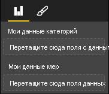

# <a name="capabilities-and-properties-of-power-bi-visuals"></a><span data-ttu-id="3a857-103">Возможности и свойства визуальных элементов Power BI</span><span class="sxs-lookup"><span data-stu-id="3a857-103">Capabilities and properties of Power BI visuals</span></span> 

<span data-ttu-id="3a857-104">Возможности предоставляют узлу сведения о визуальном элементе.</span><span class="sxs-lookup"><span data-stu-id="3a857-104">You use capabilities to provide information to the host about your visual.</span></span> <span data-ttu-id="3a857-105">Все свойства в модели возможностей являются `optional`.</span><span class="sxs-lookup"><span data-stu-id="3a857-105">All properties on the capabilities model are `optional`.</span></span>

<span data-ttu-id="3a857-106">Корневыми объектами возможностей визуального элемента являются `dataRoles`, `dataViewMappings` и т. д.</span><span class="sxs-lookup"><span data-stu-id="3a857-106">The root objects of a visual's capabilities are `dataRoles`, `dataViewMappings`, and so on.</span></span>

```json
{
    "dataRoles": [ ... ],
    "dataViewMappings": [ ... ],
    "objects":  { ... },
    "supportsHighlight": true|false,
    "advancedEditModeSupport": 0|1|2,
    "sorting": { ... }
}

```

## <a name="define-the-data-fields-that-your-visual-expects-dataroles"></a><span data-ttu-id="3a857-107">Определение полей данных, ожидаемых вашими визуальными элементами, — dataRoles</span><span class="sxs-lookup"><span data-stu-id="3a857-107">Define the data fields that your visual expects: dataRoles</span></span>

<span data-ttu-id="3a857-108">Чтобы определить поля, которые можно привязать к данным, используйте `dataRoles`.</span><span class="sxs-lookup"><span data-stu-id="3a857-108">To define fields that can be bound to data, you use `dataRoles`.</span></span> <span data-ttu-id="3a857-109">`dataRoles` принимает массив объектов `DataViewRole`, который определяет все обязательные свойства.</span><span class="sxs-lookup"><span data-stu-id="3a857-109">`dataRoles` takes an array of `DataViewRole` objects, which defines all the required properties.</span></span>

### <a name="properties"></a><span data-ttu-id="3a857-110">Свойства</span><span class="sxs-lookup"><span data-stu-id="3a857-110">Properties</span></span>

* <span data-ttu-id="3a857-111">**name** — внутреннее имя этого поля данных (должно быть уникальным).</span><span class="sxs-lookup"><span data-stu-id="3a857-111">**name**: The internal name of this data field (must be unique).</span></span>
* <span data-ttu-id="3a857-112">**kind** — тип поля:</span><span class="sxs-lookup"><span data-stu-id="3a857-112">**kind**: The kind of field:</span></span>
    * <span data-ttu-id="3a857-113">`Grouping` — дискретные значения, используемые для группировки полей мер.</span><span class="sxs-lookup"><span data-stu-id="3a857-113">`Grouping`: Discrete values that are used to group measure fields.</span></span>
    * <span data-ttu-id="3a857-114">`Measure` — числовые значения данных.</span><span class="sxs-lookup"><span data-stu-id="3a857-114">`Measure`: Numeric data values.</span></span>
    * <span data-ttu-id="3a857-115">`GroupingOrMeasure` — значения, которые могут использоваться как группирование или как мера.</span><span class="sxs-lookup"><span data-stu-id="3a857-115">`GroupingOrMeasure`: Values that can be used as either a grouping or a measure.</span></span>
* <span data-ttu-id="3a857-116">**displayName** — имя, отображаемое пользователю на панели **свойств**.</span><span class="sxs-lookup"><span data-stu-id="3a857-116">**displayName**: The name displayed to the user in the **Properties** pane.</span></span>
* <span data-ttu-id="3a857-117">**description** — краткое описание поля (необязательно).</span><span class="sxs-lookup"><span data-stu-id="3a857-117">**description**: A short description of the field (optional).</span></span>
* <span data-ttu-id="3a857-118">**requiredTypes** — требуемый тип данных для этой роли данных.</span><span class="sxs-lookup"><span data-stu-id="3a857-118">**requiredTypes**: The required type of data for this data role.</span></span> <span data-ttu-id="3a857-119">Несоответствующим значениям присваивается значение null (необязательно).</span><span class="sxs-lookup"><span data-stu-id="3a857-119">Values that don't match are set to null (optional).</span></span>
* <span data-ttu-id="3a857-120">**preferredTypes** — предпочтительный тип данных для этой роли данных (необязательно).</span><span class="sxs-lookup"><span data-stu-id="3a857-120">**preferredTypes**: The preferred type of data for this data role (optional).</span></span>

### <a name="valid-data-types-in-requiredtypes-and-preferredtypes"></a><span data-ttu-id="3a857-121">Допустимые типы данных для requiredTypes и preferredTypes</span><span class="sxs-lookup"><span data-stu-id="3a857-121">Valid data types in requiredTypes and preferredTypes</span></span>

* <span data-ttu-id="3a857-122">**bool** — логическое значение.</span><span class="sxs-lookup"><span data-stu-id="3a857-122">**bool**: A boolean value</span></span>
* <span data-ttu-id="3a857-123">**integer** — целочисленное значение (целое число).</span><span class="sxs-lookup"><span data-stu-id="3a857-123">**integer**: An integer (whole number) value</span></span>
* <span data-ttu-id="3a857-124">**numeric** — числовое значение.</span><span class="sxs-lookup"><span data-stu-id="3a857-124">**numeric**: A numeric value</span></span>
* <span data-ttu-id="3a857-125">**text** — текстовое значение.</span><span class="sxs-lookup"><span data-stu-id="3a857-125">**text**: A text value</span></span>
* <span data-ttu-id="3a857-126">**geography** — географические данные.</span><span class="sxs-lookup"><span data-stu-id="3a857-126">**geography**: A geographic data</span></span>

### <a name="example"></a><span data-ttu-id="3a857-127">Пример</span><span class="sxs-lookup"><span data-stu-id="3a857-127">Example</span></span>

```json
"dataRoles": [
    {
        "displayName": "My Category Data",
        "name": "myCategory",
        "kind": "Grouping",
        "requiredTypes": [
            {
                "text": true
            },
            {
                "numeric": true
            },
            {
                "integer": true
            }
        ],
        "preferredTypes": [
            {
                "text": true
            }
        ]
    },
    {
        "displayName": "My Measure Data",
        "name": "myMeasure",
        "kind": "Measure",
        "requiredTypes": [
            {
                "integer": true
            },
            {
                "numeric": true
            }
        ],
        "preferredTypes": [
            {
                "integer": true
            }
        ]
    },
    {
        "displayNameKey": "Visual_Location",
        "name": "Locations",
        "kind": "Measure",
        "displayName": "Locations",
        "requiredTypes": [
            {
                "geography": {
                    "address": true
                }
            },
            {
                "geography": {
                    "city": true
                }
            },
            {
                "geography": {
                    "continent": true
                }
            },
            {
                "geography": {
                    "country": true
                }
            },
            {
                "geography": {
                    "county": true
                }
            },
            {
                "geography": {
                    "place": true
                }
            },
            {
                "geography": {
                    "postalCode": true
                }
            },
            {
                "geography": {
                    "region": true
                }
            },
            {
                "geography": {
                    "stateOrProvince": true
                }
            }
        ]
    }
]
```

<span data-ttu-id="3a857-128">Приведенные выше роли данных используются для создания полей, которые показаны на следующем рисунке:</span><span class="sxs-lookup"><span data-stu-id="3a857-128">The preceding data roles would create the fields that are displayed in the following image:</span></span>



## <a name="define-how-you-want-the-data-mapped-dataviewmappings"></a><span data-ttu-id="3a857-130">Определение сопоставления данных — dataViewMappings</span><span class="sxs-lookup"><span data-stu-id="3a857-130">Define how you want the data mapped: dataViewMappings</span></span>

<span data-ttu-id="3a857-131">Свойство DataViewMapping описывает связь между ролями данных и позволяет указать для них условные требования.</span><span class="sxs-lookup"><span data-stu-id="3a857-131">A DataViewMappings property describes how the data roles relate to each other and allows you to specify conditional requirements for the them.</span></span>

<span data-ttu-id="3a857-132">Большинство визуальных элементов предоставляют одиночное сопоставление, но вы можете указать несколько DataViewMappings.</span><span class="sxs-lookup"><span data-stu-id="3a857-132">Most visuals provide a single mapping, but you can provide multiple dataViewMappings.</span></span> <span data-ttu-id="3a857-133">Каждое допустимое сопоставление создает представление данных.</span><span class="sxs-lookup"><span data-stu-id="3a857-133">Each valid mapping produces a data view.</span></span> 

```json
"dataViewMappings": [
    {
        "conditions": [ ... ],
        "categorical": { ... },
        "table": { ... },
        "single": { ... },
        "matrix": { ... }
    }
]
```

<span data-ttu-id="3a857-134">Дополнительные сведения см. в статье [Общие сведения о сопоставлениях представлений данных в визуальных элементах Power BI](dataview-mappings.md).</span><span class="sxs-lookup"><span data-stu-id="3a857-134">For more information, see [Understand data view mapping in Power BI visuals](dataview-mappings.md).</span></span>

## <a name="define-property-pane-options-objects"></a><span data-ttu-id="3a857-135">Определение параметров панели свойств — objects</span><span class="sxs-lookup"><span data-stu-id="3a857-135">Define property pane options: objects</span></span>

<span data-ttu-id="3a857-136">Объекты описывают настраиваемые свойства, связанные с визуальным элементом.</span><span class="sxs-lookup"><span data-stu-id="3a857-136">Objects describe customizable properties that are associated with the visual.</span></span> <span data-ttu-id="3a857-137">Каждый объект может иметь несколько свойств, и с каждым свойством сопоставлен тип.</span><span class="sxs-lookup"><span data-stu-id="3a857-137">Each object can have multiple properties, and each property has a type that's associated with it.</span></span> <span data-ttu-id="3a857-138">Типы указывают, что будет представлять собой свойство.</span><span class="sxs-lookup"><span data-stu-id="3a857-138">Types refer to what the property will be.</span></span> 

```json
"objects": {
    "myCustomObject": {
        "displayName": "My Object Name",
        "properties": { ... }
    }
}
```

<span data-ttu-id="3a857-139">Дополнительные сведения см. в статье [Объекты и свойства в визуальных элементах Power BI](objects-properties.md).</span><span class="sxs-lookup"><span data-stu-id="3a857-139">For more information, see [Objects and properties of Power BI visuals](objects-properties.md).</span></span>

## <a name="handle-partial-highlighting-supportshighlight"></a><span data-ttu-id="3a857-140">Использование частичного выделения — supportsHighlight</span><span class="sxs-lookup"><span data-stu-id="3a857-140">Handle partial highlighting: supportsHighlight</span></span>

<span data-ttu-id="3a857-141">По умолчанию этому параметру присваивается значение `false`, которое задает автоматическую фильтрацию значений при выборе любого элемента на странице.</span><span class="sxs-lookup"><span data-stu-id="3a857-141">By default, this value is set to `false`, which means that your values are automatically filtered when something on the page is selected.</span></span> <span data-ttu-id="3a857-142">В свою очередь, в результате автоматической фильтрации в визуальном элементе отображается только выбранное значение.</span><span class="sxs-lookup"><span data-stu-id="3a857-142">This automatic filtering in turn updates your visual to display only the selected value.</span></span> <span data-ttu-id="3a857-143">Если вы хотите отобразить полные данные и выделить только выбранные элементы, нужно задать значение `supportsHighlight` для `true` в файле *capabilities.json*.</span><span class="sxs-lookup"><span data-stu-id="3a857-143">If you want to display the full data but highlight only the selected items, you need to set `supportsHighlight` to `true` in your *capabilities.json* file.</span></span>

<span data-ttu-id="3a857-144">Дополнительные сведения см. в статье [Выделение точек данных в визуальных элементах Power BI](highlight.md).</span><span class="sxs-lookup"><span data-stu-id="3a857-144">For more information, see [Highlight data points in Power BI visuals](highlight.md).</span></span>

## <a name="handle-advanced-edit-mode-advancededitmodesupport"></a><span data-ttu-id="3a857-145">Поддержка режима расширенного редактирования — advancedEditModeSupport</span><span class="sxs-lookup"><span data-stu-id="3a857-145">Handle advanced edit mode: advancedEditModeSupport</span></span>

<span data-ttu-id="3a857-146">Визуальный элемент может объявить поддержку режима расширенного редактирования.</span><span class="sxs-lookup"><span data-stu-id="3a857-146">A visual can declare its support of advanced edit mode.</span></span> <span data-ttu-id="3a857-147">По умолчанию визуальный элемент не поддерживает режим расширенного редактирования, если иное не указано в файле *capabilities.json*.</span><span class="sxs-lookup"><span data-stu-id="3a857-147">By default, a visual doesn't support advanced edit mode, unless stated otherwise in the *capabilities.json* file.</span></span>

<span data-ttu-id="3a857-148">Дополнительные сведения см. в статье [Режим расширенного редактирования для визуальных элементов Power BI](advanced-edit-mode.md).</span><span class="sxs-lookup"><span data-stu-id="3a857-148">For more information, see [Advanced edit mode in Power BI visuals](advanced-edit-mode.md).</span></span>

## <a name="data-sorting-options-for-visual-sorting"></a><span data-ttu-id="3a857-149">Параметры сортировки данных для визуального элемента — sorting</span><span class="sxs-lookup"><span data-stu-id="3a857-149">Data sorting options for visual: sorting</span></span>

<span data-ttu-id="3a857-150">Визуальный элемент может определить свое поведение сортировки с помощью возможностей.</span><span class="sxs-lookup"><span data-stu-id="3a857-150">A visual can define its sorting behavior via its capabilities.</span></span> <span data-ttu-id="3a857-151">По умолчанию визуальный элемент не поддерживает изменение порядка сортировки, если иное не указано в файле *capabilities.json*.</span><span class="sxs-lookup"><span data-stu-id="3a857-151">By default, a visual doesn't support modifying its sorting order, unless stated otherwise in the *capabilities.json* file.</span></span>

<span data-ttu-id="3a857-152">Дополнительные сведения см. в статье [Параметры сортировки для визуальных элементов Power BI](sort-options.md).</span><span class="sxs-lookup"><span data-stu-id="3a857-152">For more information, see [Sorting options for Power BI visuals](sort-options.md).</span></span>
