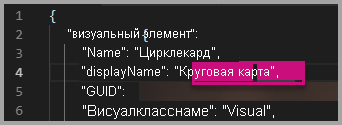

# <a name="tutorial-adding-formatting-options-to-a-power-bi-visual"></a><span data-ttu-id="6b6cb-103">Учебник. Добавление параметров форматирования в Power BI визуальный элемент</span><span class="sxs-lookup"><span data-stu-id="6b6cb-103">Tutorial: Adding formatting options to a Power BI visual</span></span>

<span data-ttu-id="6b6cb-104">В этом руководстве описывается добавление типичных свойств в визуальные элементы.</span><span class="sxs-lookup"><span data-stu-id="6b6cb-104">In this tutorial, we go through how to add common properties to the visual.</span></span>

<span data-ttu-id="6b6cb-105">Из этого руководства вы узнаете, как выполнять следующие задачи:</span><span class="sxs-lookup"><span data-stu-id="6b6cb-105">In this tutorial, you learn how to:</span></span>
> [!div class="checklist"]
> * <span data-ttu-id="6b6cb-106">Добавление свойств визуальных элементов.</span><span class="sxs-lookup"><span data-stu-id="6b6cb-106">Add visual properties.</span></span>
> * <span data-ttu-id="6b6cb-107">Упаковка визуальных элементов.</span><span class="sxs-lookup"><span data-stu-id="6b6cb-107">Package the visual.</span></span>
> * <span data-ttu-id="6b6cb-108">Импорт пользовательских визуальных элементов в отчет Power BI Desktop.</span><span class="sxs-lookup"><span data-stu-id="6b6cb-108">Import the custom visual to a Power BI Desktop report.</span></span>

## <a name="adding-formatting-options"></a><span data-ttu-id="6b6cb-109">Добавление параметров форматирования</span><span class="sxs-lookup"><span data-stu-id="6b6cb-109">Adding formatting options</span></span>

1. <span data-ttu-id="6b6cb-110">В **Power BI** выберите вкладку **Формат**.</span><span class="sxs-lookup"><span data-stu-id="6b6cb-110">In **Power BI**, select the **Format page**.</span></span>

    <span data-ttu-id="6b6cb-111">Вы увидите сообщение *Параметры форматирования недоступны для этого визуального элемента*.</span><span class="sxs-lookup"><span data-stu-id="6b6cb-111">You should see a message that reads - *Formatting options are unavailable for this visual.*</span></span>

    

2. <span data-ttu-id="6b6cb-113">В **Visual Studio Code** откройте файл *capabilities.json*.</span><span class="sxs-lookup"><span data-stu-id="6b6cb-113">In **Visual Studio Code**, open the *capabilities.json* file.</span></span>

3. <span data-ttu-id="6b6cb-114">Перед массивом **dataViewMappings** добавьте объект **objects** (после строки 8).</span><span class="sxs-lookup"><span data-stu-id="6b6cb-114">Before the **dataViewMappings** array, add **objects** (after line 8).</span></span>

    ```json
    "objects": {},
    ```

    

4. <span data-ttu-id="6b6cb-116">Сохраните файл **capabilities.json**.</span><span class="sxs-lookup"><span data-stu-id="6b6cb-116">Save the **capabilities.json** file.</span></span>

5. <span data-ttu-id="6b6cb-117">Еще раз просмотрите параметры форматирования в **Power BI**.</span><span class="sxs-lookup"><span data-stu-id="6b6cb-117">In **Power BI**, review the formatting options again.</span></span>

    > [!Note]
    > <span data-ttu-id="6b6cb-118">Если параметры форматирования не изменились, **перезагрузите пользовательский визуальный элемент**.</span><span class="sxs-lookup"><span data-stu-id="6b6cb-118">If you do not see the formatting options change then select **Reload Custom Visual**.</span></span>

    

6. <span data-ttu-id="6b6cb-120">Установите для параметра **Заголовок** значение *Откл.*</span><span class="sxs-lookup"><span data-stu-id="6b6cb-120">Set the **Title** option to *Off*.</span></span> <span data-ttu-id="6b6cb-121">Обратите внимание, что в левом верхнем углу визуального элемента перестало отображаться имя меры.</span><span class="sxs-lookup"><span data-stu-id="6b6cb-121">Notice that the visual no longer displays the measure name at the top-left corner.</span></span>

    

    

### <a name="adding-custom-formatting-options"></a><span data-ttu-id="6b6cb-124">Добавление пользовательских параметров форматирования</span><span class="sxs-lookup"><span data-stu-id="6b6cb-124">Adding custom formatting options</span></span>

<span data-ttu-id="6b6cb-125">Вы можете добавить пользовательские свойства, позволяющие настроить цвет круга и ширину границы.</span><span class="sxs-lookup"><span data-stu-id="6b6cb-125">You can add custom properties to enable configuring the color of the circle, and also the border width.</span></span>

1. <span data-ttu-id="6b6cb-126">Остановите пользовательский визуальный элемент в PowerShell.</span><span class="sxs-lookup"><span data-stu-id="6b6cb-126">In PowerShell, stop the custom visual.</span></span>

2. <span data-ttu-id="6b6cb-127">В Visual Studio Code в файле **capabilities.json** вставьте в объект **objects** следующий фрагмент кода JSON.</span><span class="sxs-lookup"><span data-stu-id="6b6cb-127">In Visual Studio Code, in the **capabilities.json** file, insert the following JSON fragment into the object labeled **objects**.</span></span>

    ```json
    "circle": {
     "displayName": "Circle",
     "properties": {
         "circleColor": {
             "displayName": "Color",
             "description": "The fill color of the circle.",
             "type": {
                 "fill": {
                     "solid": {
                         "color": true
                     }
                 }
             }
         },
         "circleThickness": {
             "displayName": "Thickness",
             "description": "The circle thickness.",
             "type": {
                 "numeric": true
                 }
             }
         }
     },
    ```

    <span data-ttu-id="6b6cb-128">Этот фрагмент JSON описывает группу с именем circle, которая состоит из двух параметров с именами circleColor и circleThickness.</span><span class="sxs-lookup"><span data-stu-id="6b6cb-128">The JSON fragment describes a group named circle, which consists of two options named circleColor and circleThickness.</span></span>

   

3. <span data-ttu-id="6b6cb-130">Сохраните файл **capabilities.json**.</span><span class="sxs-lookup"><span data-stu-id="6b6cb-130">Save the **capabilities.json** file.</span></span>

4. <span data-ttu-id="6b6cb-131">В **области обозревателя** в папке **src** выберите файл **settings.ts**.</span><span class="sxs-lookup"><span data-stu-id="6b6cb-131">In the **Explorer pane**, from inside the **src** folder, and then select **settings.ts**.</span></span> <span data-ttu-id="6b6cb-132">*Этот файл представляет параметры начального визуального элемента*.</span><span class="sxs-lookup"><span data-stu-id="6b6cb-132">*This file represents the settings for the starter visual*.</span></span>

5. <span data-ttu-id="6b6cb-133">В файле **settings.ts** замените два класса следующим кодом:</span><span class="sxs-lookup"><span data-stu-id="6b6cb-133">In the **settings.ts** file, replace the two classes with the following code.</span></span>

    ```typescript
    export class CircleSettings {
        public circleColor: string = "white";
        public circleThickness: number = 2;
    }
    export class VisualSettings extends DataViewObjectsParser {
        public circle: CircleSettings = new CircleSettings();
    }
    ```

    

    <span data-ttu-id="6b6cb-135">Этот модуль определяет два класса.</span><span class="sxs-lookup"><span data-stu-id="6b6cb-135">This module defines the two classes.</span></span> <span data-ttu-id="6b6cb-136">Класс **CircleSettings** определяет два свойства с именами, которые соответствуют объектам, определенным в файле **capabilities.json** (**circleColor** и **circleThickness**), а также задает значения по умолчанию.</span><span class="sxs-lookup"><span data-stu-id="6b6cb-136">The **CircleSettings** class defines two properties with names that match the objects defined in the **capabilities.json** file (**circleColor** and **circleThickness**) and also sets default values.</span></span> <span data-ttu-id="6b6cb-137">Класс **VisualSettings** наследует класс **DataViewObjectParser** и добавляет свойство с именем **circle**, соответствующее объекту, определенному в файле *capabilities.json*, и возвращает экземпляр **CircleSettings**.</span><span class="sxs-lookup"><span data-stu-id="6b6cb-137">The **VisualSettings** class inherits the **DataViewObjectParser** class and adds a property named **circle**, which matches the object defined in the *capabilities.json* file, and returns an instance of **CircleSettings**.</span></span>

6. <span data-ttu-id="6b6cb-138">Сохраните файл **settings.ts**.</span><span class="sxs-lookup"><span data-stu-id="6b6cb-138">Save the **settings.ts** file.</span></span>

7. <span data-ttu-id="6b6cb-139">Откройте файл **visual.ts**.</span><span class="sxs-lookup"><span data-stu-id="6b6cb-139">Open the **visual.ts** file.</span></span>

8. <span data-ttu-id="6b6cb-140">В файле **visual.ts** сделайте следующее.</span><span class="sxs-lookup"><span data-stu-id="6b6cb-140">In the **visual.ts** file,</span></span>

    <span data-ttu-id="6b6cb-141">Импортируйте класс `VisualSettings`.</span><span class="sxs-lookup"><span data-stu-id="6b6cb-141">import `VisualSettings` class</span></span>

    ```typescript
    import { VisualSettings } from "./settings";
    ```

    <span data-ttu-id="6b6cb-142">В класс **Visual** добавьте следующее свойство:</span><span class="sxs-lookup"><span data-stu-id="6b6cb-142">and in the **Visual** class add the following property:</span></span>

    ```typescript
    private visualSettings: VisualSettings;
    ```

    <span data-ttu-id="6b6cb-143">Это свойство содержит ссылку на объект **VisualSettings**, описывающий параметры визуального элемента.</span><span class="sxs-lookup"><span data-stu-id="6b6cb-143">This property stores a reference to the **VisualSettings** object, describing the visual settings.</span></span>

    

9. <span data-ttu-id="6b6cb-145">В классе **Visual** перед методом **update** добавьте следующий метод.</span><span class="sxs-lookup"><span data-stu-id="6b6cb-145">In the **Visual** class, add the following method before the **update** method.</span></span> <span data-ttu-id="6b6cb-146">Этот метод используется для заполнения параметров форматирования.</span><span class="sxs-lookup"><span data-stu-id="6b6cb-146">This method is used to populate the formatting options.</span></span>

    ```typescript
    public enumerateObjectInstances(options: EnumerateVisualObjectInstancesOptions): VisualObjectInstanceEnumeration {
        const settings: VisualSettings = this.visualSettings || <VisualSettings>VisualSettings.getDefault();
        return VisualSettings.enumerateObjectInstances(settings, options);
    }
    ```

    <span data-ttu-id="6b6cb-147">Этот метод используется для заполнения параметров форматирования.</span><span class="sxs-lookup"><span data-stu-id="6b6cb-147">This method is used to populate the formatting options.</span></span>

    

10. <span data-ttu-id="6b6cb-149">В методе **update** после объявления переменной **radius** добавьте следующий код:</span><span class="sxs-lookup"><span data-stu-id="6b6cb-149">In the **update** method, after the declaration of the **radius** variable, add the following code.</span></span>

    ```typescript
    this.visualSettings = VisualSettings.parse<VisualSettings>(dataView);

    this.visualSettings.circle.circleThickness = Math.max(0, this.visualSettings.circle.circleThickness);
    this.visualSettings.circle.circleThickness = Math.min(10, this.visualSettings.circle.circleThickness);
    ```

    <span data-ttu-id="6b6cb-150">Этот код извлекает параметры форматирования.</span><span class="sxs-lookup"><span data-stu-id="6b6cb-150">This code retrieves the format options.</span></span> <span data-ttu-id="6b6cb-151">Он корректирует любое значение, передаваемое в свойство **circleThickness**, преобразовывая его в 0, если оно отрицательное, или в 10, если оно больше 10.</span><span class="sxs-lookup"><span data-stu-id="6b6cb-151">It adjusts any value passed into the **circleThickness** property, converting it to 0 if negative, or 10 if it's a value greater than 10.</span></span>

    

11. <span data-ttu-id="6b6cb-153">Для элемента **circle** замените значение **стиля заливки** следующим выражением:</span><span class="sxs-lookup"><span data-stu-id="6b6cb-153">For the **circle element**, modify the value passed to the **fill style** to the following expression.</span></span>

    ```typescript
    this.visualSettings.circle.circleColor
    ```

    

12. <span data-ttu-id="6b6cb-155">Для элемента **circle** замените значение **стиля ширины штриха** следующим выражением:</span><span class="sxs-lookup"><span data-stu-id="6b6cb-155">For the **circle element**, modify the value passed to the **stroke-width style** to the following expression.</span></span>

    ```typescript
    this.visualSettings.circle.circleThickness
    ```

    

13. <span data-ttu-id="6b6cb-157">Сохраните файл visual.ts.</span><span class="sxs-lookup"><span data-stu-id="6b6cb-157">Save the visual.ts file.</span></span>

14. <span data-ttu-id="6b6cb-158">В PowerShell запустите визуальный элемент.</span><span class="sxs-lookup"><span data-stu-id="6b6cb-158">In PowerShell, start the visual.</span></span>

    ```powershell
    pbiviz start
    ```

15. <span data-ttu-id="6b6cb-159">В **Power BI** на панели инструментов над визуальным элементом выберите **Включить автоматическую перезагрузку**.</span><span class="sxs-lookup"><span data-stu-id="6b6cb-159">In **Power BI**, in the toolbar floating above the visual, select **Toggle Auto Reload**.</span></span>

16. <span data-ttu-id="6b6cb-160">В параметрах **форматирования визуального элемента** разверните элемент **Circle** (Круг).</span><span class="sxs-lookup"><span data-stu-id="6b6cb-160">In the **visual format** options, expand **Circle**.</span></span>

    

    <span data-ttu-id="6b6cb-162">Измените параметры **color** (цвет) и **thickness** (толщина).</span><span class="sxs-lookup"><span data-stu-id="6b6cb-162">Modify the **color** and **thickness** option.</span></span>

    <span data-ttu-id="6b6cb-163">Укажите для параметра **thickness** значение меньше нуля, а затем — больше 10.</span><span class="sxs-lookup"><span data-stu-id="6b6cb-163">Modify the **thickness** option to a value less than zero, and a value higher than 10.</span></span> <span data-ttu-id="6b6cb-164">Обратите внимание, что визуальный элемент корректирует значение до допустимого минимума или максимума.</span><span class="sxs-lookup"><span data-stu-id="6b6cb-164">Then notice the visual updates the value to a tolerable minimum or maximum.</span></span>

## <a name="packaging-the-custom-visual"></a><span data-ttu-id="6b6cb-165">Упаковка пользовательского визуального элемента</span><span class="sxs-lookup"><span data-stu-id="6b6cb-165">Packaging the custom visual</span></span>

<span data-ttu-id="6b6cb-166">Введите значения свойств для проекта пользовательского визуального элемента, обновите файл значка и упакуйте пользовательский визуальный элемент.</span><span class="sxs-lookup"><span data-stu-id="6b6cb-166">Enter property values for the custom visual project, update the icon file, and then package the custom visual.</span></span>

1. <span data-ttu-id="6b6cb-167">Остановите пользовательский визуальный элемент в **PowerShell**.</span><span class="sxs-lookup"><span data-stu-id="6b6cb-167">In **PowerShell**, stop the custom visual.</span></span>

2. <span data-ttu-id="6b6cb-168">Откройте файл **pbiviz.json** в **Visual Studio Code**.</span><span class="sxs-lookup"><span data-stu-id="6b6cb-168">Open the **pbiviz.json** file in **Visual Studio Code**.</span></span>

3. <span data-ttu-id="6b6cb-169">В объекте **visual** укажите для свойства **displayName** значение *Circle Card* (Карта круга).</span><span class="sxs-lookup"><span data-stu-id="6b6cb-169">In the **visual** object, modify the **displayName** property to *Circle Card*.</span></span>

    <span data-ttu-id="6b6cb-170">Это значение имени появляется, когда мы наводим указатель мыши на значок на панели **Визуализации**.</span><span class="sxs-lookup"><span data-stu-id="6b6cb-170">In the **Visualizations** pane, hovering over the icon reveals the display name.</span></span>

    

4. <span data-ttu-id="6b6cb-172">В свойство **description** добавьте следующий текст:</span><span class="sxs-lookup"><span data-stu-id="6b6cb-172">For the **description** property, enter the following text.</span></span>

    <span data-ttu-id="6b6cb-173">*Отображает отформатированное значение меры внутри круга*</span><span class="sxs-lookup"><span data-stu-id="6b6cb-173">*Displays a formatted measure value inside a circle*</span></span>

5. <span data-ttu-id="6b6cb-174">При желании добавьте в объект **author** сведения о себе.</span><span class="sxs-lookup"><span data-stu-id="6b6cb-174">Optionally, in the **author** object, enter your details.</span></span>

6. <span data-ttu-id="6b6cb-175">Сохраните файл **pbiviz.json**.</span><span class="sxs-lookup"><span data-stu-id="6b6cb-175">Save the **pbiviz.json** file.</span></span>

7. <span data-ttu-id="6b6cb-176">В объекте **assets** вы увидите, что документ определяет путь к значку.</span><span class="sxs-lookup"><span data-stu-id="6b6cb-176">In the **assets** object, notice that the document defines a path to an icon.</span></span> <span data-ttu-id="6b6cb-177">Изображение значка отображается в области **_Визуализации_** .</span><span class="sxs-lookup"><span data-stu-id="6b6cb-177">The icon is the image that appears in the **_Visualizations_** pane.</span></span> <span data-ttu-id="6b6cb-178">Оно должно иметь формат **PNG** и размер *20 на 20 пикселей*.</span><span class="sxs-lookup"><span data-stu-id="6b6cb-178">It must be a **PNG** file, *20 pixels by 20 pixels*.</span></span>

8. <span data-ttu-id="6b6cb-179">В проводнике Windows скопируйте файл icon.png и вставьте его вместо файла по умолчанию, размещенного в папке assets.</span><span class="sxs-lookup"><span data-stu-id="6b6cb-179">In Windows Explorer, copy the icon.png file, and then paste it to replace the default file located at assets folder.</span></span>

9. <span data-ttu-id="6b6cb-180">В Visual Studio Code в области обозревателя разверните папку assets и выберите файл icon.png.</span><span class="sxs-lookup"><span data-stu-id="6b6cb-180">In Visual Studio Code, in the Explorer pane, expand the assets folder, and then select the icon.png file.</span></span>

10. <span data-ttu-id="6b6cb-181">Просмотрите значок.</span><span class="sxs-lookup"><span data-stu-id="6b6cb-181">Review the icon.</span></span>

    

11. <span data-ttu-id="6b6cb-183">В Visual Studio Code убедитесь, что все файлы сохранены.</span><span class="sxs-lookup"><span data-stu-id="6b6cb-183">In Visual Studio Code, ensure that all files are saved.</span></span>

12. <span data-ttu-id="6b6cb-184">Чтобы упаковать пользовательский визуальный элемента, введите в PowerShell следующую команду:</span><span class="sxs-lookup"><span data-stu-id="6b6cb-184">To package the custom visual, in PowerShell, enter the following command.</span></span>

    ```powershell
    pbiviz package
    ```

    

<span data-ttu-id="6b6cb-186">Пакет будет размещен в папке проекта **dist**.</span><span class="sxs-lookup"><span data-stu-id="6b6cb-186">Now the package is output to the **dist** folder of the project.</span></span> <span data-ttu-id="6b6cb-187">Этот пакет содержит все необходимое для импорта пользовательского визуального элемента в службу Power BI или в отчет Power BI Desktop.</span><span class="sxs-lookup"><span data-stu-id="6b6cb-187">The package contains everything required to import the custom visual into either the Power BI service or a Power BI Desktop report.</span></span> <span data-ttu-id="6b6cb-188">Итак, вы упаковали пользовательский визуальный элемент и он теперь готов к использованию.</span><span class="sxs-lookup"><span data-stu-id="6b6cb-188">You have now packaged the custom visual, and it is now ready for use.</span></span>

## <a name="importing-the-custom-visual"></a><span data-ttu-id="6b6cb-189">Импорт пользовательского визуального элемента</span><span class="sxs-lookup"><span data-stu-id="6b6cb-189">Importing the custom visual</span></span>

<span data-ttu-id="6b6cb-190">Теперь откройте отчет Power BI Desktop и импортируйте пользовательский визуальный элемент Circle Card.</span><span class="sxs-lookup"><span data-stu-id="6b6cb-190">Now you can open the Power BI Desktop report, and import the Circle Card custom visual.</span></span>

1. <span data-ttu-id="6b6cb-191">Откройте **Power BI Desktop** и создайте новый отчет с помощью любого *примера набора данных*.</span><span class="sxs-lookup"><span data-stu-id="6b6cb-191">Open **Power BI Desktop**, create a new report with any *sample dataset*</span></span>

2. <span data-ttu-id="6b6cb-192">На панели **_Визуализации_** выберите **кнопку с многоточием** и щелкните **Импортировать из файла**.</span><span class="sxs-lookup"><span data-stu-id="6b6cb-192">In the **_Visualizations_** pane, select the **ellipsis**, and then select **Import** from File.</span></span>

    

3. <span data-ttu-id="6b6cb-194">В **окне импорта** выберите **Импортировать**.</span><span class="sxs-lookup"><span data-stu-id="6b6cb-194">In the **import window**, select **Import**.</span></span>

4. <span data-ttu-id="6b6cb-195">В окне "Открыть" перейдите к папке **dist** в каталоге проекта.</span><span class="sxs-lookup"><span data-stu-id="6b6cb-195">In the Open window, navigate to the **dist** folder in your project directory.</span></span>

5. <span data-ttu-id="6b6cb-196">Выберите файл **circleCard.pbiviz**, а затем — **Открыть**.</span><span class="sxs-lookup"><span data-stu-id="6b6cb-196">Select the **circleCard.pbiviz** file, and then select **Open**.</span></span>

6. <span data-ttu-id="6b6cb-197">Когда импорт визуального элемента успешно завершится, выберите **ОК**.</span><span class="sxs-lookup"><span data-stu-id="6b6cb-197">When the visual has successfully imported, select **OK**.</span></span>

7. <span data-ttu-id="6b6cb-198">Убедитесь, что визуальный элемент добавлен на панель **_Визуализации_** .</span><span class="sxs-lookup"><span data-stu-id="6b6cb-198">Verify that the visual has been added to the **_Visualizations_** pane.</span></span>

    

8. <span data-ttu-id="6b6cb-200">Наведите указатель мыши на значок **Circle Card** и убедитесь, что отображается всплывающая подсказка.</span><span class="sxs-lookup"><span data-stu-id="6b6cb-200">Hover over the **Circle Card** icon, and notice the tooltip that appears.</span></span>

## <a name="debugging"></a><span data-ttu-id="6b6cb-201">Отладка</span><span class="sxs-lookup"><span data-stu-id="6b6cb-201">Debugging</span></span>

<span data-ttu-id="6b6cb-202">Советы по отладке настраиваемого визуального элемента см. в [руководстве по отладке](https://microsoft.github.io/PowerBI-visuals/docs/how-to-guide/how-to-debug/).</span><span class="sxs-lookup"><span data-stu-id="6b6cb-202">For tips about debugging your custom visual, see the [debugging guide](https://microsoft.github.io/PowerBI-visuals/docs/how-to-guide/how-to-debug/).</span></span>

## <a name="next-steps"></a><span data-ttu-id="6b6cb-203">Дальнейшие действия</span><span class="sxs-lookup"><span data-stu-id="6b6cb-203">Next steps</span></span>

<span data-ttu-id="6b6cb-204">Вы можете сделать свои новые визуальные элементы доступными другим пользователям, отправив их в **AppSource**.</span><span class="sxs-lookup"><span data-stu-id="6b6cb-204">You can list your newly developed visual for others to use by submitting it to the **AppSource**.</span></span> <span data-ttu-id="6b6cb-205">Дополнительные сведения: [Публикация настраиваемых визуальных элементов в AppSource](../office-store.md).</span><span class="sxs-lookup"><span data-stu-id="6b6cb-205">For more information on this process reference [Publish custom visuals to AppSource](../office-store.md).</span></span>
