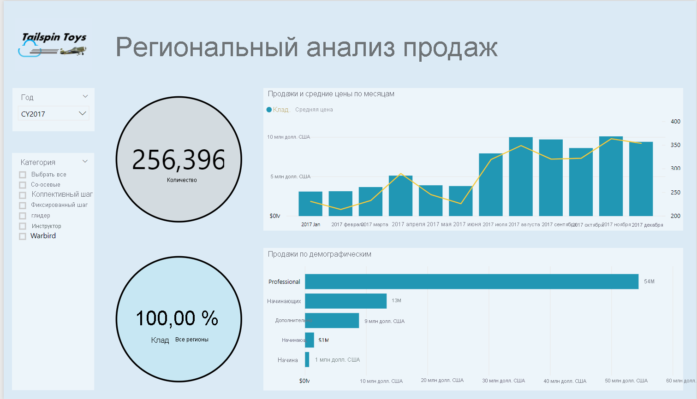
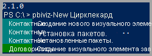
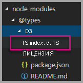
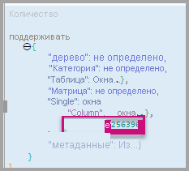
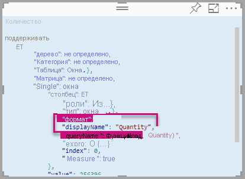

# <a name="tutorial-developing-a-power-bi-visual"></a><span data-ttu-id="7b44b-103">Руководство. Разработка визуального элемента Power BI</span><span class="sxs-lookup"><span data-stu-id="7b44b-103">Tutorial: Developing a Power BI visual</span></span>

<span data-ttu-id="7b44b-104">Мы предоставляем разработчикам возможность легко добавлять визуальные элементы Power BI в Power BI и использовать их для информационных панелей и отчетов.</span><span class="sxs-lookup"><span data-stu-id="7b44b-104">We’re enabling developers to easily add Power BI visuals into Power BI for use in dashboard and reports.</span></span> <span data-ttu-id="7b44b-105">Мы опубликовали код для всех визуальных элементов на GitHub, чтобы помочь вам приступить к работе.</span><span class="sxs-lookup"><span data-stu-id="7b44b-105">To help you get started, we’ve published the code for all of our visualizations to GitHub.</span></span>

<span data-ttu-id="7b44b-106">Кроме платформы визуализации мы предоставили набор тестов и инструменты, которые помогут участникам сообщества создавать высококачественные визуальные элементы Power BI.</span><span class="sxs-lookup"><span data-stu-id="7b44b-106">Along with the visualization framework, we’ve provided our test suite and tools to help the community build high-quality Power BI visuals for Power BI.</span></span>

<span data-ttu-id="7b44b-107">В этом руководстве показано, как разработать пользовательский визуальный элемент Power BI с именем Circle Card, который отображает форматированное значение внутри круга.</span><span class="sxs-lookup"><span data-stu-id="7b44b-107">This tutorial shows you how to develop a Power BI custom visual named Circle Card to display a formatted measure value inside a circle.</span></span> <span data-ttu-id="7b44b-108">Визуальный элемент Circle Card поддерживает настройку цвета заливки и толщины линии круга.</span><span class="sxs-lookup"><span data-stu-id="7b44b-108">The Circle Card visual supports customization of fill color and thickness of its outline.</span></span>

<span data-ttu-id="7b44b-109">В отчете Power BI Desktop карточки будут изменены на элементы Circle Card.</span><span class="sxs-lookup"><span data-stu-id="7b44b-109">In the Power BI Desktop report, the cards are modified to become Circle Cards.</span></span>

  

<span data-ttu-id="7b44b-111">Из этого руководства вы узнаете, как выполнять следующие задачи:</span><span class="sxs-lookup"><span data-stu-id="7b44b-111">In this tutorial, you learn how to:</span></span>
> [!div class="checklist"]
> * <span data-ttu-id="7b44b-112">Создание пользовательского визуального элемента Power BI.</span><span class="sxs-lookup"><span data-stu-id="7b44b-112">Create a Power BI custom visual.</span></span>
> * <span data-ttu-id="7b44b-113">Разработка пользовательского визуального элемента с на основе визуальных элементов D3.</span><span class="sxs-lookup"><span data-stu-id="7b44b-113">Develop the custom visual with D3 visual elements.</span></span>
> * <span data-ttu-id="7b44b-114">Настройка привязки данных для визуальных элементов.</span><span class="sxs-lookup"><span data-stu-id="7b44b-114">Configure data binding with the visual elements.</span></span>
> * <span data-ttu-id="7b44b-115">Форматирование значений данных.</span><span class="sxs-lookup"><span data-stu-id="7b44b-115">Format data values.</span></span>

## <a name="prerequisites"></a><span data-ttu-id="7b44b-116">Предварительные требования</span><span class="sxs-lookup"><span data-stu-id="7b44b-116">Prerequisites</span></span>

* <span data-ttu-id="7b44b-117">Если вы не зарегистрированы в **Power BI**, перед началом работы [пройдите бесплатную регистрацию](https://powerbi.microsoft.com/pricing/).</span><span class="sxs-lookup"><span data-stu-id="7b44b-117">If you're not signed up for **Power BI Pro**, [sign up for a free trial](https://powerbi.microsoft.com/pricing/) before you begin.</span></span>
* <span data-ttu-id="7b44b-118">У вас должен быть установлен редактор [Visual Studio Code](https://www.visualstudio.com/).</span><span class="sxs-lookup"><span data-stu-id="7b44b-118">You need [Visual Studio Code](https://www.visualstudio.com/) installed.</span></span>
* <span data-ttu-id="7b44b-119">Вам потребуется [Windows PowerShell](https://docs.microsoft.com/powershell/scripting/setup/installing-windows-powershell?view=powershell-6) версии 4 или более поздней для пользователей Windows либо [Terminal](https://macpaw.com/how-to/use-terminal-on-mac) для пользователей OSX.</span><span class="sxs-lookup"><span data-stu-id="7b44b-119">You need [Windows PowerShell](https://docs.microsoft.com/powershell/scripting/setup/installing-windows-powershell?view=powershell-6) version 4 or later for windows users OR the [Terminal](https://macpaw.com/how-to/use-terminal-on-mac) for OSX users.</span></span>

## <a name="setting-up-the-developer-environment"></a><span data-ttu-id="7b44b-120">Настройка среды разработки</span><span class="sxs-lookup"><span data-stu-id="7b44b-120">Setting up the developer environment</span></span>

<span data-ttu-id="7b44b-121">Вам нужно установить еще несколько средств, помимо указанных в предварительных требованиях.</span><span class="sxs-lookup"><span data-stu-id="7b44b-121">In addition to the prerequisites, there are a few more tools you need to install.</span></span>

### <a name="installing-nodejs"></a><span data-ttu-id="7b44b-122">Установка Node.js</span><span class="sxs-lookup"><span data-stu-id="7b44b-122">Installing node.js</span></span>

1. <span data-ttu-id="7b44b-123">Чтобы установить Node.js, откройте в веб-браузере страницу [Node.js](https://nodejs.org).</span><span class="sxs-lookup"><span data-stu-id="7b44b-123">To install Node.js, in a web browser, navigate to [Node.js](https://nodejs.org).</span></span>

2. <span data-ttu-id="7b44b-124">Скачайте последнюю версию установщика MSI.</span><span class="sxs-lookup"><span data-stu-id="7b44b-124">Download the latest feature MSI installer.</span></span>

3. <span data-ttu-id="7b44b-125">Запустите этот установщик и следуйте инструкциям.</span><span class="sxs-lookup"><span data-stu-id="7b44b-125">Run the installer, and then follow the installation steps.</span></span> <span data-ttu-id="7b44b-126">Примите условия лицензионного соглашения и сохраните все значения по умолчанию.</span><span class="sxs-lookup"><span data-stu-id="7b44b-126">Accept the terms of the license agreement and all defaults.</span></span>

   

4. <span data-ttu-id="7b44b-128">Перезагрузите компьютер.</span><span class="sxs-lookup"><span data-stu-id="7b44b-128">Restart the computer.</span></span>

### <a name="installing-packages"></a><span data-ttu-id="7b44b-129">Установка пакетов</span><span class="sxs-lookup"><span data-stu-id="7b44b-129">Installing packages</span></span>

<span data-ttu-id="7b44b-130">Теперь нужно установить пакет **pbiviz**.</span><span class="sxs-lookup"><span data-stu-id="7b44b-130">Now you need to install the **pbiviz** package.</span></span>

1. <span data-ttu-id="7b44b-131">После перезагрузки компьютера откройте Windows PowerShell.</span><span class="sxs-lookup"><span data-stu-id="7b44b-131">Open Windows PowerShell after the computer has been restarted.</span></span>

2. <span data-ttu-id="7b44b-132">Чтобы установить pbiviz, выполните следующую команду:</span><span class="sxs-lookup"><span data-stu-id="7b44b-132">To install pbiviz, enter the following command.</span></span>

    ```powershell
    npm i -g powerbi-visuals-tools
    ```

### <a name="creating-and-installing-a-certificate"></a><span data-ttu-id="7b44b-133">Создание и установка сертификата</span><span class="sxs-lookup"><span data-stu-id="7b44b-133">Creating and installing a certificate</span></span>

#### <a name="windows"></a><span data-ttu-id="7b44b-134">Windows</span><span class="sxs-lookup"><span data-stu-id="7b44b-134">Windows</span></span>

1. <span data-ttu-id="7b44b-135">Чтобы создать и установить сертификат, выполните следующую команду:</span><span class="sxs-lookup"><span data-stu-id="7b44b-135">To create and install a certificate, enter the following command.</span></span>

    ```powershell
    pbiviz --install-cert
    ```

    <span data-ttu-id="7b44b-136">Она возвращает результат с *парольной фразой*.</span><span class="sxs-lookup"><span data-stu-id="7b44b-136">It returns a result that produces a *passphrase*.</span></span> <span data-ttu-id="7b44b-137">В нашем примере *парольная фраза* имеет значение **_15105661266553327_**.</span><span class="sxs-lookup"><span data-stu-id="7b44b-137">In this case, the *passphrase* is **_15105661266553327_**.</span></span> <span data-ttu-id="7b44b-138">Она также запускает мастер импорта сертификатов.</span><span class="sxs-lookup"><span data-stu-id="7b44b-138">It also starts the Certificate Import Wizard.</span></span>

    

2. <span data-ttu-id="7b44b-140">В мастере импорта сертификатов убедитесь, что в качестве расположения хранилища выбрано значение "Текущий пользователь".</span><span class="sxs-lookup"><span data-stu-id="7b44b-140">In the Certificate Import Wizard, verify that the store location is set to Current User.</span></span> <span data-ttu-id="7b44b-141">Нажмите кнопку *Далее*.</span><span class="sxs-lookup"><span data-stu-id="7b44b-141">Then select *Next*.</span></span>

      

3. <span data-ttu-id="7b44b-143">На этапе **Импортируемый файл** выберите *Далее*.</span><span class="sxs-lookup"><span data-stu-id="7b44b-143">At the **File to Import** step, select *Next*.</span></span>

4. <span data-ttu-id="7b44b-144">На этапе **Защита с помощью закрытого ключа** вставьте в поле пароля полученную при создании сертификата парольную фразу.  Как вы помните, в нашем примере это **_15105661266553327_**.</span><span class="sxs-lookup"><span data-stu-id="7b44b-144">At the **Private Key Protection** step, in the Password box, paste the passphrase you received from creating the cert.  Again, in this case it is **_15105661266553327_**.</span></span>

      

5. <span data-ttu-id="7b44b-146">На этапе **Хранилище сертификатов** выберите вариант **Поместить все сертификаты в следующее хранилище**.</span><span class="sxs-lookup"><span data-stu-id="7b44b-146">At the **Certificate Store** step, select the **Place all certificates in the Following store** option.</span></span> <span data-ttu-id="7b44b-147">Затем нажмите кнопку *Обзор*.</span><span class="sxs-lookup"><span data-stu-id="7b44b-147">Then select *Browse*.</span></span>

      

6. <span data-ttu-id="7b44b-149">В окне **Выбор хранилища сертификата** выберите вариант **Доверенные корневые центры сертификации** и щелкните *ОК*.</span><span class="sxs-lookup"><span data-stu-id="7b44b-149">In the **Select Certificate Store** window, select **Trusted Root Certification Authorities** and then select *OK*.</span></span> <span data-ttu-id="7b44b-150">Затем на экране **Хранилище сертификатов** нажмите кнопку *Далее*.</span><span class="sxs-lookup"><span data-stu-id="7b44b-150">Then select *Next* on the **Certificate Store** screen.</span></span>

      

7. <span data-ttu-id="7b44b-152">Чтобы завершить импорт, щелкните **Готово**.</span><span class="sxs-lookup"><span data-stu-id="7b44b-152">To complete the import, select **Finish**.</span></span>

8. <span data-ttu-id="7b44b-153">Если появится предупреждение системы безопасности, выберите **Да**.</span><span class="sxs-lookup"><span data-stu-id="7b44b-153">If you receive a security warning, select **Yes**.</span></span>

    

9. <span data-ttu-id="7b44b-155">Получив уведомление об успешном выполнении импорта, щелкните **ОК**.</span><span class="sxs-lookup"><span data-stu-id="7b44b-155">When notified that the import was successful, select **OK**.</span></span>

    

> [!Important]
> <span data-ttu-id="7b44b-157">Не закрывайте сеанс Windows PowerShell.</span><span class="sxs-lookup"><span data-stu-id="7b44b-157">Do not close the Windows PowerShell session.</span></span>

#### <a name="osx"></a><span data-ttu-id="7b44b-158">OSX</span><span class="sxs-lookup"><span data-stu-id="7b44b-158">OSX</span></span>

1. <span data-ttu-id="7b44b-159">Если в верхнем левом углу установлена блокировка, снимите ее.</span><span class="sxs-lookup"><span data-stu-id="7b44b-159">If the lock in the upper left is locked, select it to unlock.</span></span> <span data-ttu-id="7b44b-160">Найдите *localhost* и дважды щелкните сертификат.</span><span class="sxs-lookup"><span data-stu-id="7b44b-160">Search for *localhost* and double-click on the certificate.</span></span>

    

2. <span data-ttu-id="7b44b-162">Выберите пункт **Always Trust** (Всегда доверять) и закройте окно.</span><span class="sxs-lookup"><span data-stu-id="7b44b-162">Select **Always Trust** and close the window.</span></span>

    

3. <span data-ttu-id="7b44b-164">Введите имя пользователя и пароль.</span><span class="sxs-lookup"><span data-stu-id="7b44b-164">Enter your username and password.</span></span> <span data-ttu-id="7b44b-165">Нажмите кнопку **Обновить параметры**.</span><span class="sxs-lookup"><span data-stu-id="7b44b-165">Select **Update Settings**.</span></span>

    

4. <span data-ttu-id="7b44b-167">Закройте все открытые браузеры.</span><span class="sxs-lookup"><span data-stu-id="7b44b-167">Close any browsers that you have open.</span></span>

> [!NOTE]
> <span data-ttu-id="7b44b-168">Если сертификат не удается распознать, может потребоваться перезагрузить компьютер.</span><span class="sxs-lookup"><span data-stu-id="7b44b-168">If the certificate is not recognized, you may need to restart your computer.</span></span>

## <a name="creating-a-custom-visual"></a><span data-ttu-id="7b44b-169">Создание пользовательского визуального элемента</span><span class="sxs-lookup"><span data-stu-id="7b44b-169">Creating a custom visual</span></span>

<span data-ttu-id="7b44b-170">Итак, мы настроили среду и теперь можем приступать к созданию пользовательского визуального элемента.</span><span class="sxs-lookup"><span data-stu-id="7b44b-170">Now that you have set up your environment, it is time to create your custom visual.</span></span>

<span data-ttu-id="7b44b-171">Полный исходный код для этого руководства доступен для [скачивания](https://github.com/Microsoft/PowerBI-visuals-circlecard).</span><span class="sxs-lookup"><span data-stu-id="7b44b-171">You can [download](https://github.com/Microsoft/PowerBI-visuals-circlecard) the full source code for this tutorial.</span></span>

1. <span data-ttu-id="7b44b-172">Проверьте, что установлен пакет визуальных средств Power BI.</span><span class="sxs-lookup"><span data-stu-id="7b44b-172">Verify that the Power BI Visual Tools package has been installed.</span></span>

    ```powershell
    pbiviz
    ```
    <span data-ttu-id="7b44b-173">Будут выведены данные справки.</span><span class="sxs-lookup"><span data-stu-id="7b44b-173">You should see the help output.</span></span>

    <pre><code>
        +syyso+/
    oms/+osyhdhyso/
    ym/       /+oshddhys+/
    ym/              /+oyhddhyo+/
    ym/                     /osyhdho
    ym/                           sm+
    ym/               yddy        om+
    ym/         shho /mmmm/       om+
        /    oys/ +mmmm /mmmm/       om+
    oso  ommmh +mmmm /mmmm/       om+
    ymmmy smmmh +mmmm /mmmm/       om+
    ymmmy smmmh +mmmm /mmmm/       om+
    ymmmy smmmh +mmmm /mmmm/       om+
    +dmd+ smmmh +mmmm /mmmm/       om+
            /hmdo +mmmm /mmmm/ /so+//ym/
                /dmmh /mmmm/ /osyhhy/
                    //   dmmd
                        ++

        PowerBI Custom Visual Tool

    Usage: pbiviz [options] [command]

    Commands:

    new [name]        Create a new visual
    info              Display info about the current visual
    start             Start the current visual
    package           Package the current visual into a pbiviz file
    update [version]  Updates the api definitions and schemas in the current visual. Changes the version if specified
    help [cmd]        display help for [cmd]

    Options:

    -h, --help      output usage information
    -V, --version   output the version number
    --install-cert  Install localhost certificate
    </code></pre>

    <a name="ssl-setup"></a>

2. <span data-ttu-id="7b44b-174">Просмотрите выходные данные, включая список поддерживаемых команд.</span><span class="sxs-lookup"><span data-stu-id="7b44b-174">Review the output, including the list of supported commands.</span></span>

    

3. <span data-ttu-id="7b44b-176">Чтобы создать проект пользовательского визуального элемента, введите следующую команду.</span><span class="sxs-lookup"><span data-stu-id="7b44b-176">To create a custom visual project, enter the following command.</span></span> <span data-ttu-id="7b44b-177">Этот проект имеет имя **CircleCard**.</span><span class="sxs-lookup"><span data-stu-id="7b44b-177">**CircleCard** is the name of the project.</span></span>

    ```PowerShell
    pbiviz new CircleCard
    ```
    

    > [!Note]
    > <span data-ttu-id="7b44b-179">Вы создаете проект в текущем расположении, указанном в запросе.</span><span class="sxs-lookup"><span data-stu-id="7b44b-179">You create the new project at the current location of the prompt.</span></span>

4. <span data-ttu-id="7b44b-180">Перейдите в папку проекта.</span><span class="sxs-lookup"><span data-stu-id="7b44b-180">Navigate to the project folder.</span></span>

    ```powershell
    cd CircleCard
    ```
5. <span data-ttu-id="7b44b-181">Запустите пользовательский визуальный элемент.</span><span class="sxs-lookup"><span data-stu-id="7b44b-181">Start the custom visual.</span></span> <span data-ttu-id="7b44b-182">Теперь визуальный элемент CircleCard запущен. Он размещен на локальном компьютере.</span><span class="sxs-lookup"><span data-stu-id="7b44b-182">Your CircleCard visual is now running while being hosted on your computer.</span></span>

    ```powershell
    pbiviz start
    ```

    

> [!Important]
> <span data-ttu-id="7b44b-184">Не закрывайте сеанс Windows PowerShell.</span><span class="sxs-lookup"><span data-stu-id="7b44b-184">Do not close the Windows PowerShell session.</span></span>

### <a name="testing-the-custom-visual"></a><span data-ttu-id="7b44b-185">Тестирование пользовательского визуального элемента</span><span class="sxs-lookup"><span data-stu-id="7b44b-185">Testing the custom visual</span></span>

<span data-ttu-id="7b44b-186">В этом разделе мы будем тестировать пользовательский визуальный элемент CircleCard, отправив отчет в Power BI Desktop и добавив в него наш пользовательский визуальный элемент.</span><span class="sxs-lookup"><span data-stu-id="7b44b-186">In this section, we are going to test the CircleCard custom visual by uploading a Power BI Desktop report and then editing the report to display the custom visual.</span></span>

1. <span data-ttu-id="7b44b-187">Войдите на сайт [PowerBI.com](https://powerbi.microsoft.com/), затем нажмите **значок шестеренки** и выберите элемент **Настройки**.</span><span class="sxs-lookup"><span data-stu-id="7b44b-187">Sign in to [PowerBI.com](https://powerbi.microsoft.com/) > go to the **Gear icon** > then select **Settings**.</span></span>

      

2. <span data-ttu-id="7b44b-189">Выберите пункт **Разработчик** и установите флажок **Включить тестирование для визуального элемента разработчика**.</span><span class="sxs-lookup"><span data-stu-id="7b44b-189">Select **Developer** then check the **Enable Developer Visual for testing** checkbox.</span></span>

    

3. <span data-ttu-id="7b44b-191">Передайте отчет Power BI Desktop.</span><span class="sxs-lookup"><span data-stu-id="7b44b-191">Upload a Power BI Desktop report.</span></span>  

    <span data-ttu-id="7b44b-192">Последовательно щелкните "Получить данные" > "Файлы" > "Локальный файл".</span><span class="sxs-lookup"><span data-stu-id="7b44b-192">Get Data > Files > Local File.</span></span>

    <span data-ttu-id="7b44b-193">Если вы еще не создали отчет Power BI Desktop, [скачайте](https://microsoft.github.io/PowerBI-visuals/docs/step-by-step-lab/images/US_Sales_Analysis.pbix) образец.</span><span class="sxs-lookup"><span data-stu-id="7b44b-193">You can [download](https://microsoft.github.io/PowerBI-visuals/docs/step-by-step-lab/images/US_Sales_Analysis.pbix) a sample Power BI Desktop report if you do not have one created already.</span></span>

    <span data-ttu-id="7b44b-194"> </span><span class="sxs-lookup"><span data-stu-id="7b44b-194"> </span></span>

    <span data-ttu-id="7b44b-195">Теперь в области навигации слева в разделе **Отчет** выберите **US_Sales_Analysis**, чтобы просмотреть этот отчет.</span><span class="sxs-lookup"><span data-stu-id="7b44b-195">Now to view the report, select **US_Sales_Analysis** from the **Report** section in the navigation pane on the left.</span></span>

    

4. <span data-ttu-id="7b44b-197">Теперь нам нужно изменить отчет в службе Power BI.</span><span class="sxs-lookup"><span data-stu-id="7b44b-197">Now you need to edit the report while in the Power BI service.</span></span>

    <span data-ttu-id="7b44b-198">Выберите **Изменить отчет**.</span><span class="sxs-lookup"><span data-stu-id="7b44b-198">Go to **Edit report**.</span></span>

    

5. <span data-ttu-id="7b44b-200">На панели **Визуализации** выберите **Визуальный элемент разработчика**.</span><span class="sxs-lookup"><span data-stu-id="7b44b-200">Select the **Developer Visual** from the **Visualizations** pane.</span></span>

    

    > [!Note]
    > <span data-ttu-id="7b44b-202">Этот элемент представляет пользовательский визуальный элемент, который вы ранее запустили на локальном компьютере.</span><span class="sxs-lookup"><span data-stu-id="7b44b-202">This visualization represents the custom visual that you started on your computer.</span></span> <span data-ttu-id="7b44b-203">Он станет доступен только после активации параметров разработчика.</span><span class="sxs-lookup"><span data-stu-id="7b44b-203">It is only available when the developer settings have been enabled.</span></span>

6. <span data-ttu-id="7b44b-204">Обратите внимание, что наш визуальный элемент появился на холсте отчета.</span><span class="sxs-lookup"><span data-stu-id="7b44b-204">Notice that a visualization was added to the report canvas.</span></span>

    

    > [!Note]
    > <span data-ttu-id="7b44b-206">Это очень простой визуальный элемент, который отображает число вызовов метода update.</span><span class="sxs-lookup"><span data-stu-id="7b44b-206">This is a very simple visual that displays the number of times its Update method has been called.</span></span> <span data-ttu-id="7b44b-207">На этом этапе визуальный элемент еще не может извлекать данные.</span><span class="sxs-lookup"><span data-stu-id="7b44b-207">At this stage, the visual does not yet retrieve any data.</span></span>

7. <span data-ttu-id="7b44b-208">Выделите в отчете новый визуальный элемент, перейдите на панель "Поля", разверните элемент Sales (Продажи) и выберите Quantity (Количество).</span><span class="sxs-lookup"><span data-stu-id="7b44b-208">While selecting the new visual in the report, Go to the Fields Pane > expand Sales > select Quantity.</span></span>

    

8. <span data-ttu-id="7b44b-210">Для проверки работы нового визуального элемента измените его размер и убедитесь, что значение update увеличивается.</span><span class="sxs-lookup"><span data-stu-id="7b44b-210">Then to test the new visual, resize the visual and notice the update value increments.</span></span>

    

<span data-ttu-id="7b44b-212">Чтобы остановить работу пользовательского визуального элемента в PowerShell, нажмите клавиши CTRL+C.</span><span class="sxs-lookup"><span data-stu-id="7b44b-212">To stop the custom visual running in PowerShell, enter Ctrl+C.</span></span> <span data-ttu-id="7b44b-213">В ответ на запрос о завершении пакетного задания последовательно нажмите клавиши Y и ВВОД.</span><span class="sxs-lookup"><span data-stu-id="7b44b-213">When prompted to terminate the batch job, enter Y, then press Enter.</span></span>

## <a name="adding-visual-elements"></a><span data-ttu-id="7b44b-214">Добавление визуальных элементов</span><span class="sxs-lookup"><span data-stu-id="7b44b-214">Adding visual elements</span></span>

<span data-ttu-id="7b44b-215">Теперь вам нужно установить **библиотеку D3 JavaScript**.</span><span class="sxs-lookup"><span data-stu-id="7b44b-215">Now you need to install the **D3 JavaScript library**.</span></span> <span data-ttu-id="7b44b-216">Библиотека D3 для JavaScript позволяет создавать динамические интерактивные визуализации данных в веб-браузерах.</span><span class="sxs-lookup"><span data-stu-id="7b44b-216">D3 is a JavaScript library for producing dynamic, interactive data visualizations in web browsers.</span></span> <span data-ttu-id="7b44b-217">В ней используются широко распространенные стандарты SVG HTML5 и CSS.</span><span class="sxs-lookup"><span data-stu-id="7b44b-217">It makes use of widely implemented SVG HTML5, and CSS standards.</span></span>

<span data-ttu-id="7b44b-218">Теперь вы можете разработать пользовательский визуальный элемент, отображающий круг с текстом.</span><span class="sxs-lookup"><span data-stu-id="7b44b-218">Now you can develop the custom visual to display a circle with text.</span></span>

> [!Note]
> <span data-ttu-id="7b44b-219">Многие фрагменты текста для этого руководства можно скопировать [отсюда](https://github.com/Microsoft/powerbi-visuals-circlecard).</span><span class="sxs-lookup"><span data-stu-id="7b44b-219">Many text entries in this tutorial can be copied from [here](https://github.com/Microsoft/powerbi-visuals-circlecard).</span></span>

1. <span data-ttu-id="7b44b-220">Чтобы установить **библиотеку D3**, выполните в PowerShell следующую команду:</span><span class="sxs-lookup"><span data-stu-id="7b44b-220">To install the **D3 library** in PowerShell, enter the command below.</span></span>

    ```powershell
    npm i d3@^5.0.0 --save
    ```

    ```powershell
    PS C:\circlecard>npm i d3@^5.0.0 --save
    + d3@5.11.0
    added 179 packages from 169 contributors and audited 306 packages in 33.25s
    found 0 vulnerabilities

    PS C:\circlecard>
    ```

2. <span data-ttu-id="7b44b-221">Чтобы установить определения типов для **библиотеки D3**, выполните следующую команду:</span><span class="sxs-lookup"><span data-stu-id="7b44b-221">To install type definitions for the **D3 library**, enter the command below.</span></span>

    ```powershell
    npm i @types/d3@^5.0.0 --save
    ```

    ```powershell
    PS C:\circlecard>npm i @types/d3@^5.0.0 --save
    + @types/d3@5.7.2
    updated 1 package and audited 306 packages in 2.217s
    found 0 vulnerabilities

    PS C:\circlecard>
    ```

    <span data-ttu-id="7b44b-222">Эта команда устанавливает определения TypeScript, основанные на файлах JavaScript, что позволяет разрабатывать пользовательские визуальные элементы на TypeScript (супермножество JavaScript).</span><span class="sxs-lookup"><span data-stu-id="7b44b-222">This command installs TypeScript definitions based on JavaScript files, enabling you to develop the custom visual in TypeScript (which is a superset of JavaScript).</span></span> <span data-ttu-id="7b44b-223">Для разработки приложений TypeScript идеально подходит интегрированная среда разработки Visual Studio Code.</span><span class="sxs-lookup"><span data-stu-id="7b44b-223">Visual Studio Code is an ideal IDE for developing TypeScript applications.</span></span>

3. <span data-ttu-id="7b44b-224">Чтобы установить \*\*core-JS @ no__t-1 в PowerShell, введите следующую команду.</span><span class="sxs-lookup"><span data-stu-id="7b44b-224">To install the **core-js** in PowerShell, enter the command below.</span></span>

    ```powershell
    npm i core-js@3.2.1 --save
    ```

    ```powershell
    PS C:\circlecard> npm i core-js@3.2.1 --save

    > core-js@3.2.1 postinstall F:\circlecard\node_modules\core-js
    > node scripts/postinstall || echo "ignore"

    Thank you for using core-js ( https://github.com/zloirock/core-js ) for polyfilling JavaScript standard library!

    The project needs your help! Please consider supporting of core-js on Open Collective or Patreon:
    > https://opencollective.com/core-js
    > https://www.patreon.com/zloirock

    + core-js@3.2.1
    updated 1 package and audited 306 packages in 6.051s
    found 0 vulnerabilities

    PS C:\circlecard>
    ```

    <span data-ttu-id="7b44b-225">Эта команда устанавливает модульную библиотеку стандартных модулей для JavaScript.</span><span class="sxs-lookup"><span data-stu-id="7b44b-225">This command installs modular standard library for JavaScript.</span></span> <span data-ttu-id="7b44b-226">Он включает в себя прекрашенные для ECMAScript до 2019.</span><span class="sxs-lookup"><span data-stu-id="7b44b-226">It includes polyfills for ECMAScript up to 2019.</span></span> <span data-ttu-id="7b44b-227">Дополнительные сведения [`core-js`](https://www.npmjs.com/package/core-js)</span><span class="sxs-lookup"><span data-stu-id="7b44b-227">Read more about [`core-js`](https://www.npmjs.com/package/core-js)</span></span>

4. <span data-ttu-id="7b44b-228">Чтобы установить \*\*powerbi-Visual-API @ no__t-1 в PowerShell, введите следующую команду.</span><span class="sxs-lookup"><span data-stu-id="7b44b-228">To install the **powerbi-visual-api** in PowerShell, enter the command below.</span></span>

    ```powershell
    npm i powerbi-visuals-api --save-dev
    ```

    ```powershell
    PS C:\circlecard>npm i powerbi-visuals-api --save-dev

    + powerbi-visuals-api@2.6.1
    updated 1 package and audited 306 packages in 2.139s
    found 0 vulnerabilities

    PS C:\circlecard>
    ```

    <span data-ttu-id="7b44b-229">Эта команда устанавливает определения API Power BI визуальных элементов.</span><span class="sxs-lookup"><span data-stu-id="7b44b-229">This command installs Power BI Visuals API definitions.</span></span>

5. <span data-ttu-id="7b44b-230">Запустите [Visual Studio Code](https://code.visualstudio.com/).</span><span class="sxs-lookup"><span data-stu-id="7b44b-230">Launch [Visual Studio Code](https://code.visualstudio.com/).</span></span>

    <span data-ttu-id="7b44b-231">Чтобы запустить **Visual Studio Code** из PowerShell, выполните следующую команду:</span><span class="sxs-lookup"><span data-stu-id="7b44b-231">You can launch **Visual Studio Code** from PowerShell by using the following command.</span></span>

    ```powershell
    code .
    ```

6. <span data-ttu-id="7b44b-232">В **области обозревателя** разверните папку **node_modules** и убедитесь, что **библиотека D3** успешно установлена.</span><span class="sxs-lookup"><span data-stu-id="7b44b-232">In the **Explorer pane**, expand the **node_modules** folder to verify that the **d3 library** was installed.</span></span>

    

7. <span data-ttu-id="7b44b-234">Убедитесь, что файл \*\*index. d. TS @ no__t-1 добавлен, развернув node_modules > @types > D3 в области \*\*Explorer @ no__t-4.</span><span class="sxs-lookup"><span data-stu-id="7b44b-234">Make sure that file **index.d.ts** was added, by expanding node_modules > @types > d3 in the **Explorer pane**.</span></span>

    

### <a name="developing-the-visual-elements"></a><span data-ttu-id="7b44b-236">Разработка визуальных элементов</span><span class="sxs-lookup"><span data-stu-id="7b44b-236">Developing the visual elements</span></span>

<span data-ttu-id="7b44b-237">Теперь мы готовы перейти к разработке пользовательского визуального элемента, который будет отображать круг и текст.</span><span class="sxs-lookup"><span data-stu-id="7b44b-237">Now we can explore how to develop the custom visual to show a circle and sample text.</span></span>

1. <span data-ttu-id="7b44b-238">В **области обозревателя** разверните папку **src** и выберите файл **settings.ts**.</span><span class="sxs-lookup"><span data-stu-id="7b44b-238">In the **Explorer pane**, expand the **src** folder and then select **visual.ts**.</span></span>

    > [!Note]
    > <span data-ttu-id="7b44b-239">Обратите внимание на комментарии в верхней части файла **visual.ts**.</span><span class="sxs-lookup"><span data-stu-id="7b44b-239">Notice the comments at the top of the **visual.ts** file.</span></span> <span data-ttu-id="7b44b-240">Разрешение на использование пакетов пользовательских визуальных элементов Power BI предоставляется бесплатно на условиях лицензии MIT.</span><span class="sxs-lookup"><span data-stu-id="7b44b-240">Permission to use the Power BI custom visual packages is granted free of charge under the terms of the MIT License.</span></span> <span data-ttu-id="7b44b-241">Это соглашение содержит обязательство добавлять комментарии в верхней части файла.</span><span class="sxs-lookup"><span data-stu-id="7b44b-241">As part of the agreement, you must leave the comments at the top of the file.</span></span>

2. <span data-ttu-id="7b44b-242">Удалите следующую логику пользовательского визуального элемента из класса Visual:</span><span class="sxs-lookup"><span data-stu-id="7b44b-242">Remove the following default custom visual logic from the Visual class.</span></span>
    * <span data-ttu-id="7b44b-243">объявление четырех закрытых переменных на уровне класса;</span><span class="sxs-lookup"><span data-stu-id="7b44b-243">The four class-level private variable declarations.</span></span>
    * <span data-ttu-id="7b44b-244">все строки кода из конструктора;</span><span class="sxs-lookup"><span data-stu-id="7b44b-244">All lines of code from the constructor.</span></span>
    * <span data-ttu-id="7b44b-245">все строки кода из метода update;</span><span class="sxs-lookup"><span data-stu-id="7b44b-245">All lines of code from the update method.</span></span>
    * <span data-ttu-id="7b44b-246">все оставшиеся строки в модуле, включая методы parseSettings и enumerateObjectInstances.</span><span class="sxs-lookup"><span data-stu-id="7b44b-246">All remaining lines within the module, including the parseSettings and enumerateObjectInstances methods.</span></span>

    <span data-ttu-id="7b44b-247">Убедитесь, что код модуля теперь выглядит так:</span><span class="sxs-lookup"><span data-stu-id="7b44b-247">Verify that the module code looks like the following.</span></span>

    ```typescript
    "use strict";
    import "core-js/stable";
    import "../style/visual.less";
    import powerbi from "powerbi-visuals-api";
    import IVisual = powerbi.extensibility.IVisual;
    import VisualConstructorOptions = powerbi.extensibility.visual.VisualConstructorOptions;
    import VisualUpdateOptions = powerbi.extensibility.visual.VisualUpdateOptions;

    import * as d3 from "d3";
    type Selection<T extends d3.BaseType> = d3.Selection<T, any,any, any>;

    export class Visual implements IVisual {

        constructor(options: VisualConstructorOptions) {

        }

        public update(options: VisualUpdateOptions) {

        }
    }
    ```

3. <span data-ttu-id="7b44b-248">Под объявлением класса *Visual* вставьте следующие свойства уровня класса:</span><span class="sxs-lookup"><span data-stu-id="7b44b-248">Beneath the *Visual* class declaration, insert the following class-level properties.</span></span>

    ```typescript
    export class Visual implements IVisual {
        // ...
        private host: IVisualHost;
        private svg: Selection<SVGElement>;
        private container: Selection<SVGElement>;
        private circle: Selection<SVGElement>;
        private textValue: Selection<SVGElement>;
        private textLabel: Selection<SVGElement>;
        // ...
    }
    ```

    

4. <span data-ttu-id="7b44b-250">Добавьте в *конструктор* следующий код:</span><span class="sxs-lookup"><span data-stu-id="7b44b-250">Add the following code to the *constructor*.</span></span>

    ```typescript
    this.svg = d3.select(options.element)
        .append('svg')
        .classed('circleCard', true);
    this.container = this.svg.append("g")
        .classed('container', true);
    this.circle = this.container.append("circle")
        .classed('circle', true);
    this.textValue = this.container.append("text")
        .classed("textValue", true);
    this.textLabel = this.container.append("text")
        .classed("textLabel", true);
    ```

    <span data-ttu-id="7b44b-251">Этот код добавляет в визуальный элемент группу SVG и три фигуры: круг и два текстовых элемента.</span><span class="sxs-lookup"><span data-stu-id="7b44b-251">This code adds an SVG group inside the visual and then adds three shapes: a circle and two text elements.</span></span>

    <span data-ttu-id="7b44b-252">Чтобы отформатировать этот код в документе, щелкните правой кнопкой мыши в любом месте **документа Visual Studio Code** и выберите действие **Форматировать документ**.</span><span class="sxs-lookup"><span data-stu-id="7b44b-252">To format the code in the document, right-select anywhere in the **Visual Studio Code document**, and then select **Format Document**.</span></span>

      

    <span data-ttu-id="7b44b-254">Чтобы повысить удобочитаемость, документ рекомендуется форматировать каждый раз после добавления фрагментов кода.</span><span class="sxs-lookup"><span data-stu-id="7b44b-254">To improve readability, it is recommended that you format the document every time that paste in code snippets.</span></span>

5. <span data-ttu-id="7b44b-255">Добавьте в метод *update* следующий код:</span><span class="sxs-lookup"><span data-stu-id="7b44b-255">Add the following code to the *update* method.</span></span>

    ```typescript
    let width: number = options.viewport.width;
    let height: number = options.viewport.height;
    this.svg.attr("width", width);
    this.svg.attr("height", height);
    let radius: number = Math.min(width, height) / 2.2;
    this.circle
        .style("fill", "white")
        .style("fill-opacity", 0.5)
        .style("stroke", "black")
        .style("stroke-width", 2)
        .attr("r", radius)
        .attr("cx", width / 2)
        .attr("cy", height / 2);
    let fontSizeValue: number = Math.min(width, height) / 5;
    this.textValue
        .text("Value")
        .attr("x", "50%")
        .attr("y", "50%")
        .attr("dy", "0.35em")
        .attr("text-anchor", "middle")
        .style("font-size", fontSizeValue + "px");
    let fontSizeLabel: number = fontSizeValue / 4;
    this.textLabel
        .text("Label")
        .attr("x", "50%")
        .attr("y", height / 2)
        .attr("dy", fontSizeValue / 1.2)
        .attr("text-anchor", "middle")
        .style("font-size", fontSizeLabel + "px");
    ```

    <span data-ttu-id="7b44b-256">*Этот код задает ширину и высоту визуального элемента, а затем инициализирует атрибуты и стили для визуальных элементов.*</span><span class="sxs-lookup"><span data-stu-id="7b44b-256">*This code sets the width and height of the visual, and then initializes the attributes and styles of the visual elements.*</span></span>

6. <span data-ttu-id="7b44b-257">Сохраните файл **visual.ts**.</span><span class="sxs-lookup"><span data-stu-id="7b44b-257">Save the **visual.ts** file.</span></span>

7. <span data-ttu-id="7b44b-258">Выберите файл **capabilities.json**.</span><span class="sxs-lookup"><span data-stu-id="7b44b-258">Select the **capabilities.json** file.</span></span>

    <span data-ttu-id="7b44b-259">Удалите весь элемент объекта, размещенный в строках с 14 по 60.</span><span class="sxs-lookup"><span data-stu-id="7b44b-259">At line 14, remove the entire objects element (lines 14-60).</span></span>

8. <span data-ttu-id="7b44b-260">Сохраните файл **capabilities.json**.</span><span class="sxs-lookup"><span data-stu-id="7b44b-260">Save the **capabilities.json** file.</span></span>

9. <span data-ttu-id="7b44b-261">Запустите пользовательский визуальный элемент в PowerShell.</span><span class="sxs-lookup"><span data-stu-id="7b44b-261">In PowerShell, start the custom visual.</span></span>

    ```powershell
    pbiviz start
    ```

### <a name="toggle-auto-reload"></a><span data-ttu-id="7b44b-262">Включить автоматическую перезагрузку</span><span class="sxs-lookup"><span data-stu-id="7b44b-262">Toggle auto reload</span></span>

1. <span data-ttu-id="7b44b-263">Перейдите обратно к отчету Power BI.</span><span class="sxs-lookup"><span data-stu-id="7b44b-263">Navigate back to the Power BI report.</span></span>
2. <span data-ttu-id="7b44b-264">На панели инструментов над визуальным элементом разработчика выберите **Включить автоматическую перезагрузку**.</span><span class="sxs-lookup"><span data-stu-id="7b44b-264">In the toolbar floating above the developer visual, select the **Toggle Auto Reload**.</span></span>

    

    <span data-ttu-id="7b44b-266">Этот параметр отвечает за автоматическую перезагрузку визуального элемента после каждого сохранения изменений в проекте.</span><span class="sxs-lookup"><span data-stu-id="7b44b-266">This option ensures that the visual is automatically reloaded each time you save project changes.</span></span>

3. <span data-ttu-id="7b44b-267">Из области **Поля** перетащите поле **Quantity** (Количество) в визуальный элемент разработчика.</span><span class="sxs-lookup"><span data-stu-id="7b44b-267">From the **Fields pane**, drag the **Quantity** field into the developer visual.</span></span>

4. <span data-ttu-id="7b44b-268">Убедитесь, что код визуального элемента теперь выглядит так:</span><span class="sxs-lookup"><span data-stu-id="7b44b-268">Verify that the visual looks like the following.</span></span>

    

5. <span data-ttu-id="7b44b-270">Измените размер визуального элемента.</span><span class="sxs-lookup"><span data-stu-id="7b44b-270">Resize the visual.</span></span>

    <span data-ttu-id="7b44b-271">Обратите внимание, что круг и текст в нем масштабируются в соответствии с размером визуального элемента.</span><span class="sxs-lookup"><span data-stu-id="7b44b-271">Notice that the circle and text value scales to fit the available dimension of the visual.</span></span>

    <span data-ttu-id="7b44b-272">При изменении размера визуального элемента метод update вызывается постоянно, что приводит к плавному масштабированию визуальных элементов.</span><span class="sxs-lookup"><span data-stu-id="7b44b-272">The update method is called continuously with resizing the visual, and it results in the fluid rescaling of the visual elements.</span></span>

    <span data-ttu-id="7b44b-273">Итак, вы разработали визуальный элемент.</span><span class="sxs-lookup"><span data-stu-id="7b44b-273">You have now developed the visual elements.</span></span>

6. <span data-ttu-id="7b44b-274">Оставьте визуальный элемент в работающем состоянии.</span><span class="sxs-lookup"><span data-stu-id="7b44b-274">Continue running the visual.</span></span>

## <a name="process-data-in-the-visual-code"></a><span data-ttu-id="7b44b-275">Обработка данных в визуальном коде</span><span class="sxs-lookup"><span data-stu-id="7b44b-275">Process data in the visual code</span></span>

<span data-ttu-id="7b44b-276">Определите роли данных и сопоставления представлений данных, а затем измените логику пользовательского визуального элемента, чтобы он отображал имя и значение меры.</span><span class="sxs-lookup"><span data-stu-id="7b44b-276">Define the data roles and data view mappings, and then modify the custom visual logic to display the value and display name of a measure.</span></span>

### <a name="configuring-the-capabilities"></a><span data-ttu-id="7b44b-277">Настройка возможностей</span><span class="sxs-lookup"><span data-stu-id="7b44b-277">Configuring the capabilities</span></span>

<span data-ttu-id="7b44b-278">В файле **capabilities.json** определите роли данных и сопоставления представлений данных.</span><span class="sxs-lookup"><span data-stu-id="7b44b-278">Modify the **capabilities.json** file to define the data role and data view mappings.</span></span>

1. <span data-ttu-id="7b44b-279">В Visual Studio Code откройте файл **capabilities.json** и удалите из массива **dataRoles** все его содержимое (строки 3—12).</span><span class="sxs-lookup"><span data-stu-id="7b44b-279">In Visual Studio code, in the **capabilities.json** file, from inside the **dataRoles** array, remove all content (lines 3-12).</span></span>

2. <span data-ttu-id="7b44b-280">Вставьте в массив **dataRoles** следующий код:</span><span class="sxs-lookup"><span data-stu-id="7b44b-280">Inside the **dataRoles** array, insert the following code.</span></span>

    ```json
    {
        "displayName": "Measure",
        "name": "measure",
        "kind": "Measure"
    }
    ```

    <span data-ttu-id="7b44b-281">Массив **dataRoles** теперь определяет одну роли данных с типом **measure** и именем **measure**, которая отображает значение **Measure**.</span><span class="sxs-lookup"><span data-stu-id="7b44b-281">The **dataRoles** array now defines a single data role of type **measure**, that is named **measure**, and displays as **Measure**.</span></span> <span data-ttu-id="7b44b-282">Эта роль позволяет передавать значение из поля меры или поля сводных данных.</span><span class="sxs-lookup"><span data-stu-id="7b44b-282">This data role allows passing either a measure field, or a field that is summarized.</span></span>

3. <span data-ttu-id="7b44b-283">Удалите из массива **dataViewMappings** все его содержимое (строки 10—31).</span><span class="sxs-lookup"><span data-stu-id="7b44b-283">From inside the **dataViewMappings** array, remove all content (lines 10-31).</span></span>

4. <span data-ttu-id="7b44b-284">Вставьте в массив **dataViewMappings** следующее содержимое:</span><span class="sxs-lookup"><span data-stu-id="7b44b-284">Inside the **dataViewMappings** array, insert the following content.</span></span>

    ```json
    {
        "conditions": [
            { "measure": { "max": 1 } }
        ],
        "single": {
            "role": "measure"
        }
    }
    ```

    <span data-ttu-id="7b44b-285">Теперь массив **dataViewMappings** определяет одно поле, которое можно передавать в роль данных с именем **measure**.</span><span class="sxs-lookup"><span data-stu-id="7b44b-285">The **dataViewMappings** array now defines one field can be passed to the data role named **measure**.</span></span>

5. <span data-ttu-id="7b44b-286">Сохраните файл **capabilities.json**.</span><span class="sxs-lookup"><span data-stu-id="7b44b-286">Save the **capabilities.json** file.</span></span>

6. <span data-ttu-id="7b44b-287">В Power BI вы можете заметить, что для визуального элемента теперь можно настроить элемент **Measure**.</span><span class="sxs-lookup"><span data-stu-id="7b44b-287">In Power BI, notice that the visual now can be configured with **Measure**.</span></span>

    

    > [!Note]
    > <span data-ttu-id="7b44b-289">В нашем проекте визуального элемента пока нет логики привязки данных.</span><span class="sxs-lookup"><span data-stu-id="7b44b-289">The visual project does not yet include data binding logic.</span></span>

### <a name="exploring-the-dataview"></a><span data-ttu-id="7b44b-290">Исследование представления данных</span><span class="sxs-lookup"><span data-stu-id="7b44b-290">Exploring the dataview</span></span>

1. <span data-ttu-id="7b44b-291">На панели инструментов над визуальным элементом выберите **Показать представление данных**.</span><span class="sxs-lookup"><span data-stu-id="7b44b-291">In the toolbar floating above the visual, select **Show Dataview**.</span></span>

    

2. <span data-ttu-id="7b44b-293">Разверните представление вниз до узла **single** и обратите внимание на значение.</span><span class="sxs-lookup"><span data-stu-id="7b44b-293">Expand down into **single**, and then notice the value.</span></span>

    

3. <span data-ttu-id="7b44b-295">Разверните представление до узла **metadata** (метаданные) и разверните массив **columns** (столбцы). Обратите особое внимание на значения **format** и **displayName**.</span><span class="sxs-lookup"><span data-stu-id="7b44b-295">Expand down into **metadata**, and then into the **columns** array, and in particular notice the **format** and **displayName** values.</span></span>

    

4. <span data-ttu-id="7b44b-297">Чтобы вернуться к отображению визуального элемента, на панели инструментов над визуальным элементом выберите **Показать представление данных**.</span><span class="sxs-lookup"><span data-stu-id="7b44b-297">To toggle back to the visual, in the toolbar floating above the visual, select **Show Dataview**.</span></span>

    

### <a name="consume-data-in-the-visual-code"></a><span data-ttu-id="7b44b-299">Использование данных в визуальном коде</span><span class="sxs-lookup"><span data-stu-id="7b44b-299">Consume data in the visual code</span></span>

1. <span data-ttu-id="7b44b-300">В @no__t 0Visual Studio Code @ no__t-1 в файле \*\*visual. TS @ no__t-3,</span><span class="sxs-lookup"><span data-stu-id="7b44b-300">In **Visual Studio Code**, in the **visual.ts** file,</span></span>

    <span data-ttu-id="7b44b-301">Импорт интерфейса `DataView` из модуля `powerbi`</span><span class="sxs-lookup"><span data-stu-id="7b44b-301">import the `DataView` interface from `powerbi` module</span></span>

    ```typescript
    import DataView = powerbi.DataView;
    ```

    <span data-ttu-id="7b44b-302">и добавьте следующий оператор в качестве первого оператора метода Update.</span><span class="sxs-lookup"><span data-stu-id="7b44b-302">and add the following statement as the first statement of the update method.</span></span>

    ```typescript
    let dataView: DataView = options.dataViews[0];
    ```

    

    <span data-ttu-id="7b44b-304">Эта инструкция сохраняет значение *dataView* в переменной для упрощения доступа и объявляет эту переменную, чтобы она ссылалась на объект *dataView*.</span><span class="sxs-lookup"><span data-stu-id="7b44b-304">This statement assigns the *dataView* to a variable for easy access, and declares the variable to reference the *dataView* object.</span></span>

2. <span data-ttu-id="7b44b-305">В методе **update** замените **.text("Value")** следующим кодом:</span><span class="sxs-lookup"><span data-stu-id="7b44b-305">In the **update** method, replace **.text("Value")** with the following.</span></span>

    ```typescript
    .text(<string>dataView.single.value)
    ```

    

3. <span data-ttu-id="7b44b-307">В методе **update** замените **text("Label")** следующим кодом:</span><span class="sxs-lookup"><span data-stu-id="7b44b-307">In the **update** method, replace **.text("Label")** with the following.</span></span>

    ```typescript
    .text(dataView.metadata.columns[0].displayName)
    ```

    

4. <span data-ttu-id="7b44b-309">Сохраните файл **visual.ts**.</span><span class="sxs-lookup"><span data-stu-id="7b44b-309">Save the **visual.ts** file.</span></span>

5. <span data-ttu-id="7b44b-310">Посмотрите на визуальный элемент в **Power BI** — на нем теперь отображаются значение и имя.</span><span class="sxs-lookup"><span data-stu-id="7b44b-310">In **Power BI**, review the visual, which now displays the value and the display name.</span></span>

<span data-ttu-id="7b44b-311">Итак, вы настроили роли данных и привязали визуальный элемент к представлению данных.</span><span class="sxs-lookup"><span data-stu-id="7b44b-311">You have now configured the data roles and bound the visual to the dataview.</span></span>

<span data-ttu-id="7b44b-312">В следующем руководстве вы узнаете, как в пользовательский визуальный элемент добавить параметры форматирования.</span><span class="sxs-lookup"><span data-stu-id="7b44b-312">In the next tutorial you learn how to add formatting options to the custom visual.</span></span>

## <a name="debugging"></a><span data-ttu-id="7b44b-313">Отладка</span><span class="sxs-lookup"><span data-stu-id="7b44b-313">Debugging</span></span>

<span data-ttu-id="7b44b-314">Советы по отладке настраиваемого визуального элемента см. в [руководстве по отладке](https://microsoft.github.io/PowerBI-visuals/docs/how-to-guide/how-to-debug/).</span><span class="sxs-lookup"><span data-stu-id="7b44b-314">For tips about debugging your custom visual, see the [debugging guide](https://microsoft.github.io/PowerBI-visuals/docs/how-to-guide/how-to-debug/).</span></span>

## <a name="next-steps"></a><span data-ttu-id="7b44b-315">Дальнейшие действия</span><span class="sxs-lookup"><span data-stu-id="7b44b-315">Next steps</span></span>

> [!div class="nextstepaction"]
> [<span data-ttu-id="7b44b-316">Добавление параметров форматирования</span><span class="sxs-lookup"><span data-stu-id="7b44b-316">Adding formatting options</span></span>](custom-visual-develop-tutorial-format-options.md)
