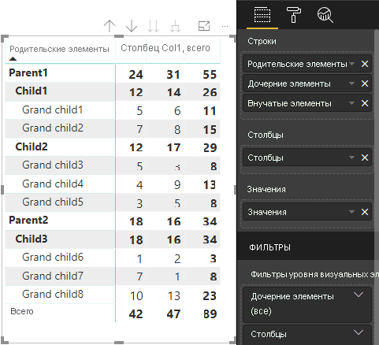

# <a name="understand-data-view-mapping-in-power-bi-visuals"></a><span data-ttu-id="68fbf-103">Общие сведения о сопоставлениях представлений данных в визуальных элементах Power BI</span><span class="sxs-lookup"><span data-stu-id="68fbf-103">Understand data view mapping in Power BI visuals</span></span>

<span data-ttu-id="68fbf-104">В этой статье рассматриваются представления данных и описывается связь между ролями данных, что позволяет указывать для них условные требования.</span><span class="sxs-lookup"><span data-stu-id="68fbf-104">This article discusses data view mapping and describes how data roles relate to each other and allow you to specify conditional requirements for them.</span></span> <span data-ttu-id="68fbf-105">В этой статье также описываются все типы `dataMappings`.</span><span class="sxs-lookup"><span data-stu-id="68fbf-105">The article also describes each `dataMappings` type.</span></span>

<span data-ttu-id="68fbf-106">Каждое допустимое сопоставление создает представление данных, но в настоящее время поддерживается выполнение только одного запроса для одного визуального элемента.</span><span class="sxs-lookup"><span data-stu-id="68fbf-106">Each valid mapping produces a data view, but we currently support performing only one query per visual.</span></span> <span data-ttu-id="68fbf-107">Обычно получается только одно представление данных.</span><span class="sxs-lookup"><span data-stu-id="68fbf-107">You ordinarily get only one data view.</span></span> <span data-ttu-id="68fbf-108">Однако можно указать несколько сопоставлений данных с разными условиями, что разрешено:</span><span class="sxs-lookup"><span data-stu-id="68fbf-108">However, you can provide multiple data mappings in certain conditions, which allow:</span></span>

```json
"dataViewMappings": [
    {
        "conditions": [ ... ],
        "categorical": { ... },
        "single": { ... },
        "table": { ... },
        "matrix": { ... }
    }
]
```

<span data-ttu-id="68fbf-109">Power BI создает сопоставление с представлением данных только в том случае, если допустимое сопоставление указано в `dataViewMappings`.</span><span class="sxs-lookup"><span data-stu-id="68fbf-109">Power BI creates a mapping to a data view if and only if the valid mapping is filled in `dataViewMappings`.</span></span>

<span data-ttu-id="68fbf-110">Иными словами, `categorical` может быть определено в `dataViewMappings`, однако другие сопоставления, такие как `table` или `single`, могут быть не определены.</span><span class="sxs-lookup"><span data-stu-id="68fbf-110">In other words, `categorical` might be defined in `dataViewMappings` but other mappings, such as `table` or `single`, might not be.</span></span> <span data-ttu-id="68fbf-111">Например:</span><span class="sxs-lookup"><span data-stu-id="68fbf-111">For example:</span></span>

```json
"dataViewMappings": [
    {
        "categorical": { ... }
    }
]
```

<span data-ttu-id="68fbf-112">Служба Power BI создает представление данных с одним сопоставлением `categorical`, но при этом `table` и другие сопоставления не определены:</span><span class="sxs-lookup"><span data-stu-id="68fbf-112">Power BI produces a data view with a single `categorical` mapping, and `table` and other mappings are undefined:</span></span>

```javascript
{
    "categorical": {
        "categories": [ ... ],
        "values": [ ... ]
    },
    "metadata": { ... }
}
```

## <a name="conditions"></a><span data-ttu-id="68fbf-113">Условия</span><span class="sxs-lookup"><span data-stu-id="68fbf-113">Conditions</span></span>

<span data-ttu-id="68fbf-114">В этом разделе описываются условия для определенного сопоставления данных.</span><span class="sxs-lookup"><span data-stu-id="68fbf-114">This section describes conditions for a particular data mapping.</span></span> <span data-ttu-id="68fbf-115">Можно предоставить несколько наборов условий, и, если данные совпадают с одним из описанных наборов, визуальный элемент примет данные как допустимые.</span><span class="sxs-lookup"><span data-stu-id="68fbf-115">You can provide multiple sets of conditions and, if the data matches one of the described sets of conditions, the visual accepts the data as valid.</span></span>

<span data-ttu-id="68fbf-116">В настоящее время для каждого поля можно указать минимальное и максимальное значения.</span><span class="sxs-lookup"><span data-stu-id="68fbf-116">Currently, for each field, you can specify a minimum and maximum value.</span></span> <span data-ttu-id="68fbf-117">Они представляют количество полей, которые можно привязать к этой роли данных.</span><span class="sxs-lookup"><span data-stu-id="68fbf-117">The value represents the number of fields that can be bound to that data role.</span></span> 

> [!NOTE]
> <span data-ttu-id="68fbf-118">Если роль данных в условии опущена, она может иметь любое количество полей.</span><span class="sxs-lookup"><span data-stu-id="68fbf-118">If a data role is omitted in the condition, it can have any number of fields.</span></span>

### <a name="example-1"></a><span data-ttu-id="68fbf-119">Пример 1</span><span class="sxs-lookup"><span data-stu-id="68fbf-119">Example 1</span></span>

<span data-ttu-id="68fbf-120">В каждую роль данных можно перетащить несколько полей.</span><span class="sxs-lookup"><span data-stu-id="68fbf-120">You can drag multiple fields into each data role.</span></span> <span data-ttu-id="68fbf-121">В этом примере мы ограничим категорию одним полем данных, а меру — двумя.</span><span class="sxs-lookup"><span data-stu-id="68fbf-121">In this example, you limit the category to one data field and the measure to two data fields.</span></span>

```json
"conditions": [
    { "category": { "max": 1 }, "y": { "max": 2 } },
]
```

### <a name="example-2"></a><span data-ttu-id="68fbf-122">Пример 2</span><span class="sxs-lookup"><span data-stu-id="68fbf-122">Example 2</span></span>

<span data-ttu-id="68fbf-123">В этом примере требуется соблюдение любого из двух условий:</span><span class="sxs-lookup"><span data-stu-id="68fbf-123">In this example, either of two conditions is required:</span></span>
* <span data-ttu-id="68fbf-124">Точно одно поле данных категории и точно две меры.</span><span class="sxs-lookup"><span data-stu-id="68fbf-124">Exactly one category data field and exactly two measures</span></span>
* <span data-ttu-id="68fbf-125">Точно две категории и точно одна мера.</span><span class="sxs-lookup"><span data-stu-id="68fbf-125">Exactly two categories and exactly one measure.</span></span>

```json
"conditions": [
    { "category": { "min": 1, "max": 1 }, "measure": { "min": 2, "max": 2 } },
    { "category": { "min": 2, "max": 2 }, "measure": { "min": 1, "max": 1 } }
]
```

## <a name="single-data-mapping"></a><span data-ttu-id="68fbf-126">Одиночное сопоставление данных</span><span class="sxs-lookup"><span data-stu-id="68fbf-126">Single data mapping</span></span>

<span data-ttu-id="68fbf-127">Одиночное сопоставление данных — это простейшая форма сопоставления данных.</span><span class="sxs-lookup"><span data-stu-id="68fbf-127">Single data mapping is the simplest form of data mapping.</span></span> <span data-ttu-id="68fbf-128">Оно принимает одно поле меры и выдает итог.</span><span class="sxs-lookup"><span data-stu-id="68fbf-128">It accepts a single measure field and gives you the total.</span></span> <span data-ttu-id="68fbf-129">Если поле является числовым, то выдается сумма.</span><span class="sxs-lookup"><span data-stu-id="68fbf-129">If the field is numeric, it gives you the sum.</span></span> <span data-ttu-id="68fbf-130">В противном случае выдается количество уникальных значений.</span><span class="sxs-lookup"><span data-stu-id="68fbf-130">Otherwise, it gives you a count of unique values.</span></span>

<span data-ttu-id="68fbf-131">Чтобы использовать одиночное сопоставление данных, нужно определить имя роли данных, которую требуется сопоставить.</span><span class="sxs-lookup"><span data-stu-id="68fbf-131">To use single data mapping, you need to define the name of the data role that you want to map.</span></span> <span data-ttu-id="68fbf-132">Это сопоставление работает только с одним полем меры.</span><span class="sxs-lookup"><span data-stu-id="68fbf-132">This mapping works only with a single measure field.</span></span> <span data-ttu-id="68fbf-133">Если присвоено второе поле, представление данных не будет создаваться. В связи с этим рекомендуется включать условие, которое будет ограничивать данные одним полем.</span><span class="sxs-lookup"><span data-stu-id="68fbf-133">If a second field is assigned, no data view is generated, so it's also a good practice to include a condition that limits the data to a single field.</span></span>

> [!NOTE]
> <span data-ttu-id="68fbf-134">Это сопоставление данных невозможно использовать совместно с любым другим сопоставлением данных.</span><span class="sxs-lookup"><span data-stu-id="68fbf-134">This data mapping can't be used in conjunction with any other data mapping.</span></span> <span data-ttu-id="68fbf-135">Оно предназначено для сокращения данных до одного числового значения.</span><span class="sxs-lookup"><span data-stu-id="68fbf-135">It's meant to reduce data into a single numeric value.</span></span>

### <a name="example-3"></a><span data-ttu-id="68fbf-136">Пример 3</span><span class="sxs-lookup"><span data-stu-id="68fbf-136">Example 3</span></span>

```json
"dataViewMappings": {
    "conditions": [
        { "Y": { "max": 1 } }
    ],
    "single": {
        "role": "Y"
    }
}  
```

<span data-ttu-id="68fbf-137">Итоговое представление данных по-прежнему содержит другие типы (табличные, категориальные и т. д.), но каждое сопоставление будет содержать только одно значение.</span><span class="sxs-lookup"><span data-stu-id="68fbf-137">The resulting data view still contains the other types (table, categorical, and so on), but each mapping contains only the single value.</span></span> <span data-ttu-id="68fbf-138">Рекомендуется просто обращаться к значению по отдельности.</span><span class="sxs-lookup"><span data-stu-id="68fbf-138">The best practice is to access the value only in single.</span></span>

```JSON
{
    "dataView": [
        {
            "metadata": null,
            "categorical": null,
            "matrix": null,
            "table": null,
            "tree": null,
            "single": {
                "value": 94163140.3560001
            }
        }
    ]
}
```

## <a name="categorical-data-mapping"></a><span data-ttu-id="68fbf-139">Категориальное сопоставление данных</span><span class="sxs-lookup"><span data-stu-id="68fbf-139">Categorical data mapping</span></span>

<span data-ttu-id="68fbf-140">Категориальное сопоставление данных используется для получения одного или двух независимых группирований данных.</span><span class="sxs-lookup"><span data-stu-id="68fbf-140">Categorical data mapping is used to get one or two independent groupings of data.</span></span>

### <a name="example-4"></a><span data-ttu-id="68fbf-141">Пример 4</span><span class="sxs-lookup"><span data-stu-id="68fbf-141">Example 4</span></span>

<span data-ttu-id="68fbf-142">Ниже приведено определение из нашего предыдущего примера для ролей данных:</span><span class="sxs-lookup"><span data-stu-id="68fbf-142">Here is the definition from the previous example for data roles:</span></span>

```json
"dataRole":[
    {
        "displayName": "Category",
        "name": "category",
        "kind": "Grouping"
    },
    {
        "displayName": "Y Axis",
        "name": "measure",
        "kind": "Measure"
    }
]
```

<span data-ttu-id="68fbf-143">А теперь для сопоставления:</span><span class="sxs-lookup"><span data-stu-id="68fbf-143">Here is the mapping:</span></span>

```json
"dataViewMappings": {
    "categorical": {
        "categories": {
            "for": { "in": "category" }
        },
        "values": {
            "select": [
                { "bind": { "to": "measure" } }
            ]
        }
    }
}
```

<span data-ttu-id="68fbf-144">Это простой пример.</span><span class="sxs-lookup"><span data-stu-id="68fbf-144">It's a simple example.</span></span> <span data-ttu-id="68fbf-145">В общем виде он означает следующее: "сопоставить мою роль данных `category`, чтобы для каждого поля, которое я перетаскиваю в `category`, его данные сопоставлялись с `categorical.categories`.</span><span class="sxs-lookup"><span data-stu-id="68fbf-145">It reads "Map my `category` data role so that for every field I drag into `category`, its data is mapped to `categorical.categories`.</span></span> <span data-ttu-id="68fbf-146">Кроме того, сопоставить мою роль данных `measure` с `categorical.values`".</span><span class="sxs-lookup"><span data-stu-id="68fbf-146">Also map my `measure` data role to `categorical.values`."</span></span>

* <span data-ttu-id="68fbf-147">**for...in** — включение всех элементов в этой роли данных в запрос данных.</span><span class="sxs-lookup"><span data-stu-id="68fbf-147">**for...in**: For all the items in this data role, include them in the data query.</span></span>
* <span data-ttu-id="68fbf-148">**bind...to** — дает тот же результат, что и *for...in*, но ожидает, что роль данных будет иметь условие, ограничивающее его до одного поля.</span><span class="sxs-lookup"><span data-stu-id="68fbf-148">**bind...to**: Produces the same result as in *for...in*, but expects that the data role will have a condition restricting it to a single field.</span></span>

### <a name="example-5"></a><span data-ttu-id="68fbf-149">Пример 5</span><span class="sxs-lookup"><span data-stu-id="68fbf-149">Example 5</span></span>

<span data-ttu-id="68fbf-150">В этом примере мы будем использовать две первых роли данных из предыдущего примера, а также дополнительно определим `grouping` и `measure2`.</span><span class="sxs-lookup"><span data-stu-id="68fbf-150">This example uses the first two data roles from the previous example and additionally defines `grouping` and `measure2`.</span></span>

```json
"dataRole":[
    {
        "displayName": "Category",
        "name": "category",
        "kind": "Grouping"
    },
    {
        "displayName": "Y Axis",
        "name": "measure",
        "kind": "Measure"
    },
    {
        "displayName": "Grouping with",
        "name": "grouping",
        "kind": "Grouping"
    },
    {
        "displayName": "X Axis",
        "name": "measure2",
        "kind": "Grouping"
    }
]
```

<span data-ttu-id="68fbf-151">А теперь для сопоставления:</span><span class="sxs-lookup"><span data-stu-id="68fbf-151">Here is the mapping:</span></span>

```json
"dataViewMappings":{
    "categorical": {
        "categories": {
            "for": { "in": "category" }
        },
        "values": {
            "group": {
                "by": "grouping",
                "select":[
                    { "bind": { "to": "measure" } },
                    { "bind": { "to": "measure2" } }
                ]
            }
        }
    }
}
```

<span data-ttu-id="68fbf-152">Разница заключается в том, как мы сопоставляем categorical.values.</span><span class="sxs-lookup"><span data-stu-id="68fbf-152">Here the difference is in how we are mapping categorical.values.</span></span> <span data-ttu-id="68fbf-153">Мы предписываем: "сопоставить мои роли данных `measure` и `measure2` для группирования по роли данных `grouping`".</span><span class="sxs-lookup"><span data-stu-id="68fbf-153">We are saying that "Map my `measure` and `measure2` data roles to be grouped by the data role `grouping`."</span></span>

### <a name="example-6"></a><span data-ttu-id="68fbf-154">Пример 6</span><span class="sxs-lookup"><span data-stu-id="68fbf-154">Example 6</span></span>

<span data-ttu-id="68fbf-155">Вот эти роли данных:</span><span class="sxs-lookup"><span data-stu-id="68fbf-155">Here are the data roles:</span></span>

```json
"dataRoles": [
    {
        "displayName": "Categories",
        "name": "category",
        "kind": "Grouping"
    },
    {
        "displayName": "Measures",
        "name": "measure",
        "kind": "Measure"
    },
    {
        "displayName": "Series",
        "name": "series",
        "kind": "Measure"
    }
]
```

<span data-ttu-id="68fbf-156">Это сопоставление представления данных:</span><span class="sxs-lookup"><span data-stu-id="68fbf-156">Here is the data view mapping:</span></span>

```json
"dataViewMappings": [
    {
        "categorical": {
            "categories": {
                "for": {
                    "in": "category"
                }
            },
            "values": {
                "group": {
                    "by": "series",
                    "select": [{
                            "for": {
                                "in": "measure"
                            }
                        }
                    ]
                }
            }
        }
    }
]
```

<span data-ttu-id="68fbf-157">Категориальное представление данных можно визуализировать указанным образом:</span><span class="sxs-lookup"><span data-stu-id="68fbf-157">The categorical data view could be visualized like this:</span></span>

| <span data-ttu-id="68fbf-158">Категориальный</span><span class="sxs-lookup"><span data-stu-id="68fbf-158">Categorical</span></span> |  |  | | | |
|-----|-----|------|------|------|------|
| | <span data-ttu-id="68fbf-159">Год</span><span class="sxs-lookup"><span data-stu-id="68fbf-159">Year</span></span> | <span data-ttu-id="68fbf-160">2013</span><span class="sxs-lookup"><span data-stu-id="68fbf-160">2013</span></span> | <span data-ttu-id="68fbf-161">2014</span><span class="sxs-lookup"><span data-stu-id="68fbf-161">2014</span></span> | <span data-ttu-id="68fbf-162">2015</span><span class="sxs-lookup"><span data-stu-id="68fbf-162">2015</span></span> | <span data-ttu-id="68fbf-163">2016</span><span class="sxs-lookup"><span data-stu-id="68fbf-163">2016</span></span> |
| <span data-ttu-id="68fbf-164">Страна</span><span class="sxs-lookup"><span data-stu-id="68fbf-164">Country</span></span> | | |
| <span data-ttu-id="68fbf-165">США</span><span class="sxs-lookup"><span data-stu-id="68fbf-165">USA</span></span> | | <span data-ttu-id="68fbf-166">x</span><span class="sxs-lookup"><span data-stu-id="68fbf-166">x</span></span> | <span data-ttu-id="68fbf-167">x</span><span class="sxs-lookup"><span data-stu-id="68fbf-167">x</span></span> | <span data-ttu-id="68fbf-168">125</span><span class="sxs-lookup"><span data-stu-id="68fbf-168">125</span></span> | <span data-ttu-id="68fbf-169">100</span><span class="sxs-lookup"><span data-stu-id="68fbf-169">100</span></span> |
| <span data-ttu-id="68fbf-170">Канада</span><span class="sxs-lookup"><span data-stu-id="68fbf-170">Canada</span></span> | | <span data-ttu-id="68fbf-171">x</span><span class="sxs-lookup"><span data-stu-id="68fbf-171">x</span></span> | <span data-ttu-id="68fbf-172">50</span><span class="sxs-lookup"><span data-stu-id="68fbf-172">50</span></span> | <span data-ttu-id="68fbf-173">200</span><span class="sxs-lookup"><span data-stu-id="68fbf-173">200</span></span> | <span data-ttu-id="68fbf-174">x</span><span class="sxs-lookup"><span data-stu-id="68fbf-174">x</span></span> |
| <span data-ttu-id="68fbf-175">Мексика</span><span class="sxs-lookup"><span data-stu-id="68fbf-175">Mexico</span></span> | | <span data-ttu-id="68fbf-176">300</span><span class="sxs-lookup"><span data-stu-id="68fbf-176">300</span></span> | <span data-ttu-id="68fbf-177">x</span><span class="sxs-lookup"><span data-stu-id="68fbf-177">x</span></span> | <span data-ttu-id="68fbf-178">x</span><span class="sxs-lookup"><span data-stu-id="68fbf-178">x</span></span> | <span data-ttu-id="68fbf-179">x</span><span class="sxs-lookup"><span data-stu-id="68fbf-179">x</span></span> |
| <span data-ttu-id="68fbf-180">Соединенное Королевство</span><span class="sxs-lookup"><span data-stu-id="68fbf-180">UK</span></span> | | <span data-ttu-id="68fbf-181">x</span><span class="sxs-lookup"><span data-stu-id="68fbf-181">x</span></span> | <span data-ttu-id="68fbf-182">x</span><span class="sxs-lookup"><span data-stu-id="68fbf-182">x</span></span> | <span data-ttu-id="68fbf-183">75</span><span class="sxs-lookup"><span data-stu-id="68fbf-183">75</span></span> | <span data-ttu-id="68fbf-184">x</span><span class="sxs-lookup"><span data-stu-id="68fbf-184">x</span></span> |

<span data-ttu-id="68fbf-185">Служба Power BI создает его как категориальное представление данных.</span><span class="sxs-lookup"><span data-stu-id="68fbf-185">Power BI produces it as the categorical data view.</span></span> <span data-ttu-id="68fbf-186">Это набор категорий.</span><span class="sxs-lookup"><span data-stu-id="68fbf-186">It's the set of categories.</span></span>

```JSON
{
    "categorical": {
        "categories": [
            {
                "source": {...},
                "values": [
                    "Canada",
                    "Mexico",
                    "UK",
                    "USA"
                ],
                "identity": [...],
                "identityFields": [...],
            }
        ]
    }
}
```

<span data-ttu-id="68fbf-187">Каждая категория также сопоставляется с набором значений.</span><span class="sxs-lookup"><span data-stu-id="68fbf-187">Each category maps to a set of values as well.</span></span> <span data-ttu-id="68fbf-188">Каждое из этих значений сгруппировано по рядам, то есть по годам.</span><span class="sxs-lookup"><span data-stu-id="68fbf-188">Each of these values is grouped by series, which is expressed as years.</span></span>

<span data-ttu-id="68fbf-189">Например, продажи в Канаде в 2013 г. равны нулю, а продажи в Канаде в 2014 г. — 50.</span><span class="sxs-lookup"><span data-stu-id="68fbf-189">For example, Canada sales in 2013 is null, Canada sales in 2014 is 50.</span></span>

```JSON
{
    "values": [
        {
            "source": {...},
            "values": [
                null,
                300,
                null,
                null
            ],
            "identity": [...],
        },
        {
            "source": {...},
            "values": [
                50,
                null,
                150,
                null
            ],
            "identity": [...],
        },
        {
            "source": {...},
            "values": [
                200,
                null,
                null,
                125
            ],
            "identity": [...],
        },
        {
            "source": {...},
            "values": [
                null,
                null,
                null,
                100
            ],
            "identity": [...],
        }
    ]
}
```

## <a name="table-data-mapping"></a><span data-ttu-id="68fbf-190">Сопоставление табличных данных</span><span class="sxs-lookup"><span data-stu-id="68fbf-190">Table data mapping</span></span>

<span data-ttu-id="68fbf-191">Представление табличных данных — это простое сопоставление данных.</span><span class="sxs-lookup"><span data-stu-id="68fbf-191">The table data view is a simple data mapping.</span></span> <span data-ttu-id="68fbf-192">По сути, это список точек данных, где можно агрегировать точки числовых данных.</span><span class="sxs-lookup"><span data-stu-id="68fbf-192">Essentially, it's a list of data points, where numeric data points could be aggregated.</span></span>

### <a name="example-7"></a><span data-ttu-id="68fbf-193">Пример 7</span><span class="sxs-lookup"><span data-stu-id="68fbf-193">Example 7</span></span>

<span data-ttu-id="68fbf-194">Учитывая доступные возможности:</span><span class="sxs-lookup"><span data-stu-id="68fbf-194">With the given capabilities:</span></span>

```json
"dataRoles": [
    {
        "displayName": "Values",
        "name": "values",
        "kind": "Measure"
    }
]
```

```json
"dataViewMappings": [
    {
        "table": {
            "rows": {
                "for": {
                    "in": "values"
                }
            }
        }
    }
]
```

<span data-ttu-id="68fbf-195">Представление табличных данных можно визуализировать следующим образом:</span><span class="sxs-lookup"><span data-stu-id="68fbf-195">You can visualize the table data view as the following:</span></span>  

| <span data-ttu-id="68fbf-196">Страна</span><span class="sxs-lookup"><span data-stu-id="68fbf-196">Country</span></span>| <span data-ttu-id="68fbf-197">Год</span><span class="sxs-lookup"><span data-stu-id="68fbf-197">Year</span></span> | <span data-ttu-id="68fbf-198">Продажи</span><span class="sxs-lookup"><span data-stu-id="68fbf-198">Sales</span></span> |
|-----|-----|------|
| <span data-ttu-id="68fbf-199">США</span><span class="sxs-lookup"><span data-stu-id="68fbf-199">USA</span></span> | <span data-ttu-id="68fbf-200">2016</span><span class="sxs-lookup"><span data-stu-id="68fbf-200">2016</span></span> | <span data-ttu-id="68fbf-201">100</span><span class="sxs-lookup"><span data-stu-id="68fbf-201">100</span></span> |
| <span data-ttu-id="68fbf-202">США</span><span class="sxs-lookup"><span data-stu-id="68fbf-202">USA</span></span> | <span data-ttu-id="68fbf-203">2015</span><span class="sxs-lookup"><span data-stu-id="68fbf-203">2015</span></span> | <span data-ttu-id="68fbf-204">50</span><span class="sxs-lookup"><span data-stu-id="68fbf-204">50</span></span> |
| <span data-ttu-id="68fbf-205">Канада</span><span class="sxs-lookup"><span data-stu-id="68fbf-205">Canada</span></span> | <span data-ttu-id="68fbf-206">2015</span><span class="sxs-lookup"><span data-stu-id="68fbf-206">2015</span></span> | <span data-ttu-id="68fbf-207">200</span><span class="sxs-lookup"><span data-stu-id="68fbf-207">200</span></span> |
| <span data-ttu-id="68fbf-208">Канада</span><span class="sxs-lookup"><span data-stu-id="68fbf-208">Canada</span></span> | <span data-ttu-id="68fbf-209">2015</span><span class="sxs-lookup"><span data-stu-id="68fbf-209">2015</span></span> | <span data-ttu-id="68fbf-210">50</span><span class="sxs-lookup"><span data-stu-id="68fbf-210">50</span></span> |
| <span data-ttu-id="68fbf-211">Мексика</span><span class="sxs-lookup"><span data-stu-id="68fbf-211">Mexico</span></span> | <span data-ttu-id="68fbf-212">2013</span><span class="sxs-lookup"><span data-stu-id="68fbf-212">2013</span></span> | <span data-ttu-id="68fbf-213">300</span><span class="sxs-lookup"><span data-stu-id="68fbf-213">300</span></span> |
| <span data-ttu-id="68fbf-214">Соединенное Королевство</span><span class="sxs-lookup"><span data-stu-id="68fbf-214">UK</span></span> | <span data-ttu-id="68fbf-215">2014</span><span class="sxs-lookup"><span data-stu-id="68fbf-215">2014</span></span> | <span data-ttu-id="68fbf-216">150</span><span class="sxs-lookup"><span data-stu-id="68fbf-216">150</span></span> |
| <span data-ttu-id="68fbf-217">США</span><span class="sxs-lookup"><span data-stu-id="68fbf-217">USA</span></span> | <span data-ttu-id="68fbf-218">2015</span><span class="sxs-lookup"><span data-stu-id="68fbf-218">2015</span></span> | <span data-ttu-id="68fbf-219">75</span><span class="sxs-lookup"><span data-stu-id="68fbf-219">75</span></span> |

<span data-ttu-id="68fbf-220">Служба Power BI отображает данные в представлении табличных данных.</span><span class="sxs-lookup"><span data-stu-id="68fbf-220">Power BI displays your data as the table data view.</span></span> <span data-ttu-id="68fbf-221">Изначально предполагать, что данные упорядочены, не следует.</span><span class="sxs-lookup"><span data-stu-id="68fbf-221">You shouldn't assume that the data is ordered.</span></span>

```JSON
{
    "table" : {
        "columns": [...],
        "rows": [
            [
                "Canada",
                2014,
                50
            ],
            [
                "Canada",
                2015,
                200
            ],
            [
                "Mexico",
                2013,
                300
            ],
            [
                "UK",
                2014,
                150
            ],
            [
                "USA",
                2015,
                100
            ],
            [
                "USA",
                2015,
                75
            ],
            [
                "USA",
                2016,
                100
            ]
        ]
    }
}
```

<span data-ttu-id="68fbf-222">Вы можете выполнить статистическую обработку данных, выбрав нужное поле и затем указав операцию суммирования.</span><span class="sxs-lookup"><span data-stu-id="68fbf-222">You can aggregate the data by selecting the desired field and then selecting sum.</span></span>  


## <a name="matrix-data-mapping"></a><span data-ttu-id="68fbf-224">Сопоставление матричных данных</span><span class="sxs-lookup"><span data-stu-id="68fbf-224">Matrix data mapping</span></span>

<span data-ttu-id="68fbf-225">Сопоставление матричных данных похоже на сопоставление табличных данных, однако строки в нем представляются иерархически.</span><span class="sxs-lookup"><span data-stu-id="68fbf-225">Matrix data mapping is similar to table data mapping, but the rows are presented hierarchically.</span></span> <span data-ttu-id="68fbf-226">Кроме того, любое из значений роли данных можно использовать в качестве заголовка столбца.</span><span class="sxs-lookup"><span data-stu-id="68fbf-226">Any of the data role values can be used as a column header value.</span></span>

```json
{
    "dataRoles": [
        {
            "name": "Category",
            "displayName": "Category",
            "displayNameKey": "Visual_Category",
            "kind": "Grouping"
        },
        {
            "name": "Column",
            "displayName": "Column",
            "displayNameKey": "Visual_Column",
            "kind": "Grouping"
        },
        {
            "name": "Measure",
            "displayName": "Measure",
            "displayNameKey": "Visual_Values",
            "kind": "Measure"
        }
    ],
    "dataViewMappings": [
        {
            "matrix": {
                "rows": {
                    "for": {
                        "in": "Category"
                    }
                },
                "columns": {
                    "for": {
                        "in": "Column"
                    }
                },
                "values": {
                    "select": [
                        {
                            "for": {
                                "in": "Measure"
                            }
                        }
                    ]
                }
            }
        }
    ]
}
```

<span data-ttu-id="68fbf-227">Служба Power BI создает иерархическую структуру данных.</span><span class="sxs-lookup"><span data-stu-id="68fbf-227">Power BI creates a hierarchical data structure.</span></span> <span data-ttu-id="68fbf-228">Корневой элемент иерархии дерева включает данные из столбца **Parents** (Родители) роли данных `Category` и столбца **Children** (Дети) табличной роли данных.</span><span class="sxs-lookup"><span data-stu-id="68fbf-228">The root of the tree hierarchy includes the data from the **Parents** column of the `Category` data role, with children from the **Children** column of the data role table.</span></span>

<span data-ttu-id="68fbf-229">Набор данных:</span><span class="sxs-lookup"><span data-stu-id="68fbf-229">Dataset:</span></span>

| <span data-ttu-id="68fbf-230">Родительские элементы</span><span class="sxs-lookup"><span data-stu-id="68fbf-230">Parents</span></span> | <span data-ttu-id="68fbf-231">Дочерние элементы</span><span class="sxs-lookup"><span data-stu-id="68fbf-231">Children</span></span> | <span data-ttu-id="68fbf-232">Grandchildren</span><span class="sxs-lookup"><span data-stu-id="68fbf-232">Grandchildren</span></span> | <span data-ttu-id="68fbf-233">Столбцы</span><span class="sxs-lookup"><span data-stu-id="68fbf-233">Columns</span></span> | <span data-ttu-id="68fbf-234">Значения</span><span class="sxs-lookup"><span data-stu-id="68fbf-234">Values</span></span> |
|-----|-----|------|-------|-------|
| <span data-ttu-id="68fbf-235">Parent1</span><span class="sxs-lookup"><span data-stu-id="68fbf-235">Parent1</span></span> | <span data-ttu-id="68fbf-236">Child1</span><span class="sxs-lookup"><span data-stu-id="68fbf-236">Child1</span></span> | <span data-ttu-id="68fbf-237">Grand child1</span><span class="sxs-lookup"><span data-stu-id="68fbf-237">Grand child1</span></span> | <span data-ttu-id="68fbf-238">Col1</span><span class="sxs-lookup"><span data-stu-id="68fbf-238">Col1</span></span> | <span data-ttu-id="68fbf-239">5</span><span class="sxs-lookup"><span data-stu-id="68fbf-239">5</span></span> |
| <span data-ttu-id="68fbf-240">Parent1</span><span class="sxs-lookup"><span data-stu-id="68fbf-240">Parent1</span></span> | <span data-ttu-id="68fbf-241">Child1</span><span class="sxs-lookup"><span data-stu-id="68fbf-241">Child1</span></span> | <span data-ttu-id="68fbf-242">Grand child1</span><span class="sxs-lookup"><span data-stu-id="68fbf-242">Grand child1</span></span> | <span data-ttu-id="68fbf-243">Col2</span><span class="sxs-lookup"><span data-stu-id="68fbf-243">Col2</span></span> | <span data-ttu-id="68fbf-244">6</span><span class="sxs-lookup"><span data-stu-id="68fbf-244">6</span></span> |
| <span data-ttu-id="68fbf-245">Parent1</span><span class="sxs-lookup"><span data-stu-id="68fbf-245">Parent1</span></span> | <span data-ttu-id="68fbf-246">Child1</span><span class="sxs-lookup"><span data-stu-id="68fbf-246">Child1</span></span> | <span data-ttu-id="68fbf-247">Grand child2</span><span class="sxs-lookup"><span data-stu-id="68fbf-247">Grand child2</span></span> | <span data-ttu-id="68fbf-248">Col1</span><span class="sxs-lookup"><span data-stu-id="68fbf-248">Col1</span></span> | <span data-ttu-id="68fbf-249">7</span><span class="sxs-lookup"><span data-stu-id="68fbf-249">7</span></span> |
| <span data-ttu-id="68fbf-250">Parent1</span><span class="sxs-lookup"><span data-stu-id="68fbf-250">Parent1</span></span> | <span data-ttu-id="68fbf-251">Child1</span><span class="sxs-lookup"><span data-stu-id="68fbf-251">Child1</span></span> | <span data-ttu-id="68fbf-252">Grand child2</span><span class="sxs-lookup"><span data-stu-id="68fbf-252">Grand child2</span></span> | <span data-ttu-id="68fbf-253">Col2</span><span class="sxs-lookup"><span data-stu-id="68fbf-253">Col2</span></span> | <span data-ttu-id="68fbf-254">8</span><span class="sxs-lookup"><span data-stu-id="68fbf-254">8</span></span> |
| <span data-ttu-id="68fbf-255">Parent1</span><span class="sxs-lookup"><span data-stu-id="68fbf-255">Parent1</span></span> | <span data-ttu-id="68fbf-256">Child2</span><span class="sxs-lookup"><span data-stu-id="68fbf-256">Child2</span></span> | <span data-ttu-id="68fbf-257">Grand child3</span><span class="sxs-lookup"><span data-stu-id="68fbf-257">Grand child3</span></span> | <span data-ttu-id="68fbf-258">Col1</span><span class="sxs-lookup"><span data-stu-id="68fbf-258">Col1</span></span> | <span data-ttu-id="68fbf-259">5</span><span class="sxs-lookup"><span data-stu-id="68fbf-259">5</span></span> |
| <span data-ttu-id="68fbf-260">Parent1</span><span class="sxs-lookup"><span data-stu-id="68fbf-260">Parent1</span></span> | <span data-ttu-id="68fbf-261">Child2</span><span class="sxs-lookup"><span data-stu-id="68fbf-261">Child2</span></span> | <span data-ttu-id="68fbf-262">Grand child3</span><span class="sxs-lookup"><span data-stu-id="68fbf-262">Grand child3</span></span> | <span data-ttu-id="68fbf-263">Col2</span><span class="sxs-lookup"><span data-stu-id="68fbf-263">Col2</span></span> | <span data-ttu-id="68fbf-264">3</span><span class="sxs-lookup"><span data-stu-id="68fbf-264">3</span></span> |
| <span data-ttu-id="68fbf-265">Parent1</span><span class="sxs-lookup"><span data-stu-id="68fbf-265">Parent1</span></span> | <span data-ttu-id="68fbf-266">Child2</span><span class="sxs-lookup"><span data-stu-id="68fbf-266">Child2</span></span> | <span data-ttu-id="68fbf-267">Grand child4</span><span class="sxs-lookup"><span data-stu-id="68fbf-267">Grand child4</span></span> | <span data-ttu-id="68fbf-268">Col1</span><span class="sxs-lookup"><span data-stu-id="68fbf-268">Col1</span></span> | <span data-ttu-id="68fbf-269">4</span><span class="sxs-lookup"><span data-stu-id="68fbf-269">4</span></span> |
| <span data-ttu-id="68fbf-270">Parent1</span><span class="sxs-lookup"><span data-stu-id="68fbf-270">Parent1</span></span> | <span data-ttu-id="68fbf-271">Child2</span><span class="sxs-lookup"><span data-stu-id="68fbf-271">Child2</span></span> | <span data-ttu-id="68fbf-272">Grand child4</span><span class="sxs-lookup"><span data-stu-id="68fbf-272">Grand child4</span></span> | <span data-ttu-id="68fbf-273">Col2</span><span class="sxs-lookup"><span data-stu-id="68fbf-273">Col2</span></span> | <span data-ttu-id="68fbf-274">9</span><span class="sxs-lookup"><span data-stu-id="68fbf-274">9</span></span> |
| <span data-ttu-id="68fbf-275">Parent1</span><span class="sxs-lookup"><span data-stu-id="68fbf-275">Parent1</span></span> | <span data-ttu-id="68fbf-276">Child2</span><span class="sxs-lookup"><span data-stu-id="68fbf-276">Child2</span></span> | <span data-ttu-id="68fbf-277">Grand child5</span><span class="sxs-lookup"><span data-stu-id="68fbf-277">Grand child5</span></span> | <span data-ttu-id="68fbf-278">Col1</span><span class="sxs-lookup"><span data-stu-id="68fbf-278">Col1</span></span> | <span data-ttu-id="68fbf-279">3</span><span class="sxs-lookup"><span data-stu-id="68fbf-279">3</span></span> |
| <span data-ttu-id="68fbf-280">Parent1</span><span class="sxs-lookup"><span data-stu-id="68fbf-280">Parent1</span></span> | <span data-ttu-id="68fbf-281">Child2</span><span class="sxs-lookup"><span data-stu-id="68fbf-281">Child2</span></span> | <span data-ttu-id="68fbf-282">Grand child5</span><span class="sxs-lookup"><span data-stu-id="68fbf-282">Grand child5</span></span> | <span data-ttu-id="68fbf-283">Col2</span><span class="sxs-lookup"><span data-stu-id="68fbf-283">Col2</span></span> | <span data-ttu-id="68fbf-284">5</span><span class="sxs-lookup"><span data-stu-id="68fbf-284">5</span></span> |
| <span data-ttu-id="68fbf-285">Parent2</span><span class="sxs-lookup"><span data-stu-id="68fbf-285">Parent2</span></span> | <span data-ttu-id="68fbf-286">Child3</span><span class="sxs-lookup"><span data-stu-id="68fbf-286">Child3</span></span> | <span data-ttu-id="68fbf-287">Grand child6</span><span class="sxs-lookup"><span data-stu-id="68fbf-287">Grand child6</span></span> | <span data-ttu-id="68fbf-288">Col1</span><span class="sxs-lookup"><span data-stu-id="68fbf-288">Col1</span></span> | <span data-ttu-id="68fbf-289">1</span><span class="sxs-lookup"><span data-stu-id="68fbf-289">1</span></span> |
| <span data-ttu-id="68fbf-290">Parent2</span><span class="sxs-lookup"><span data-stu-id="68fbf-290">Parent2</span></span> | <span data-ttu-id="68fbf-291">Child3</span><span class="sxs-lookup"><span data-stu-id="68fbf-291">Child3</span></span> | <span data-ttu-id="68fbf-292">Grand child6</span><span class="sxs-lookup"><span data-stu-id="68fbf-292">Grand child6</span></span> | <span data-ttu-id="68fbf-293">Col2</span><span class="sxs-lookup"><span data-stu-id="68fbf-293">Col2</span></span> | <span data-ttu-id="68fbf-294">2</span><span class="sxs-lookup"><span data-stu-id="68fbf-294">2</span></span> |
| <span data-ttu-id="68fbf-295">Parent2</span><span class="sxs-lookup"><span data-stu-id="68fbf-295">Parent2</span></span> | <span data-ttu-id="68fbf-296">Child3</span><span class="sxs-lookup"><span data-stu-id="68fbf-296">Child3</span></span> | <span data-ttu-id="68fbf-297">Grand child7</span><span class="sxs-lookup"><span data-stu-id="68fbf-297">Grand child7</span></span> | <span data-ttu-id="68fbf-298">Col1</span><span class="sxs-lookup"><span data-stu-id="68fbf-298">Col1</span></span> | <span data-ttu-id="68fbf-299">7</span><span class="sxs-lookup"><span data-stu-id="68fbf-299">7</span></span> |
| <span data-ttu-id="68fbf-300">Parent2</span><span class="sxs-lookup"><span data-stu-id="68fbf-300">Parent2</span></span> | <span data-ttu-id="68fbf-301">Child3</span><span class="sxs-lookup"><span data-stu-id="68fbf-301">Child3</span></span> | <span data-ttu-id="68fbf-302">Grand child7</span><span class="sxs-lookup"><span data-stu-id="68fbf-302">Grand child7</span></span> | <span data-ttu-id="68fbf-303">Col2</span><span class="sxs-lookup"><span data-stu-id="68fbf-303">Col2</span></span> | <span data-ttu-id="68fbf-304">1</span><span class="sxs-lookup"><span data-stu-id="68fbf-304">1</span></span> |
| <span data-ttu-id="68fbf-305">Parent2</span><span class="sxs-lookup"><span data-stu-id="68fbf-305">Parent2</span></span> | <span data-ttu-id="68fbf-306">Child3</span><span class="sxs-lookup"><span data-stu-id="68fbf-306">Child3</span></span> | <span data-ttu-id="68fbf-307">Grand child8</span><span class="sxs-lookup"><span data-stu-id="68fbf-307">Grand child8</span></span> | <span data-ttu-id="68fbf-308">Col1</span><span class="sxs-lookup"><span data-stu-id="68fbf-308">Col1</span></span> | <span data-ttu-id="68fbf-309">10</span><span class="sxs-lookup"><span data-stu-id="68fbf-309">10</span></span> |
| <span data-ttu-id="68fbf-310">Parent2</span><span class="sxs-lookup"><span data-stu-id="68fbf-310">Parent2</span></span> | <span data-ttu-id="68fbf-311">Child3</span><span class="sxs-lookup"><span data-stu-id="68fbf-311">Child3</span></span> | <span data-ttu-id="68fbf-312">Grand child8</span><span class="sxs-lookup"><span data-stu-id="68fbf-312">Grand child8</span></span> | <span data-ttu-id="68fbf-313">Col2</span><span class="sxs-lookup"><span data-stu-id="68fbf-313">Col2</span></span> | <span data-ttu-id="68fbf-314">13</span><span class="sxs-lookup"><span data-stu-id="68fbf-314">13</span></span> |

<span data-ttu-id="68fbf-315">Базовый визуальный элемент матрицы Power BI отрисовывает данные как таблицу.</span><span class="sxs-lookup"><span data-stu-id="68fbf-315">The core matrix visual of Power BI renders the data as a table.</span></span>



<span data-ttu-id="68fbf-317">Визуальный элемент получает структуру данных, как описывается в следующем коде (здесь показаны только две первые строки таблицы):</span><span class="sxs-lookup"><span data-stu-id="68fbf-317">The visual gets its data structure as described in the following code (only the first two table rows are shown here):</span></span>

```json
{
    "metadata": {...},
    "matrix": {
        "rows": {
            "levels": [...],
            "root": {
                "childIdentityFields": [...],
                "children": [
                    {
                        "level": 0,
                        "levelValues": [...],
                        "value": "Parent1",
                        "identity": {...},
                        "childIdentityFields": [...],
                        "children": [
                            {
                                "level": 1,
                                "levelValues": [...],
                                "value": "Child1",
                                "identity": {...},
                                "childIdentityFields": [...],
                                "children": [
                                    {
                                        "level": 2,
                                        "levelValues": [...],
                                        "value": "Grand child1",
                                        "identity": {...},
                                        "values": {
                                            "0": {
                                                "value": 5 // value for Col1
                                            },
                                            "1": {
                                                "value": 6 // value for Col2
                                            }
                                        }
                                    },
                                    ...
                                ]
                            },
                            ...
                        ]
                    },
                    ...
                ]
            }
        },
        "columns": {
            "levels": [...],
            "root": {
                "childIdentityFields": [...],
                "children": [
                    {
                        "level": 0,
                        "levelValues": [...],
                        "value": "Col1",
                        "identity": {...}
                    },
                    {
                        "level": 0,
                        "levelValues": [...],
                        "value": "Col2",
                        "identity": {...}
                    },
                    ...
                ]
            }
        },
        "valueSources": [...]
    }
}
```

## <a name="data-reduction-algorithm"></a><span data-ttu-id="68fbf-318">Алгоритм сокращения данных</span><span class="sxs-lookup"><span data-stu-id="68fbf-318">Data reduction algorithm</span></span>

<span data-ttu-id="68fbf-319">Чтобы контролировать объем данных, получаемых представлением, можно применить алгоритм сокращения данных.</span><span class="sxs-lookup"><span data-stu-id="68fbf-319">To control the amount of data to receive in the data view, you can apply a data reduction algorithm.</span></span>

<span data-ttu-id="68fbf-320">По умолчанию для всех визуальных элементов Power BI применяется верхний алгоритм сокращения данных, для которого задано значение *count* в 1000 точек данных.</span><span class="sxs-lookup"><span data-stu-id="68fbf-320">By default, all Power BI visuals have the top data reduction algorithm applied with the *count* set to 1000 data points.</span></span> <span data-ttu-id="68fbf-321">Это эквивалентно установке следующих свойств в файле *capabilities.json*:</span><span class="sxs-lookup"><span data-stu-id="68fbf-321">It's the same as setting the following properties in the *capabilities.json* file:</span></span>

```json
"dataReductionAlgorithm": {
    "top": {
        "count": 1000
    }
}
```

<span data-ttu-id="68fbf-322">Вы можете изменить параметр *count* на любое целое значение не более 30 000.</span><span class="sxs-lookup"><span data-stu-id="68fbf-322">You can modify the *count* value to any integer value up to 30000.</span></span> <span data-ttu-id="68fbf-323">Визуальные элементы Power BI на основе R могут поддерживать до 150 000 строк.</span><span class="sxs-lookup"><span data-stu-id="68fbf-323">R-based Power BI visuals can support up to 150000 rows.</span></span>

## <a name="data-reduction-algorithm-types"></a><span data-ttu-id="68fbf-324">Типы алгоритмов для сокращения данных</span><span class="sxs-lookup"><span data-stu-id="68fbf-324">Data reduction algorithm types</span></span>

<span data-ttu-id="68fbf-325">Предусмотрено четыре типа параметров для алгоритма сокращения данных:</span><span class="sxs-lookup"><span data-stu-id="68fbf-325">There are four types of data reduction algorithm settings:</span></span>

* <span data-ttu-id="68fbf-326">`top` — если требуется ограничить данные значениями, взятыми из верхней части набора данных.</span><span class="sxs-lookup"><span data-stu-id="68fbf-326">`top`: If you want to limit the data to values taken from the top of the dataset.</span></span> <span data-ttu-id="68fbf-327">Из набора данных будут взяты первые *count* значений.</span><span class="sxs-lookup"><span data-stu-id="68fbf-327">The top first *count* values will be taken from the dataset.</span></span>
* <span data-ttu-id="68fbf-328">`bottom` — если требуется ограничить данные значениями, взятыми из нижней части набора данных.</span><span class="sxs-lookup"><span data-stu-id="68fbf-328">`bottom`: If you want to limit the data to values taken from the bottom of the dataset.</span></span> <span data-ttu-id="68fbf-329">Из набора данных будут взяты последние "count" значений.</span><span class="sxs-lookup"><span data-stu-id="68fbf-329">The last "count" values will be taken from the dataset.</span></span>
* <span data-ttu-id="68fbf-330">`sample` — сокращение набора данных с помощью простого алгоритма выборки, ограниченного количеством элементов (*count*).</span><span class="sxs-lookup"><span data-stu-id="68fbf-330">`sample`: Reduce the dataset by a simple sampling algorithm, limited to a *count* number of items.</span></span> <span data-ttu-id="68fbf-331">Это означает, что включаются первый и последний элементы, а элементы в количестве *count* располагаются между ними с равными интервалами.</span><span class="sxs-lookup"><span data-stu-id="68fbf-331">It means that the first and last items are included, and a *count* number of items have equal intervals between them.</span></span>
<span data-ttu-id="68fbf-332">Например, если получен набор данных [0, 1, 2, ... 100] и *count* равно 9, вы получите значения [0, 10, 20 ... 100].</span><span class="sxs-lookup"><span data-stu-id="68fbf-332">For example, if you have a dataset [0, 1, 2, ... 100] and a *count* of 9,  you'll receive the values [0, 10, 20 ... 100].</span></span>
* <span data-ttu-id="68fbf-333">`window` — загружает одно *окно* точек данных за раз, содержащее определенное число (*count*) элементов.</span><span class="sxs-lookup"><span data-stu-id="68fbf-333">`window`: Loads one *window* of data points at a time containing *count* elements.</span></span> <span data-ttu-id="68fbf-334">На данный момент `top` и `window` эквивалентны.</span><span class="sxs-lookup"><span data-stu-id="68fbf-334">Currently, `top` and `window` are equivalent.</span></span> <span data-ttu-id="68fbf-335">Сейчас мы работаем над тем, чтобы обеспечить полноценную поддержку настройки окон.</span><span class="sxs-lookup"><span data-stu-id="68fbf-335">We are working toward fully supporting a windowing setting.</span></span>

## <a name="data-reduction-algorithm-usage"></a><span data-ttu-id="68fbf-336">Использование алгоритма сокращения данных</span><span class="sxs-lookup"><span data-stu-id="68fbf-336">Data reduction algorithm usage</span></span>

<span data-ttu-id="68fbf-337">Алгоритм сокращения данных можно использовать в сопоставлениях представлений категориальных, табличных или матричных данных.</span><span class="sxs-lookup"><span data-stu-id="68fbf-337">The data reduction algorithm can be used in categorical, table, or matrix data view mapping.</span></span>

<span data-ttu-id="68fbf-338">Этот алгоритм можно задать в `categories` и (или) в разделе группы объекта `values` для категориального сопоставления данных.</span><span class="sxs-lookup"><span data-stu-id="68fbf-338">You can set the algorithm into `categories` and/or group section of `values` for categorical data mapping.</span></span>

### <a name="example-8"></a><span data-ttu-id="68fbf-339">Пример 8</span><span class="sxs-lookup"><span data-stu-id="68fbf-339">Example 8</span></span>

```json
"dataViewMappings": {
    "categorical": {
        "categories": {
            "for": { "in": "category" },
            "dataReductionAlgorithm": {
                "window": {
                    "count": 300
                }
            }  
        },
        "values": {
            "group": {
                "by": "series",
                "select": [{
                        "for": {
                            "in": "measure"
                        }
                    }
                ],
                "dataReductionAlgorithm": {
                    "top": {
                        "count": 100
                    }
                }  
            }
        }
    }
}
```

<span data-ttu-id="68fbf-340">Алгоритм сокращения данных можно применить к разделу `rows` таблицы сопоставления представления данных.</span><span class="sxs-lookup"><span data-stu-id="68fbf-340">You can apply the data reduction algorithm to the `rows` section of the Data View mapping table.</span></span>

### <a name="example-9"></a><span data-ttu-id="68fbf-341">Пример 9</span><span class="sxs-lookup"><span data-stu-id="68fbf-341">Example 9</span></span>

```json
"dataViewMappings": [
    {
        "table": {
            "rows": {
                "for": {
                    "in": "values"
                },
                "dataReductionAlgorithm": {
                    "top": {
                        "count": 2000
                    }
                } 
            }
        }
    }
]
```

<span data-ttu-id="68fbf-342">Алгоритм сокращения данных можно применить к разделам `rows` и `columns` матрицы сопоставления представления данных.</span><span class="sxs-lookup"><span data-stu-id="68fbf-342">You can apply the data reduction algorithm to the `rows` and `columns` sections of the Data View mapping matrix.</span></span>
