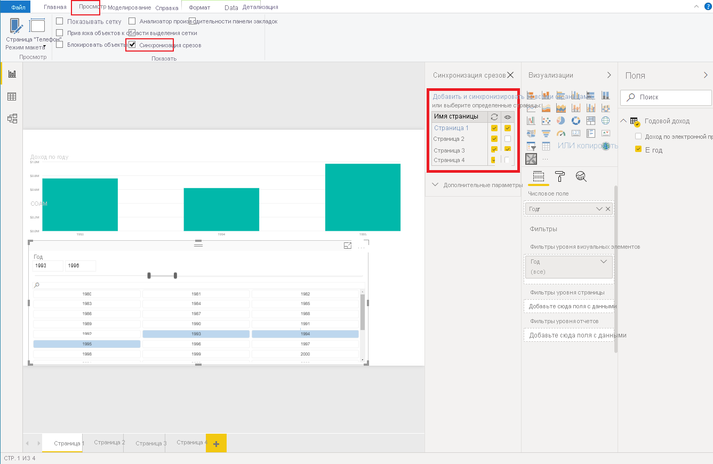

# <a name="sync-slicers-in-power-bi-visuals"></a><span data-ttu-id="74a01-103">Синхронизация срезов для визуальных элементов Power BI</span><span class="sxs-lookup"><span data-stu-id="74a01-103">Sync slicers in Power BI visuals</span></span>

<span data-ttu-id="74a01-104">Чтобы реализовать поддержку функции [Синхронизация срезов](https://docs.microsoft.com/power-bi/desktop-slicers), ваш настраиваемый визуальный элемент среза должен использовать API версии 1.13 или более поздней.</span><span class="sxs-lookup"><span data-stu-id="74a01-104">To support the [Sync Slicers](https://docs.microsoft.com/power-bi/desktop-slicers) feature, your custom slicer visual must use API version 1.13 or later.</span></span>

<span data-ttu-id="74a01-105">Кроме того, необходимо включить соответствующий параметр в файле *capabilities.json*, как показано в следующем коде:</span><span class="sxs-lookup"><span data-stu-id="74a01-105">Additionally, you need to enable the option in the *capabilities.json* file, as shown in the following code:</span></span>

```json
{
    ...
    "supportsHighlight": true,
    "suppressDefaultTitle": true,
    "supportsSynchronizingFilterState": true,
    "sorting": {
        "default": {}
    }
}
```

<span data-ttu-id="74a01-106">После обновления файла *capabilities.json* при выборе настраиваемого визуального элемента среза будет отображаться область параметров **Синхронизация срезов**.</span><span class="sxs-lookup"><span data-stu-id="74a01-106">After you've updated the *capabilities.json* file, you can view the **Sync slicers** options pane when you select your custom slicer visual.</span></span>

> [!NOTE]
> <span data-ttu-id="74a01-107">Функция синхронизации срезов поддерживает не более одного поля.</span><span class="sxs-lookup"><span data-stu-id="74a01-107">The Sync Slicers feature doesn't support more than one field.</span></span> <span data-ttu-id="74a01-108">Если срез содержит несколько полей (**Категория** или **Мера**), эта функция будет отключена.</span><span class="sxs-lookup"><span data-stu-id="74a01-108">If your slicer has more than one field (**Category** or **Measure**), the feature is disabled.</span></span>



<span data-ttu-id="74a01-110">В области **Синхронизация срезов** можно узнать, что параметры видимости и фильтрации срезов могут применяться к нескольким страницам отчета.</span><span class="sxs-lookup"><span data-stu-id="74a01-110">In the **Sync slicers** pane, you can see that your slicer visibility and its filtration can be applied to several report pages.</span></span>
