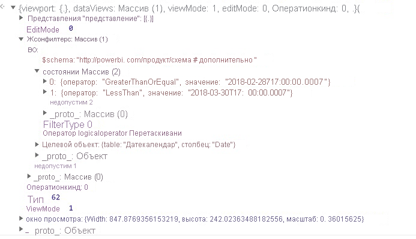

# <a name="the-visual-filters-api-in-power-bi-visuals"></a><span data-ttu-id="4750b-103">API фильтров визуальных элементов в визуальных элементах Power BI</span><span class="sxs-lookup"><span data-stu-id="4750b-103">The Visual Filters API in Power BI visuals</span></span>

<span data-ttu-id="4750b-104">API фильтров визуальных элементов позволяет фильтровать данные в визуальных элементах Power BI.</span><span class="sxs-lookup"><span data-stu-id="4750b-104">The Visual Filters API allows you to filter data in Power BI visuals.</span></span> <span data-ttu-id="4750b-105">Основное отличие от других способов выбора заключается в том, что другие визуальные элементы будут фильтроваться всегда, независимо от поддержки выделения другими визуальными элементами.</span><span class="sxs-lookup"><span data-stu-id="4750b-105">The main difference from other selections is that other visuals will be filtered in any way, despite highlight support by other visual.</span></span>

<span data-ttu-id="4750b-106">Чтобы включить фильтрацию для визуального элемента, он должен содержать объект `filter` в разделе `general` файла *capabilities.json*.</span><span class="sxs-lookup"><span data-stu-id="4750b-106">To enable filtering for the visual, it should contain a `filter` object in the `general` section of *capabilities.json* code.</span></span>

```json
"objects": {
        "general": {
            "displayName": "General",
            "displayNameKey": "formattingGeneral",
            "properties": {
                "filter": {
                    "type": {
                        "filter": true
                    }
                }
            }
        }
    }
```

<span data-ttu-id="4750b-107">Интерфейсы API фильтров визуальных фильтров доступны в пакете [powerbi-models](https://www.npmjs.com/package/powerbi-models).</span><span class="sxs-lookup"><span data-stu-id="4750b-107">Visual Filters API interfaces are available in the [powerbi-models](https://www.npmjs.com/package/powerbi-models) package.</span></span> <span data-ttu-id="4750b-108">Этот пакет также содержит классы для создания экземпляров фильтра.</span><span class="sxs-lookup"><span data-stu-id="4750b-108">The package also contains classes to create filter instances.</span></span>

```cmd
npm install powerbi-models --save
```

<span data-ttu-id="4750b-109">Если вы используете более раннюю версию средств (до 3. x. x), следует включить `powerbi-models` в пакет визуальных элементов.</span><span class="sxs-lookup"><span data-stu-id="4750b-109">If you use an older (earlier than 3.x.x) version of the tools, you should include `powerbi-models` in the visuals package.</span></span> <span data-ttu-id="4750b-110">Дополнительные сведения см. в кратком руководстве [Добавление API расширенного фильтра к пользовательскому визуальному элементу](https://github.com/Microsoft/powerbi-visuals-sampleslicer/blob/master/doc/AddingAdvancedFilterAPI.md).</span><span class="sxs-lookup"><span data-stu-id="4750b-110">For more information, see the short guide, [Add the Advanced Filter API to the custom visual](https://github.com/Microsoft/powerbi-visuals-sampleslicer/blob/master/doc/AddingAdvancedFilterAPI.md).</span></span>

<span data-ttu-id="4750b-111">Все фильтры расширяют интерфейс `IFilter`, как показано в следующем коде:</span><span class="sxs-lookup"><span data-stu-id="4750b-111">All filters extend the `IFilter` interface, as shown in the following code:</span></span>

```typescript
export interface IFilter {
    $schema: string;
    target: IFilterTarget;
}
```
<span data-ttu-id="4750b-112">Здесь:</span><span class="sxs-lookup"><span data-stu-id="4750b-112">Where:</span></span>
* <span data-ttu-id="4750b-113">`target` — это столбец таблицы в источнике данных.</span><span class="sxs-lookup"><span data-stu-id="4750b-113">`target` is the table column on the data source.</span></span>

## <a name="the-basic-filter-api"></a><span data-ttu-id="4750b-114">API базового фильтра</span><span class="sxs-lookup"><span data-stu-id="4750b-114">The Basic Filter API</span></span>

<span data-ttu-id="4750b-115">Интерфейс базового фильтра показан в следующем коде:</span><span class="sxs-lookup"><span data-stu-id="4750b-115">Basic filter interface is shown in the following code:</span></span>

```typescript
export interface IBasicFilter extends IFilter {
    operator: BasicFilterOperators;
    values: (string | number | boolean)[];
}
```

<span data-ttu-id="4750b-116">Здесь:</span><span class="sxs-lookup"><span data-stu-id="4750b-116">Where:</span></span>
* <span data-ttu-id="4750b-117">`operator` — это перечисление со значениями *In*, *NotIn* и *All*.</span><span class="sxs-lookup"><span data-stu-id="4750b-117">`operator` is an enumeration with the values *In*, *NotIn*, and *All*.</span></span>
* <span data-ttu-id="4750b-118">`values` — это значения для условия.</span><span class="sxs-lookup"><span data-stu-id="4750b-118">`values` are values for the condition.</span></span>

<span data-ttu-id="4750b-119">Пример базового фильтра:</span><span class="sxs-lookup"><span data-stu-id="4750b-119">Example of a basic filter:</span></span>

```typescript
let basicFilter = {
    target: {
        column: "Col1"
    },
    operator: "In",
    values: [1,2,3]
}
```

<span data-ttu-id="4750b-120">Этот фильтр имеет следующее значение: "вывести все строки, где `col1` равняется 1, 2 или 3".</span><span class="sxs-lookup"><span data-stu-id="4750b-120">The filter means, "Give me all rows where `col1` equals the value 1, 2, or 3."</span></span>

<span data-ttu-id="4750b-121">Эквивалент SQL:</span><span class="sxs-lookup"><span data-stu-id="4750b-121">The SQL equivalent is:</span></span>

```sql
SELECT * FROM table WHERE col1 IN ( 1 , 2 , 3 )
```

<span data-ttu-id="4750b-122">Чтобы создать фильтр, можно использовать класс BasicFilter в `powerbi-models`.</span><span class="sxs-lookup"><span data-stu-id="4750b-122">To create a filter, you can use the BasicFilter class in `powerbi-models`.</span></span>

<span data-ttu-id="4750b-123">Если вы используете более старую версию средства, следует получить экземпляр моделей в объекте окна с помощью `window['powerbi-models']`, как показано в следующем коде:</span><span class="sxs-lookup"><span data-stu-id="4750b-123">If you use an older version of the tool, you should get an instance of models in the window object by using `window['powerbi-models']`, as shown in the following code:</span></span>

```javascript
let categories: DataViewCategoricalColumn = this.dataView.categorical.categories[0];

let target: IFilterColumnTarget = {
    table: categories.source.queryName.substr(0, categories.source.queryName.indexOf('.')),
    column: categories.source.displayName
};

let values = [ 1, 2, 3 ];

let filter: IBasicFilter = new window['powerbi-models'].BasicFilter(target, "In", values);
```

<span data-ttu-id="4750b-124">Визуальный элемент вызывает фильтр, используя метод applyJsonFilter() в интерфейсе узла IVisualHost, предоставляемом визуальному элементу в конструкторе.</span><span class="sxs-lookup"><span data-stu-id="4750b-124">The visual invokes the filter by using the applyJsonFilter() method on the host interface, IVisualHost, which is provided to the visual in the constructor.</span></span>

```typescript
visualHost.applyJsonFilter(filter, "general", "filter", FilterAction.merge);
```

## <a name="the-advanced-filter-api"></a><span data-ttu-id="4750b-125">API расширенного фильтра</span><span class="sxs-lookup"><span data-stu-id="4750b-125">The Advanced Filter API</span></span>

<span data-ttu-id="4750b-126">[API расширенного фильтра](https://github.com/Microsoft/powerbi-models) позволяет выполнять сложные запросы выборки и фильтрации точек данных на основе нескольких визуальных элементов (например, *LessThan*, *Contains*, *Is*, *IsBlank* и т. д.).</span><span class="sxs-lookup"><span data-stu-id="4750b-126">The [Advanced Filter API](https://github.com/Microsoft/powerbi-models) enables complex cross-visual data-point selection and filtering queries that are based on multiple criteria, such as *LessThan*, *Contains*, *Is*, *IsBlank*, and so on).</span></span>

<span data-ttu-id="4750b-127">Этот фильтр появился в API визуальных элементов 1.7.0.</span><span class="sxs-lookup"><span data-stu-id="4750b-127">The filter was introduced in Visuals API 1.7.0.</span></span>

<span data-ttu-id="4750b-128">API расширенного фильтра также требует `target` с `table` и именем `column`.</span><span class="sxs-lookup"><span data-stu-id="4750b-128">The Advanced Filter API also requires `target` with a `table` and `column` name.</span></span> <span data-ttu-id="4750b-129">Однако операторами API расширенного фильтра являются *And* и *Or*.</span><span class="sxs-lookup"><span data-stu-id="4750b-129">But the Advanced Filter API operators are *And* and *Or*.</span></span> 

<span data-ttu-id="4750b-130">Кроме того, фильтр использует условия вместо значений с интерфейсом:</span><span class="sxs-lookup"><span data-stu-id="4750b-130">Additionally, the filter uses conditions instead of values with the interface:</span></span>

```typescript
interface IAdvancedFilterCondition {
    value: (string | number | boolean);
    operator: AdvancedFilterConditionOperators;
}
```

<span data-ttu-id="4750b-131">Условными операторами для параметра `operator` являются *None*, *LessThan*, *LessThanOrEqual*, *GreaterThan*, *GreaterThanOrEqual*, *Contains*, *DoesNotContain*, *StartsWith*, *DoesNotStartWith*, *Is*, *IsNot*, *IsBlank* и IsNotBlank.</span><span class="sxs-lookup"><span data-stu-id="4750b-131">Condition operators for the `operator` parameter are *None*, *LessThan*, *LessThanOrEqual*, *GreaterThan*, *GreaterThanOrEqual*, *Contains*, *DoesNotContain*, *StartsWith*, *DoesNotStartWith*, *Is*, *IsNot*, *IsBlank*, and "IsNotBlank"\`</span></span>

```javascript
let categories: DataViewCategoricalColumn = this.dataView.categorical.categories[0];

let target: IFilterColumnTarget = {
    table: categories.source.queryName.substr(0, categories.source.queryName.indexOf('.')), // table
    column: categories.source.displayName // col1
};

let conditions: IAdvancedFilterCondition[] = [];

conditions.push({
    operator: "LessThan",
    value: 0
});

let filter: IAdvancedFilter = new window['powerbi-models'].AdvancedFilter(target, "And", conditions);

// invoke the filter
visualHost.applyJsonFilter(filter, "general", "filter", FilterAction.merge);
```

<span data-ttu-id="4750b-132">Эквивалент SQL:</span><span class="sxs-lookup"><span data-stu-id="4750b-132">The SQL equivalent is:</span></span>

```sql
SELECT * FROM table WHERE col1 < 0;
```

<span data-ttu-id="4750b-133">Полный пример кода, в котором используется пример API расширенного фильтра, см. в статье [Репозиторий визуальных элементов Sampleslicer](https://github.com/Microsoft/powerbi-visuals-sampleslicer).</span><span class="sxs-lookup"><span data-stu-id="4750b-133">For the complete sample code for using the Advanced Filter API, go to the [Sampleslicer visual repository](https://github.com/Microsoft/powerbi-visuals-sampleslicer).</span></span>

## <a name="the-tuple-filter-api-multi-column-filter"></a><span data-ttu-id="4750b-134">API фильтра кортежей (фильтр для нескольких столбцов)</span><span class="sxs-lookup"><span data-stu-id="4750b-134">The Tuple Filter API (multi-column filter)</span></span>

<span data-ttu-id="4750b-135">API фильтра кортежей появился в API визуальных элементов 2.3.0.</span><span class="sxs-lookup"><span data-stu-id="4750b-135">The Tuple Filter API was introduced in Visuals API 2.3.0.</span></span> <span data-ttu-id="4750b-136">Он аналогичен API базового фильтра, но позволяет определять условия для нескольких столбцов и таблиц.</span><span class="sxs-lookup"><span data-stu-id="4750b-136">It is similar to the Basic Filter API, but it allows you to define conditions for several columns and tables.</span></span>

<span data-ttu-id="4750b-137">Интерфейс фильтра показан в следующем коде:</span><span class="sxs-lookup"><span data-stu-id="4750b-137">The filter interface is shown in the following code:</span></span> 

```typescript
interface ITupleFilter extends IFilter {
    $schema: string;
    filterType: FilterType;
    operator: TupleFilterOperators;
    target: ITupleFilterTarget;
    values: TupleValueType[];
}
```

<span data-ttu-id="4750b-138">Здесь:</span><span class="sxs-lookup"><span data-stu-id="4750b-138">Where:</span></span>
* <span data-ttu-id="4750b-139">`target` — это массив столбцов с именами таблиц:</span><span class="sxs-lookup"><span data-stu-id="4750b-139">`target` is an array of columns with table names:</span></span>

    ```typescript
    declare type ITupleFilterTarget = IFilterTarget[];
    ```

  <span data-ttu-id="4750b-140">Фильтр может обращаться к столбцам из разных таблиц.</span><span class="sxs-lookup"><span data-stu-id="4750b-140">The filter can address columns from various tables.</span></span>

* <span data-ttu-id="4750b-141">`$schema` — это http://powerbi.com/product/schema#tuple.</span><span class="sxs-lookup"><span data-stu-id="4750b-141">`$schema` is http://powerbi.com/product/schema#tuple.</span></span>

* <span data-ttu-id="4750b-142">`filterType` — это *FilterType.Tuple*.</span><span class="sxs-lookup"><span data-stu-id="4750b-142">`filterType` is *FilterType.Tuple*.</span></span>

* <span data-ttu-id="4750b-143">`operator` допускает использование только в операторе *In*.</span><span class="sxs-lookup"><span data-stu-id="4750b-143">`operator` allows use only in the *In* operator.</span></span>

* <span data-ttu-id="4750b-144">`values` — это массив кортежей значений, где каждый кортеж представляет одно разрешенное сочетание значений целевого столбца.</span><span class="sxs-lookup"><span data-stu-id="4750b-144">`values` is an array of value tuples, and each tuple represents one permitted combination of the target column values.</span></span> 

```typescript
declare type TupleValueType = ITupleElementValue[];

interface ITupleElementValue {
    value: PrimitiveValueType
}
```

<span data-ttu-id="4750b-145">Полный пример:</span><span class="sxs-lookup"><span data-stu-id="4750b-145">Complete example:</span></span>

```typescript
let target: ITupleFilterTarget = [
    {
        table: "DataTable",
        column: "Team"
    },
    {
        table: "DataTable",
        column: "Value"
    }
];

let values = [
    [
        // the first column combination value (or the column tuple/vector value) that the filter will pass through
        {
            value: "Team1" // the value for the `Team` column of the `DataTable` table
        },
        {
            value: 5 // the value for the `Value` column of the `DataTable` table
        }
    ],
    [
        // the second column combination value (or the column tuple/vector value) that the filter will pass through
        {
            value: "Team2" // the value for `Team` column of `DataTable` table
        },
        {
            value: 6 // the value for `Value` column of `DataTable` table
        }
    ]
];

let filter: ITupleFilter = {
    $schema: "http://powerbi.com/product/schema#tuple",
    filterType: FilterType.Tuple,
    operator: "In",
    target: target,
    values: values
}

// invoke the filter
visualHost.applyJsonFilter(filter, "general", "filter", FilterAction.merge);
```

> [!IMPORTANT]
> <span data-ttu-id="4750b-146">Учитывается порядок имен столбцов и значений условий.</span><span class="sxs-lookup"><span data-stu-id="4750b-146">The order of the column names and condition values is sensitive.</span></span>

<span data-ttu-id="4750b-147">Эквивалент SQL:</span><span class="sxs-lookup"><span data-stu-id="4750b-147">The SQL equivalent is:</span></span>

```sql
SELECT * FROM DataTable WHERE ( Team = "Team1" AND Value = 5 ) OR ( Team = "Team2" AND Value = 6 );
```  

## <a name="restore-the-json-filter-from-the-data-view"></a><span data-ttu-id="4750b-148">Восстановление фильтра JSON из представления данных</span><span class="sxs-lookup"><span data-stu-id="4750b-148">Restore the JSON filter from the data view</span></span>

<span data-ttu-id="4750b-149">Начиная с API версии 2.2 можно восстановить фильтр JSON из *VisualUpdateOptions*, как показано в следующем коде:</span><span class="sxs-lookup"><span data-stu-id="4750b-149">Starting with API version 2.2, you can restore the JSON filter from *VisualUpdateOptions*, as shown in the following code:</span></span>

```typescript
export interface VisualUpdateOptions extends extensibility.VisualUpdateOptions {
    viewport: IViewport;
    dataViews: DataView[];
    type: VisualUpdateType;
    viewMode?: ViewMode;
    editMode?: EditMode;
    operationKind?: VisualDataChangeOperationKind;
    jsonFilters?: IFilter[];
}
```

<span data-ttu-id="4750b-150">Power BI вызывает метод `update` визуального элемента, когда использует переключение между закладками. При этом визуальный элемент получает соответствующий объект `filter`.</span><span class="sxs-lookup"><span data-stu-id="4750b-150">When you switch, bookmarks, Power BI calls the `update` method of the visual, and the visual gets a corresponding `filter` object.</span></span> <span data-ttu-id="4750b-151">Дополнительные сведения см. в статье [Добавление поддержки закладок для визуальных элементов Power BI](bookmarks-support.md).</span><span class="sxs-lookup"><span data-stu-id="4750b-151">For more information, see [Add bookmark support for Power BI visuals](bookmarks-support.md).</span></span>

### <a name="sample-json-filter"></a><span data-ttu-id="4750b-152">Пример фильтра JSON</span><span class="sxs-lookup"><span data-stu-id="4750b-152">Sample JSON filter</span></span>

<span data-ttu-id="4750b-153">Пример с кодом фильтра JSON показан на следующем рисунке:</span><span class="sxs-lookup"><span data-stu-id="4750b-153">Some sample JSON filter code is shown in the following image:</span></span>



### <a name="clear-the-json-filter"></a><span data-ttu-id="4750b-155">Очистка фильтра JSON</span><span class="sxs-lookup"><span data-stu-id="4750b-155">Clear the JSON filter</span></span>

<span data-ttu-id="4750b-156">API фильтра принимает значение `null` фильтра в качестве *сброса* или *очистки*.</span><span class="sxs-lookup"><span data-stu-id="4750b-156">The Filter API accepts the `null` value of the filter as *reset* or *clear*.</span></span>

```typescript
// invoke the filter
visualHost.applyJsonFilter(null, "general", "filter", FilterAction.merge);
```
