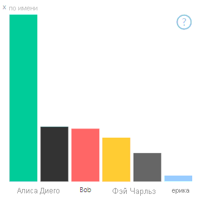
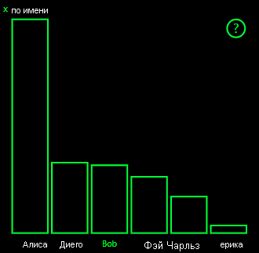
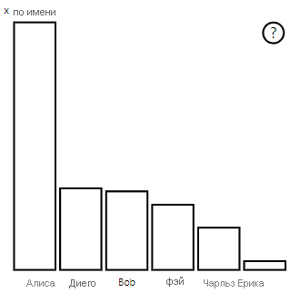

# <a name="high-contrast-mode-support-in-power-bi-visuals"></a><span data-ttu-id="4d39b-103">Поддержка режима высокой контрастности для визуальных элементов Power BI</span><span class="sxs-lookup"><span data-stu-id="4d39b-103">High-contrast mode support in Power BI visuals</span></span>

<span data-ttu-id="4d39b-104">Параметр *Высокая контрастность* Windows упрощает чтение текста и приложений за счет использования более резко выраженных цветов.</span><span class="sxs-lookup"><span data-stu-id="4d39b-104">The Windows *high contrast* setting makes text and apps easier to see by displaying more distinct colors.</span></span> <span data-ttu-id="4d39b-105">В этой статье описывается, как добавить поддержку режима высокой контрастности для визуальных элементов Power BI.</span><span class="sxs-lookup"><span data-stu-id="4d39b-105">This article discusses how to add high-contrast mode support to Power BI visuals.</span></span> <span data-ttu-id="4d39b-106">Дополнительные сведения см. в разделе [Поддержка режима высокой контрастности в Power BI](https://powerbi.microsoft.com/blog/power-bi-desktop-june-2018-feature-summary/#highContrast).</span><span class="sxs-lookup"><span data-stu-id="4d39b-106">For more information, see [high-contrast support in Power BI](https://powerbi.microsoft.com/blog/power-bi-desktop-june-2018-feature-summary/#highContrast).</span></span>

<span data-ttu-id="4d39b-107">Чтобы просмотреть реализацию поддержки высокой контрастности, перейдите в [репозиторий визуальных элементов PowerBI-visuals-sampleBarChart](https://github.com/Microsoft/PowerBI-visuals-sampleBarChart/commit/61011c82b66ca0d3321868f1d089c65101ca42e6).</span><span class="sxs-lookup"><span data-stu-id="4d39b-107">To view an implementation of high-contrast support, go to the [PowerBI-visuals-sampleBarChart visual repository](https://github.com/Microsoft/PowerBI-visuals-sampleBarChart/commit/61011c82b66ca0d3321868f1d089c65101ca42e6).</span></span>

## <a name="on-initialization"></a><span data-ttu-id="4d39b-108">При инициализации</span><span class="sxs-lookup"><span data-stu-id="4d39b-108">On initialization</span></span>

<span data-ttu-id="4d39b-109">Член colorPalette объекта `options.host` имеет несколько свойств для режима высокой контрастности.</span><span class="sxs-lookup"><span data-stu-id="4d39b-109">The colorPalette member of `options.host` has several properties for high-contrast mode.</span></span> <span data-ttu-id="4d39b-110">Используйте их, чтобы определить, активен ли режим высокой контрастности, и если активен, какие следует использовать цвета.</span><span class="sxs-lookup"><span data-stu-id="4d39b-110">Use these properties to determine whether high-contrast mode is active and, if it is, what colors to use.</span></span>

### <a name="detect-that-power-bi-is-in-high-contrast-mode"></a><span data-ttu-id="4d39b-111">Определение того, что Power BI работает в режиме высокой контрастности</span><span class="sxs-lookup"><span data-stu-id="4d39b-111">Detect that Power BI is in high-contrast mode</span></span>

<span data-ttu-id="4d39b-112">Если параметр `host.colorPalette.isHighContrast` имеет значение `true`, то активен режим высокой контрастности и визуальный элемент должен отрисовываться соответствующим образом.</span><span class="sxs-lookup"><span data-stu-id="4d39b-112">If `host.colorPalette.isHighContrast` is `true`, high-contrast mode is active and the visual should draw itself accordingly.</span></span>

### <a name="get-high-contrast-colors"></a><span data-ttu-id="4d39b-113">Получение цветов режима высокой контрастности</span><span class="sxs-lookup"><span data-stu-id="4d39b-113">Get high-contrast colors</span></span>

<span data-ttu-id="4d39b-114">В режиме высокой контрастности визуальный элемент должен ограничивать используемые цвета следующими:</span><span class="sxs-lookup"><span data-stu-id="4d39b-114">In high-contrast mode, your visual should limit itself to the following settings:</span></span>

* <span data-ttu-id="4d39b-115">**Передний план** — этот цвет используется для рисования всех линий, значков, текста, а также контуров или заливки фигур.</span><span class="sxs-lookup"><span data-stu-id="4d39b-115">**Foreground** color is used to draw any lines, icons, text, and outline or fill of shapes.</span></span>
* <span data-ttu-id="4d39b-116">**Фон** — этот цвет используется для фона, а также для заливки выделенных по контуру фигур.</span><span class="sxs-lookup"><span data-stu-id="4d39b-116">**Background** color is used for background, and as the fill color of outlined shapes.</span></span>
* <span data-ttu-id="4d39b-117">**Foreground - selected** (Передний план — выбранный) — этот цвет используется для обозначения выбранного или активного элемента.</span><span class="sxs-lookup"><span data-stu-id="4d39b-117">**Foreground - selected** color is used to indicate a selected or active element.</span></span>
* <span data-ttu-id="4d39b-118">**Гиперссылка** — этот цвет используется только для текста гиперссылки.</span><span class="sxs-lookup"><span data-stu-id="4d39b-118">**Hyperlink** color is used only for hyperlink text.</span></span>

> [!NOTE]
> <span data-ttu-id="4d39b-119">Если требуется дополнительный цвет, можно использовать цвет переднего плана с некоторой степенью непрозрачности (в собственных визуальных элементах Power BI используется непрозрачность 40 %).</span><span class="sxs-lookup"><span data-stu-id="4d39b-119">If a secondary color is needed, foreground color may be used with some opacity (Power BI native visuals use 40% opacity).</span></span> <span data-ttu-id="4d39b-120">Используйте эту функцию аккуратно, чтобы обеспечить читаемость сведений визуальных элементов.</span><span class="sxs-lookup"><span data-stu-id="4d39b-120">Use this sparingly to keep the visual details easy to see.</span></span>

<span data-ttu-id="4d39b-121">Во время инициализации вы можете сохранить следующие значения:</span><span class="sxs-lookup"><span data-stu-id="4d39b-121">During initialization, you can store the following values:</span></span>

```typescript
private isHighContrast: boolean;

private foregroundColor: string;
private backgroundColor: string;
private foregroundSelectedColor: string;
private hyperlinkColor: string;
//...

constructor(options: VisualConstructorOptions) {
    this.host = options.host;
    let colorPalette: ISandboxExtendedColorPalette = host.colorPalette;
    //...
    this.isHighContrast = colorPalette.isHighContrast;
    if (this.isHighContrast) {
        this.foregroundColor = colorPalette.foreground.value;
        this.backgroundColor = colorPalette.background.value;
        this.foregroundSelectedColor = colorPalette.foregroundSelected.value;
        this.hyperlinkColor = colorPalette.hyperlink.value;
    }
```

<span data-ttu-id="4d39b-122">Можно также сохранить объект `host` во время инициализации и получить доступ к соответствующим свойствам `colorPalette` во время обновления.</span><span class="sxs-lookup"><span data-stu-id="4d39b-122">Or you can store the `host` object during initialization and access the relevant `colorPalette` properties during update.</span></span>

## <a name="on-update"></a><span data-ttu-id="4d39b-123">При обновлении</span><span class="sxs-lookup"><span data-stu-id="4d39b-123">On update</span></span>

<span data-ttu-id="4d39b-124">Конкретные реализации поддержки высокой контрастности отличаются у разных визуальных элементов и зависят от особенностей графического дизайна.</span><span class="sxs-lookup"><span data-stu-id="4d39b-124">The specific implementations of high-contrast support vary from visual to visual and depend on the details of the graphic design.</span></span> <span data-ttu-id="4d39b-125">Как правило, для режима высокой контрастности требуется немного иной дизайн, чем для режима по умолчанию, чтобы было легче различить важные детали, представленные ограниченными цветами.</span><span class="sxs-lookup"><span data-stu-id="4d39b-125">To keep important details easy to distinguish with the limited colors, high-contrast mode ordinarily requires a design that's slightly different from the default mode.</span></span>

<span data-ttu-id="4d39b-126">В отношении собственных визуальных элементов Power BI применяются следующие рекомендации:</span><span class="sxs-lookup"><span data-stu-id="4d39b-126">Power BI native visuals follow these guidelines:</span></span>

* <span data-ttu-id="4d39b-127">Все точки данных используют один и тот же цвет (передний план).</span><span class="sxs-lookup"><span data-stu-id="4d39b-127">All data points use the same color (foreground).</span></span>
* <span data-ttu-id="4d39b-128">Текст, оси, стрелки, линии и другие аналогичные элементы используют цвет переднего плана.</span><span class="sxs-lookup"><span data-stu-id="4d39b-128">All text, axes, arrows, lines, and so on use the foreground color.</span></span>
* <span data-ttu-id="4d39b-129">Толстые фигуры рисуются в виде контуров с толстыми линиями (по меньшей мере два пикселя) и заливкой цвета фона.</span><span class="sxs-lookup"><span data-stu-id="4d39b-129">Thick shapes are drawn as outlines, with thick strokes (at least two pixels) and background color fill.</span></span>
* <span data-ttu-id="4d39b-130">Если это применимо, точки данных дифференцируются с помощью маркеров различных форм, а линии данных — с помощью различных штрихов.</span><span class="sxs-lookup"><span data-stu-id="4d39b-130">When data points are relevant, they're distinguished by different marker shapes, and data lines are distinguished by different dashing.</span></span>
* <span data-ttu-id="4d39b-131">При выделении элемента данных для всех остальных элементов устанавливается непрозрачность 40 %.</span><span class="sxs-lookup"><span data-stu-id="4d39b-131">When a data element is highlighted, all other elements change their opacity to 40%.</span></span>
* <span data-ttu-id="4d39b-132">Для срезов в активных элементах фильтра используется цвет, выбранный для переднего плана.</span><span class="sxs-lookup"><span data-stu-id="4d39b-132">For slicers, active filter elements use foreground-selected color.</span></span>

<span data-ttu-id="4d39b-133">Например, на следующем образце линейчатой диаграммы все линии рисуются толщиной в два пикселя с контуром цвета переднего плана и заливкой цвета фона.</span><span class="sxs-lookup"><span data-stu-id="4d39b-133">In the following sample bar chart, for example, all bars are drawn with two pixels of thick foreground outline and background fill.</span></span> <span data-ttu-id="4d39b-134">Сравните цвета по умолчанию с парой тем высокой контрастности:</span><span class="sxs-lookup"><span data-stu-id="4d39b-134">Compare the way it looks with default colors and with a couple of high-contrast themes:</span></span>

<span data-ttu-id="4d39b-135">

</span><span class="sxs-lookup"><span data-stu-id="4d39b-135">

</span></span>

<span data-ttu-id="4d39b-136">В следующем разделе показано изменение в функции `visualTransform`, реализованное для поддержки высокой контрастности.</span><span class="sxs-lookup"><span data-stu-id="4d39b-136">The next section shows one place in the `visualTransform` function that was changed to support high contrast.</span></span> <span data-ttu-id="4d39b-137">Она вызывается в процессе отрисовки во время обновления.</span><span class="sxs-lookup"><span data-stu-id="4d39b-137">It's called as part of rendering during the update.</span></span>

### <a name="before"></a><span data-ttu-id="4d39b-138">До</span><span class="sxs-lookup"><span data-stu-id="4d39b-138">Before</span></span>

```typescript
for (let i = 0, len = Math.max(category.values.length, dataValue.values.length); i < len; i++) {
    let defaultColor: Fill = {
        solid: {
            color: colorPalette.getColor(category.values[i] + '').value
        }
    };

    barChartDataPoints.push({
        category: category.values[i] + '',
        value: dataValue.values[i],
        color: getCategoricalObjectValue<Fill>(category, i, 'colorSelector', 'fill', defaultColor).solid.color,
        selectionId: host.createSelectionIdBuilder()
            .withCategory(category, i)
            .createSelectionId()
    });
}
```

### <a name="after"></a><span data-ttu-id="4d39b-139">После</span><span class="sxs-lookup"><span data-stu-id="4d39b-139">After</span></span>

```typescript
for (let i = 0, len = Math.max(category.values.length, dataValue.values.length); i < len; i++) {
    const color: string = getColumnColorByIndex(category, i, colorPalette);

    const selectionId: ISelectionId = host.createSelectionIdBuilder()
        .withCategory(category, i)
        .createSelectionId();

    barChartDataPoints.push({
        color,
        strokeColor,
        strokeWidth,
        selectionId,
        value: dataValue.values[i],
        category: `${category.values[i]}`,
    });
}

//...

function getColumnColorByIndex(
    category: DataViewCategoryColumn,
    index: number,
    colorPalette: ISandboxExtendedColorPalette,
): string {
    if (colorPalette.isHighContrast) {
        return colorPalette.background.value;
    }

    const defaultColor: Fill = {
        solid: {
            color: colorPalette.getColor(`${category.values[index]}`).value,
        }
    };

    return getCategoricalObjectValue<Fill>(category, index, 'colorSelector', 'fill', defaultColor).solid.color;
}
```
