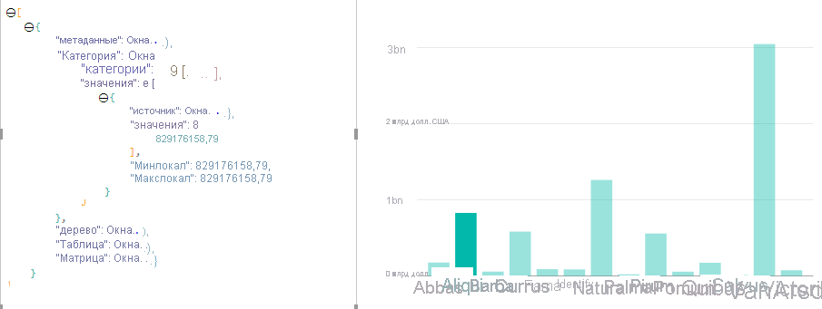
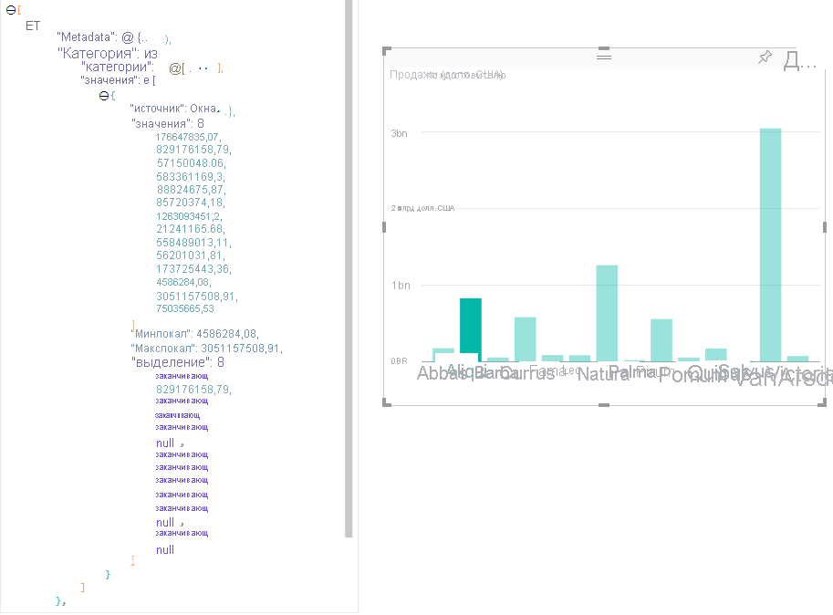

# Выделение точек данных в визуальных элементах Power BIHighlight data points in Power BI Visuals

По умолчанию при каждом выборе элемента массив `values` в объекте `dataView` будет отфильтрован до одних выбранных значений.By default whenever an element is selected the `values` array in the `dataView` object will be filtered to just the selected values. Это приведет к тому, что все остальные визуальные элементы на странице будут отображать только выбранные данные.It will cause all other visuals on the page to display just the selected data.

Если задать для свойства `supportsHighlight` в `capabilities.json` значение `true`, вы получите полный нефильтрованный массив `values` вместе с массивом `highlights`.If you set the `supportsHighlight` property in your `capabilities.json` to `true`, you'll receive the full unfiltered `values` array along with a `highlights` array. Массив `highlights` будет иметь ту же длину, что и массив values, а все невыбранные значения будут установлены в `null`.The `highlights` array will be the same length as the values array and any non-selected values will be set to `null`. Если это свойство включено, визуальный элемент отвечает за выделение соответствующих данных путем сравнения массива `values` с массивом `highlights`.With this property enabled it's the visual's responsibility to highlight the appropriate data by comparing the `values` array to the `highlights` array.

В этом примере вы заметите 1 выбранную полосу.In the example, you'll notice the 1 bar that is selected. И это единственное значение в массиве highlights.And it's the only value in the highlights array. Также важно отметить, что могут иметь место несколько выбранных значений и частичное выделение.It's also important to note there could be multiple selections and partial highlight. В этом случае соответствующее числовое значение в массивах values и highlights будет присутствовать, но различаться.There's the corresponding numeric value in the values and highlights arrays will be present but different.
