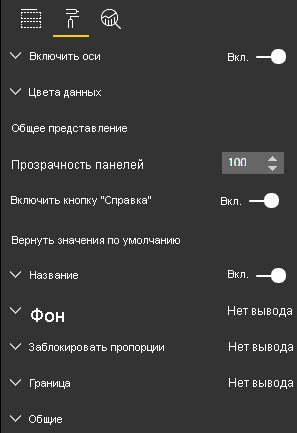

# <a name="create-a-launch-url"></a><span data-ttu-id="6535f-103">Создание URL-адреса запуска</span><span class="sxs-lookup"><span data-stu-id="6535f-103">Create a launch URL</span></span>

<span data-ttu-id="6535f-104">URL-адрес запуска позволяет открыть новую вкладку браузера (или окно), делегировав фактическую работу Power BI.</span><span class="sxs-lookup"><span data-stu-id="6535f-104">By creating a launch URL, you can open a new browser tab (or window) by delegating the actual work to Power BI.</span></span>

## <a name="sample"></a><span data-ttu-id="6535f-105">Пример</span><span class="sxs-lookup"><span data-stu-id="6535f-105">Sample</span></span>

```typescript
   this.host.launchUrl('https://powerbi.microsoft.com');
```

## <a name="usage"></a><span data-ttu-id="6535f-106">Usage</span><span class="sxs-lookup"><span data-stu-id="6535f-106">Usage</span></span>

<span data-ttu-id="6535f-107">Используйте вызов `host.launchUrl()` API, передав URL-адрес назначения в виде строкового аргумента:</span><span class="sxs-lookup"><span data-stu-id="6535f-107">Use the `host.launchUrl()` API call, passing your destination URL as a string argument:</span></span>

```typescript
this.host.launchUrl('http://some.link.net');
```

## <a name="restrictions"></a><span data-ttu-id="6535f-108">Ограничения</span><span class="sxs-lookup"><span data-stu-id="6535f-108">Restrictions</span></span>

* <span data-ttu-id="6535f-109">Используйте только абсолютные пути, а не относительные.</span><span class="sxs-lookup"><span data-stu-id="6535f-109">Use only absolute paths, not relative paths.</span></span> <span data-ttu-id="6535f-110">Например, используйте абсолютный путь, такой как `http://some.link.net/subfolder/page.html`.</span><span class="sxs-lookup"><span data-stu-id="6535f-110">For example, use an absolute path such as `http://some.link.net/subfolder/page.html`.</span></span> <span data-ttu-id="6535f-111">Относительный путь `/page.html` не будет открыт.</span><span class="sxs-lookup"><span data-stu-id="6535f-111">The relative path,`/page.html`, won't be opened.</span></span>

* <span data-ttu-id="6535f-112">На данный момент поддерживаются только протоколы *HTTP* и *HTTPS*.</span><span class="sxs-lookup"><span data-stu-id="6535f-112">Currently, only *HTTP* and *HTTPS* protocols are supported.</span></span> <span data-ttu-id="6535f-113">Не используйте протоколы *FTP*, *MAILTO* и другие.</span><span class="sxs-lookup"><span data-stu-id="6535f-113">Avoid *FTP*, *MAILTO*, and so on.</span></span>

## <a name="best-practices"></a><span data-ttu-id="6535f-114">Советы и рекомендации</span><span class="sxs-lookup"><span data-stu-id="6535f-114">Best practices</span></span>

* <span data-ttu-id="6535f-115">В большинстве случаев лучше всего открывать ссылку только в ответ на явные действия пользователя.</span><span class="sxs-lookup"><span data-stu-id="6535f-115">Usually, it's best to open a link only as a response to a user's explicit action.</span></span> <span data-ttu-id="6535f-116">Четко дайте пользователю понять, что выбор ссылки или нажатие кнопки приведут к открытию новой вкладки. Активация вызова `launchUrl()` без действия со стороны пользователя либо в качестве побочного эффекта от другого действия может привести к путанице или раздражать пользователя.</span><span class="sxs-lookup"><span data-stu-id="6535f-116">Make it easy for the user to understand that clicking the link or button will result in opening a new tab. Triggering a `launchUrl()` call without a user's action, or as a side effect of a different action can be confusing or frustrating for the user.</span></span>

* <span data-ttu-id="6535f-117">Если ссылка не является критически важной для правильной работы визуального элемента, рекомендуется предоставить автору отчета способ отключить и скрыть ее.</span><span class="sxs-lookup"><span data-stu-id="6535f-117">If the link isn't essential for the proper functioning of the visual, we recommend that you give the report's author a way to disable and hide the link.</span></span> <span data-ttu-id="6535f-118">Эта рекомендация особенно актуальна для специальных вариантов использования Power BI, таких как внедрение отчета в стороннее приложение или его публикация в Интернете.</span><span class="sxs-lookup"><span data-stu-id="6535f-118">This recommendation is especially relevant for special Power BI use cases, such as embedding a report in a third-party application or publishing it to the web.</span></span>

* <span data-ttu-id="6535f-119">Избегайте активации вызова `launchUrl()` изнутри цикла, функции `update` визуального элемента или другого часто повторяющегося кода.</span><span class="sxs-lookup"><span data-stu-id="6535f-119">Avoid triggering a `launchUrl()` call from inside a loop, the visual's `update` function, or any other frequently recurring code.</span></span>

## <a name="a-step-by-step-example"></a><span data-ttu-id="6535f-120">Пошаговый пример</span><span class="sxs-lookup"><span data-stu-id="6535f-120">A step-by-step example</span></span>

### <a name="add-a-link-launching-element"></a><span data-ttu-id="6535f-121">Добавление элемента для открытия ссылки</span><span class="sxs-lookup"><span data-stu-id="6535f-121">Add a link-launching element</span></span>

<span data-ttu-id="6535f-122">В функцию `constructor` визуального элемента были добавлены следующие строки:</span><span class="sxs-lookup"><span data-stu-id="6535f-122">The following lines were added to the visual's `constructor` function:</span></span>

```typescript
    this.helpLinkElement = this.createHelpLinkElement();
    options.element.appendChild(this.helpLinkElement);
```

<span data-ttu-id="6535f-123">Кроме того, была добавлена закрытая функция, создающая и подключающая элемент привязки:</span><span class="sxs-lookup"><span data-stu-id="6535f-123">A private function that creates and attaches the anchor element was added:</span></span>

```typescript
private createHelpLinkElement(): Element {
    let linkElement = document.createElement("a");
    linkElement.textContent = "?";
    linkElement.setAttribute("title", "Open documentation");
    linkElement.setAttribute("class", "helpLink");
    linkElement.addEventListener("click", () => {
        this.host.launchUrl("https://docs.microsoft.com/power-bi/developer/visuals/custom-visual-develop-tutorial");
    });
    return linkElement;
};
```

<span data-ttu-id="6535f-124">Наконец, запись в файле *visual.less* определяет стиль для элемента ссылки:</span><span class="sxs-lookup"><span data-stu-id="6535f-124">Finally, an entry in the *visual.less* file defines the style for the link element:</span></span>

```less
.helpLink {
    position: absolute;
    top: 0px;
    right: 12px;
    display: block;
    width: 20px;
    height: 20px;
    border: 2px solid #80B0E0;
    border-radius: 20px;
    color: #80B0E0;
    text-align: center;
    font-size: 16px;
    line-height: 20px;
    background-color: #FFFFFF;
    transition: all 900ms ease;

    &:hover {
        background-color: #DDEEFF;
        color: #5080B0;
        border-color: #5080B0;
        transition: all 250ms ease;
    }

    &.hidden {
        display: none;
    }
}
```

### <a name="add-a-toggling-mechanism"></a><span data-ttu-id="6535f-125">Добавление механизма переключения</span><span class="sxs-lookup"><span data-stu-id="6535f-125">Add a toggling mechanism</span></span>

<span data-ttu-id="6535f-126">Чтобы добавить механизм переключения, необходимо добавить статический объект, с помощью которого автор отчета сможет переключать видимость элемента ссылки.</span><span class="sxs-lookup"><span data-stu-id="6535f-126">To add a toggling mechanism, you need to add a static object so that the report's author can toggle the visibility of the link element.</span></span> <span data-ttu-id="6535f-127">(По умолчанию используется значение *hidden*.) Дополнительные сведения см. в [руководстве по работе со статическими объектами](https://microsoft.github.io/PowerBI-visuals/docs/concepts/objects-and-properties).</span><span class="sxs-lookup"><span data-stu-id="6535f-127">(The default is set to *hidden*.) For more information, see the [static object tutorial](https://microsoft.github.io/PowerBI-visuals/docs/concepts/objects-and-properties).</span></span>

<span data-ttu-id="6535f-128">Был добавлен статический объект логического типа `showHelpLink` в запись объектов в файле *capabilities.json*, как показано в следующем коде:</span><span class="sxs-lookup"><span data-stu-id="6535f-128">A `showHelpLink` Boolean static object was added to the *capabilities.json* file's objects entry, as shown in the following code:</span></span>

```typescript
"objects": {
    "generalView": {
            "displayName": "General View",
            "properties":
                "showHelpLink": {
                    "displayName": "Show Help Button",
                    "type": {
                        "bool": true
                    }
                }
            }
        }
    }
```



<span data-ttu-id="6535f-130">В функцию `update` визуального элемента были добавлены следующие строки:</span><span class="sxs-lookup"><span data-stu-id="6535f-130">And, in the visual's `update` function, the following lines were added:</span></span>

```typescript
if (settings.generalView.showHelpLink) {
    this.helpLinkElement.classList.remove("hidden");
} else {
    this.helpLinkElement.classList.add("hidden");
}
```

<span data-ttu-id="6535f-131">В файле *visual.less* определен класс *hidden*, который контролирует отображение элемента.</span><span class="sxs-lookup"><span data-stu-id="6535f-131">The *hidden* class is defined in the *visual.less* file to control the display of the element.</span></span>
