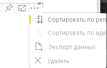

# <a name="sorting-options-for-power-bi-visuals"></a><span data-ttu-id="3fa75-103">Параметры сортировки для визуальных элементов Power BI</span><span class="sxs-lookup"><span data-stu-id="3fa75-103">Sorting options for Power BI visuals</span></span>

<span data-ttu-id="3fa75-104">В этой статье описывается, каким образом можно настроить поведение сортировки для визуальных элементов в Power BI с помощью *параметров сортировки*.</span><span class="sxs-lookup"><span data-stu-id="3fa75-104">This article describes how *sorting* options specify the sorting behavior for Power BI visuals.</span></span> 

<span data-ttu-id="3fa75-105">Функция сортировки использует один из следующих параметров.</span><span class="sxs-lookup"><span data-stu-id="3fa75-105">The sorting capability requires one of the following parameters.</span></span>

## <a name="default-sorting"></a><span data-ttu-id="3fa75-106">Сортировка по умолчанию</span><span class="sxs-lookup"><span data-stu-id="3fa75-106">Default sorting</span></span>

<span data-ttu-id="3fa75-107">Параметр `default` является простейшей формой.</span><span class="sxs-lookup"><span data-stu-id="3fa75-107">The `default` option is the simplest form.</span></span> <span data-ttu-id="3fa75-108">Он позволяет сортировать данные, представленные в разделе "DataMappings".</span><span class="sxs-lookup"><span data-stu-id="3fa75-108">It allows sorting the data presented in the 'DataMappings' section.</span></span> <span data-ttu-id="3fa75-109">Этот параметр обеспечивает сортировку сопоставлений данных пользователем и позволяет задать ее направление.</span><span class="sxs-lookup"><span data-stu-id="3fa75-109">The option enables sorting of the data mappings by the user and specifies the sorting direction.</span></span>

```json
    "sorting": {
        "default": {   }
    }
```



## <a name="implicit-sorting"></a><span data-ttu-id="3fa75-111">Неявная сортировка</span><span class="sxs-lookup"><span data-stu-id="3fa75-111">Implicit sorting</span></span>

<span data-ttu-id="3fa75-112">Неявная сортировка использует параметр массива `clauses`, который описывает сортировку для каждой роли данных.</span><span class="sxs-lookup"><span data-stu-id="3fa75-112">Implicit sorting is sorting with the array parameter `clauses`, which describes sorting for each data role.</span></span> <span data-ttu-id="3fa75-113">`implicit` означает, что пользователь визуального элемента не может изменить порядок сортировки.</span><span class="sxs-lookup"><span data-stu-id="3fa75-113">`implicit` means that the visual's user can't change the sorting order.</span></span> <span data-ttu-id="3fa75-114">Power BI не отображает параметры сортировки в меню визуального элемента.</span><span class="sxs-lookup"><span data-stu-id="3fa75-114">Power BI doesn't display sorting options in the visual's menu.</span></span> <span data-ttu-id="3fa75-115">Однако Power BI сортирует данные в соответствии с указанными параметрами.</span><span class="sxs-lookup"><span data-stu-id="3fa75-115">However, Power BI does sort data according to specified settings.</span></span>

<span data-ttu-id="3fa75-116">Параметры `clauses` могут содержать несколько объектов с двумя параметрами:</span><span class="sxs-lookup"><span data-stu-id="3fa75-116">`clauses` parameters can contain several objects with two parameters:</span></span>

- <span data-ttu-id="3fa75-117">`role` — определяет `DataMapping` для сортировки</span><span class="sxs-lookup"><span data-stu-id="3fa75-117">`role`: Determines `DataMapping` for sorting</span></span>
- <span data-ttu-id="3fa75-118">`direction` — определяет направление сортировки (1 — по возрастанию, 2 — по убыванию)</span><span class="sxs-lookup"><span data-stu-id="3fa75-118">`direction`: Determines sort direction (1 = Ascending, 2 = Descending)</span></span>

```json
    "sorting": {
        "implicit": {
            "clauses": [
                {
                    "role": "category",
                    "direction": 1
                },
                {
                    "role": "measure",
                    "direction": 2
                }
            ]
        }
    }
```

## <a name="custom-sorting"></a><span data-ttu-id="3fa75-119">Пользовательская сортировка</span><span class="sxs-lookup"><span data-stu-id="3fa75-119">Custom sorting</span></span>

<span data-ttu-id="3fa75-120">Пользовательская сортировка управляется разработчиком в коде визуального элемента.</span><span class="sxs-lookup"><span data-stu-id="3fa75-120">Custom sorting means that the sorting is managed by the developer in the visual's code.</span></span>
