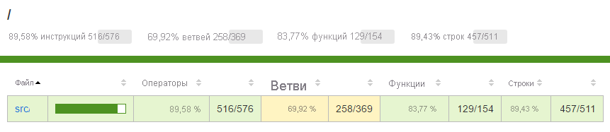
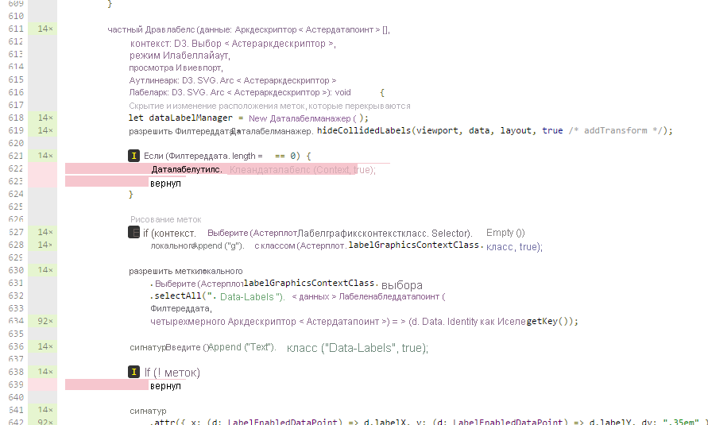

# <a name="tutorial-add-unit-tests-for-power-bi-visual-projects"></a><span data-ttu-id="a6a78-103">Руководство. Добавление модульных тестов для проектов визуальных элементов Power BI</span><span class="sxs-lookup"><span data-stu-id="a6a78-103">Tutorial: Add unit tests for Power BI visual projects</span></span>

<span data-ttu-id="a6a78-104">В этой статье рассматриваются основы написания модульных тестов для визуальных элементов Power BI, в том числе следующие сведения:</span><span class="sxs-lookup"><span data-stu-id="a6a78-104">This article describes the basics of writing unit tests for your Power BI visuals, including how to:</span></span>

* <span data-ttu-id="a6a78-105">Настройка платформы тестирования JavaScript Karma — Jasmine.</span><span class="sxs-lookup"><span data-stu-id="a6a78-105">Set up the Karma JavaScript test runner testing framework, Jasmine.</span></span>
* <span data-ttu-id="a6a78-106">Использование пакета powerbi-visuals-utils-testutils.</span><span class="sxs-lookup"><span data-stu-id="a6a78-106">Use the powerbi-visuals-utils-testutils package.</span></span>
* <span data-ttu-id="a6a78-107">Применение макетов и заполнителей для упрощения модульного тестирования визуальных элементов Power BI.</span><span class="sxs-lookup"><span data-stu-id="a6a78-107">Use mocks and fakes to help simplify unit testing of Power BI visuals.</span></span>

## <a name="prerequisites"></a><span data-ttu-id="a6a78-108">Предварительные требования</span><span class="sxs-lookup"><span data-stu-id="a6a78-108">Prerequisites</span></span>

* <span data-ttu-id="a6a78-109">Установленный проект визуальных элементов Power BI</span><span class="sxs-lookup"><span data-stu-id="a6a78-109">An installed Power BI visuals project</span></span>
* <span data-ttu-id="a6a78-110">Настроенная среда Node.js</span><span class="sxs-lookup"><span data-stu-id="a6a78-110">A configured Node.js environment</span></span>

## <a name="install-and-configure-the-karma-javascript-test-runner-and-jasmine"></a><span data-ttu-id="a6a78-111">Установленные и настроенные средство выполнения тестов JavaScript Karma и платформа Jasmine</span><span class="sxs-lookup"><span data-stu-id="a6a78-111">Install and configure the Karma JavaScript test runner and Jasmine</span></span>

<span data-ttu-id="a6a78-112">Добавьте необходимые библиотеки в файл *package.json* в разделе `devDependencies`:</span><span class="sxs-lookup"><span data-stu-id="a6a78-112">Add the required libraries to the *package.json* file in the `devDependencies` section:</span></span>

```json
"@babel/polyfill": "^7.2.5",
"@types/d3": "5.5.0",
"@types/jasmine": "2.5.37",
"@types/jasmine-jquery": "1.5.28",
"@types/jquery": "2.0.41",
"@types/karma": "3.0.0",
"@types/lodash-es": "4.17.1",
"coveralls": "3.0.2",
"istanbul-instrumenter-loader": "^3.0.1",
"jasmine": "2.5.2",
"jasmine-core": "2.5.2",
"jasmine-jquery": "2.1.1",
"jquery": "3.1.1",
"karma": "3.1.1",
"karma-chrome-launcher": "2.2.0",
"karma-coverage": "1.1.2",
"karma-coverage-istanbul-reporter": "^2.0.4",
"karma-jasmine": "2.0.1",
"karma-junit-reporter": "^1.2.0",
"karma-sourcemap-loader": "^0.3.7",
"karma-typescript": "^3.0.13",
"karma-typescript-preprocessor": "0.4.0",
"karma-webpack": "3.0.5",
"puppeteer": "1.17.0",
"style-loader": "0.23.1",
"ts-loader": "5.3.0",
"ts-node": "7.0.1",
"tslint": "^5.12.0",
"webpack": "4.26.0"
```

<span data-ttu-id="a6a78-113">Чтобы узнать больше о пакете, ознакомьтесь с его описанием.</span><span class="sxs-lookup"><span data-stu-id="a6a78-113">To learn more about the package, see the description at.</span></span>

<span data-ttu-id="a6a78-114">Сохраните файл *package.json*, а затем выполните следующую команду в расположении `package.json`:</span><span class="sxs-lookup"><span data-stu-id="a6a78-114">Save the *package.json* file and, at the `package.json` location, run the following command:</span></span>

```cmd
npm install
```

<span data-ttu-id="a6a78-115">Диспетчер пакетов устанавливает все новые пакеты, которые добавляются в файл *package.json*.</span><span class="sxs-lookup"><span data-stu-id="a6a78-115">The package manager installs all new packages that are added to *package.json*.</span></span>

<span data-ttu-id="a6a78-116">Чтобы выполнить модульные тесты, настройте средство выполнения тестов и конфигурацию `webpack`.</span><span class="sxs-lookup"><span data-stu-id="a6a78-116">To run unit tests, configure the test runner and `webpack` config.</span></span>

<span data-ttu-id="a6a78-117">В следующем коде показан пример файла *test.webpack.config.js*:</span><span class="sxs-lookup"><span data-stu-id="a6a78-117">The following code is a sample of the *test.webpack.config.js* file:</span></span>

```typescript
const path = require('path');
const webpack = require("webpack");

module.exports = {
    devtool: 'source-map',
    mode: 'development',
    optimization : {
        concatenateModules: false,
        minimize: false
    },
    module: {
        rules: [
            {
                test: /\.tsx?$/,
                use: 'ts-loader',
                exclude: /node_modules/
            },
            {
                test: /\.json$/,
                loader: 'json-loader'
            },
            {
                test: /\.tsx?$/i,
                enforce: 'post',
                include: /(src)/,
                exclude: /(node_modules|resources\/js\/vendor)/,
                loader: 'istanbul-instrumenter-loader',
                options: { esModules: true }
            },
            {
                test: /\.less$/,
                use: [
                    {
                        loader: 'style-loader'
                    },
                    {
                        loader: 'css-loader'
                    },
                    {
                        loader: 'less-loader',
                        options: {
                            paths: [path.resolve(__dirname, 'node_modules')]
                        }
                    }
                ]
            }
        ]
    },
    externals: {
        "powerbi-visuals-api": '{}'
    },
    resolve: {
        extensions: ['.tsx', '.ts', '.js', '.css']
    },
    output: {
        path: path.resolve(__dirname, ".tmp/test")
    },
    plugins: [
        new webpack.ProvidePlugin({
            'powerbi-visuals-api': null
        })
    ]
};
```

<span data-ttu-id="a6a78-118">В следующем коде показан пример файла *karma.conf.ts*:</span><span class="sxs-lookup"><span data-stu-id="a6a78-118">The following code is a sample of the *karma.conf.ts* file:</span></span>

```typescript
"use strict";

const webpackConfig = require("./test.webpack.config.js");
const tsconfig = require("./test.tsconfig.json");
const path = require("path");

const testRecursivePath = "test/visualTest.ts";
const srcOriginalRecursivePath = "src/**/*.ts";
const coverageFolder = "coverage";

process.env.CHROME_BIN = require("puppeteer").executablePath();

import { Config, ConfigOptions } from "karma";

module.exports = (config: Config) => {
    config.set(<ConfigOptions>{
        mode: "development",
        browserNoActivityTimeout: 100000,
        browsers: ["ChromeHeadless"], // or Chrome to use locally installed Chrome browser
        colors: true,
        frameworks: ["jasmine"],
        reporters: [
            "progress",
            "junit",
            "coverage-istanbul"
        ],
        junitReporter: {
            outputDir: path.join(__dirname, coverageFolder),
            outputFile: "TESTS-report.xml",
            useBrowserName: false
        },
        singleRun: true,
        plugins: [
            "karma-coverage",
            "karma-typescript",
            "karma-webpack",
            "karma-jasmine",
            "karma-sourcemap-loader",
            "karma-chrome-launcher",
            "karma-junit-reporter",
            "karma-coverage-istanbul-reporter"
        ],
        files: [
            "node_modules/jquery/dist/jquery.min.js",
            "node_modules/jasmine-jquery/lib/jasmine-jquery.js",
            {
                pattern: './capabilities.json',
                watched: false,
                served: true,
                included: false
            },
            testRecursivePath,
            {
                pattern: srcOriginalRecursivePath,
                included: false,
                served: true
            }
        ],
        preprocessors: {
            [testRecursivePath]: ["webpack", "coverage"]
        },
        typescriptPreprocessor: {
            options: tsconfig.compilerOptions
        },
        coverageIstanbulReporter: {
            reports: ["html", "lcovonly", "text-summary", "cobertura"],
            dir: path.join(__dirname, coverageFolder),
            'report-config': {
                html: {
                    subdir: 'html-report'
                }
            },
            combineBrowserReports: true,
            fixWebpackSourcePaths: true,
            verbose: false
        },
        coverageReporter: {
            dir: path.join(__dirname, coverageFolder),
            reporters: [
                // reporters not supporting the `file` property
                { type: 'html', subdir: 'html-report' },
                { type: 'lcov', subdir: 'lcov' },
                // reporters supporting the `file` property, use `subdir` to directly
                // output them in the `dir` directory
                { type: 'cobertura', subdir: '.', file: 'cobertura-coverage.xml' },
                { type: 'lcovonly', subdir: '.', file: 'report-lcovonly.txt' },
                { type: 'text-summary', subdir: '.', file: 'text-summary.txt' },
            ]
        },
        mime: {
            "text/x-typescript": ["ts", "tsx"]
        },
        webpack: webpackConfig,
        webpackMiddleware: {
            stats: "errors-only"
        }
    });
};
```

<span data-ttu-id="a6a78-119">При необходимости эту конфигурацию можно изменить.</span><span class="sxs-lookup"><span data-stu-id="a6a78-119">If necessary, you can modify this configuration.</span></span>

<span data-ttu-id="a6a78-120">Код в файле *karma.conf.js* содержит следующую переменную:</span><span class="sxs-lookup"><span data-stu-id="a6a78-120">The code in *karma.conf.js* contains the following variable:</span></span>

* <span data-ttu-id="a6a78-121">`recursivePathToTests` — местоположение кода теста.</span><span class="sxs-lookup"><span data-stu-id="a6a78-121">`recursivePathToTests`: Locates the test code</span></span>

* <span data-ttu-id="a6a78-122">`srcRecursivePath` — местоположение выходного кода JavaScript после компиляции.</span><span class="sxs-lookup"><span data-stu-id="a6a78-122">`srcRecursivePath`: Locates the output JavaScript code after compiling</span></span>

* <span data-ttu-id="a6a78-123">`srcCssRecursivePath` — местоположение выходной CSS после компиляции файла less с использованием стилей.</span><span class="sxs-lookup"><span data-stu-id="a6a78-123">`srcCssRecursivePath`: Locates the output CSS after compiling less file with styles</span></span>

* <span data-ttu-id="a6a78-124">`srcOriginalRecursivePath` — местоположение исходного кода визуального элемента.</span><span class="sxs-lookup"><span data-stu-id="a6a78-124">`srcOriginalRecursivePath`: Locates the source code of your visual</span></span>

* <span data-ttu-id="a6a78-125">`coverageFolder` — местоположение создаваемого отчета об объеме протестированного кода.</span><span class="sxs-lookup"><span data-stu-id="a6a78-125">`coverageFolder`: Determines where the coverage report is to be created</span></span>

<span data-ttu-id="a6a78-126">Файл конфигурации содержит следующие свойства:</span><span class="sxs-lookup"><span data-stu-id="a6a78-126">The configuration file includes the following properties:</span></span>

* <span data-ttu-id="a6a78-127">`singleRun: true` — тесты выполняются в системе непрерывной интеграции или однократно.</span><span class="sxs-lookup"><span data-stu-id="a6a78-127">`singleRun: true`: Tests are run on a continuous integration (CI) system, or they can be run one time.</span></span> <span data-ttu-id="a6a78-128">Для отладки тестов можно изменить значение этого параметра на *false*.</span><span class="sxs-lookup"><span data-stu-id="a6a78-128">You can change the setting to *false* for debugging your tests.</span></span> <span data-ttu-id="a6a78-129">Средство Karma поддерживает браузер в рабочем состоянии, чтобы вы могли использовать консоль для отладки.</span><span class="sxs-lookup"><span data-stu-id="a6a78-129">Karma keeps the browser running so that you can use the console for debugging.</span></span>

* <span data-ttu-id="a6a78-130">`files: [...]` — в этом массиве можно указать файлы для загрузки в браузер.</span><span class="sxs-lookup"><span data-stu-id="a6a78-130">`files: [...]`: In this array, you can specify the files to load to the browser.</span></span> <span data-ttu-id="a6a78-131">Обычно используются исходные файлы, тестовые случаи, библиотеки (Jasmine, тестовые служебные программы).</span><span class="sxs-lookup"><span data-stu-id="a6a78-131">Usually, there are source files, test cases, libraries (Jasmine, test utilities).</span></span> <span data-ttu-id="a6a78-132">При необходимости в список можно добавить дополнительные файлы.</span><span class="sxs-lookup"><span data-stu-id="a6a78-132">You can add additional files to the list, as necessary.</span></span>

* <span data-ttu-id="a6a78-133">`preprocessors` — в этом разделе вы настраиваете действия, которые выполняются перед запуском модульных тестов.</span><span class="sxs-lookup"><span data-stu-id="a6a78-133">`preprocessors`: In this section, you configure actions that run before the unit tests run.</span></span> <span data-ttu-id="a6a78-134">С их помощью осуществляется предварительная компиляция TypeScript в JavaScript и подготовка сопоставителей с исходным кодом, а также создание отчета об объеме протестированного кода.</span><span class="sxs-lookup"><span data-stu-id="a6a78-134">They precompile the typescript to JavaScript, prepare source map files, and generate code coverage report.</span></span> <span data-ttu-id="a6a78-135">При отладке тестов `coverage` можно отключить.</span><span class="sxs-lookup"><span data-stu-id="a6a78-135">You can disable `coverage` when you debug your tests.</span></span> <span data-ttu-id="a6a78-136">Объем протестированного кода создает дополнительный код для кода проверки на предмет объема протестированного кода, что усложнит отладку тестов.</span><span class="sxs-lookup"><span data-stu-id="a6a78-136">Coverage generates additional code for check code for the test coverage, which complicates debugging tests.</span></span>

<span data-ttu-id="a6a78-137">Описание всех конфигураций Karma можно найти на странице с [файлом конфигурации Karma](https://karma-runner.github.io/1.0/config/configuration-file.html).</span><span class="sxs-lookup"><span data-stu-id="a6a78-137">For descriptions of all Karma configurations, go to the [Karma Configuration File](https://karma-runner.github.io/1.0/config/configuration-file.html) page.</span></span>

<span data-ttu-id="a6a78-138">Для удобства можно добавить тестовую команду в `scripts`:</span><span class="sxs-lookup"><span data-stu-id="a6a78-138">For your convenience, you can add a test command into `scripts`:</span></span>

```json
{
    "scripts": {
        "pbiviz": "pbiviz",
        "start": "pbiviz start",
        "typings":"node node_modules/typings/dist/bin.js i",
        "lint": "tslint -r \"node_modules/tslint-microsoft-contrib\"  \"+(src|test)/**/*.ts\"",
        "pretest": "pbiviz package --resources --no-minify --no-pbiviz --no-plugin",
        "test": "karma start"
    }
    ...
}
```

<span data-ttu-id="a6a78-139">Итак, вы готовы к тому, чтобы начать писать модульные тесты.</span><span class="sxs-lookup"><span data-stu-id="a6a78-139">You're now ready to begin writing your unit tests.</span></span>

## <a name="check-the-dom-element-of-the-visual"></a><span data-ttu-id="a6a78-140">Проверка элемента DOM визуального элемента</span><span class="sxs-lookup"><span data-stu-id="a6a78-140">Check the DOM element of the visual</span></span>

<span data-ttu-id="a6a78-141">Для тестирования визуального элемента сначала нужно создать его экземпляр.</span><span class="sxs-lookup"><span data-stu-id="a6a78-141">To test the visual, first create an instance of visual.</span></span>

### <a name="create-a-visual-instance-builder"></a><span data-ttu-id="a6a78-142">Создание конструктора экземпляров визуальных элементов</span><span class="sxs-lookup"><span data-stu-id="a6a78-142">Create a visual instance builder</span></span>

<span data-ttu-id="a6a78-143">Добавьте файл *visualBuilder.ts* в папку *test* с помощью следующего кода:</span><span class="sxs-lookup"><span data-stu-id="a6a78-143">Add a *visualBuilder.ts* file to the *test* folder by using the following code:</span></span>

```typescript
import {
    VisualBuilderBase
} from "powerbi-visuals-utils-testutils";

import {
    BarChart as VisualClass
} from "../src/visual";

import  powerbi from "powerbi-visuals-api";
import VisualConstructorOptions = powerbi.extensibility.visual.VisualConstructorOptions;

export class BarChartBuilder extends VisualBuilderBase<VisualClass> {
    constructor(width: number, height: number) {
        super(width, height);
    }

    protected build(options: VisualConstructorOptions) {
        return new VisualClass(options);
    }

    public get mainElement() {
        return this.element.children("svg.barChart");
    }
}
```

<span data-ttu-id="a6a78-144">Имеется метод `build` для создания экземпляра визуального элемента.</span><span class="sxs-lookup"><span data-stu-id="a6a78-144">There's `build` method for creating an instance of your visual.</span></span> <span data-ttu-id="a6a78-145">`mainElement` является методом Get, который возвращает экземпляр "корневого" элемента объектной модели документа (DOM) в визуальном элементе.</span><span class="sxs-lookup"><span data-stu-id="a6a78-145">`mainElement` is a get method, which returns an instance of "root" document object model (DOM) element in your visual.</span></span> <span data-ttu-id="a6a78-146">Этот метод получения необязателен, но он упрощает написание модульного теста.</span><span class="sxs-lookup"><span data-stu-id="a6a78-146">The getter is optional, but it makes writing the unit test easier.</span></span>

<span data-ttu-id="a6a78-147">Итак, вы создали экземпляр своего визуального элемента.</span><span class="sxs-lookup"><span data-stu-id="a6a78-147">You now have a build of an instance of your visual.</span></span> <span data-ttu-id="a6a78-148">Давайте напишем тестовый случай.</span><span class="sxs-lookup"><span data-stu-id="a6a78-148">Let's write the test case.</span></span> <span data-ttu-id="a6a78-149">Этот тестовый случай проверяет элементы SVG, которые создаются при отображении вашего визуального элемента.</span><span class="sxs-lookup"><span data-stu-id="a6a78-149">The test case checks the SVG elements that are created when your visual is displayed.</span></span>

### <a name="create-a-typescript-file-to-write-test-cases"></a><span data-ttu-id="a6a78-150">Создание файла TypeScript для записи тестовых случаев</span><span class="sxs-lookup"><span data-stu-id="a6a78-150">Create a typescript file to write test cases</span></span>

<span data-ttu-id="a6a78-151">Добавьте файл *visualTest.ts* для тестовых случаев с помощью следующего кода:</span><span class="sxs-lookup"><span data-stu-id="a6a78-151">Add a *visualTest.ts* file for the test cases by using the following code:</span></span>

```typescript
import powerbi from "powerbi-visuals-api";

import { BarChartBuilder } from "./VisualBuilder";

import {
    BarChart as VisualClass
} from "../src/visual";

import VisualBuilder = powerbi.extensibility.visual.test.BarChartBuilder;

describe("BarChart", () => {
    let visualBuilder: VisualBuilder;
    let dataView: DataView;

    beforeEach(() => {
        visualBuilder = new VisualBuilder(500, 500);
    });

    it("root DOM element is created", () => {
        expect(visualBuilder.mainElement).toBeInDOM();
    });
});
```

<span data-ttu-id="a6a78-152">Вызывается несколько методов:</span><span class="sxs-lookup"><span data-stu-id="a6a78-152">Several methods are called:</span></span>

* <span data-ttu-id="a6a78-153">[`describe`](https://jasmine.github.io/api/2.6/global.html#describe) — описывает тестовый случай.</span><span class="sxs-lookup"><span data-stu-id="a6a78-153">[`describe`](https://jasmine.github.io/api/2.6/global.html#describe): Describes a test case.</span></span> <span data-ttu-id="a6a78-154">В контексте платформы Jasmine он часто описывает набор или группу спецификаций.</span><span class="sxs-lookup"><span data-stu-id="a6a78-154">In the context of the Jasmine framework, it often describes a suite or group of specs.</span></span>

* <span data-ttu-id="a6a78-155">`beforeEach` — вызывается перед каждым вызовом метода `it`, который определяется в методе [`describe`](https://jasmine.github.io/api/2.6/global.html#beforeEach).</span><span class="sxs-lookup"><span data-stu-id="a6a78-155">`beforeEach`: Is called before each call of the `it` method, which is defined in the [`describe`](https://jasmine.github.io/api/2.6/global.html#beforeEach) method.</span></span>

* <span data-ttu-id="a6a78-156">[`it`](https://jasmine.github.io/api/2.6/global.html#it) — определяет отдельную спецификацию. метод `it` должен содержать одно или несколько ожиданий `expectations`.</span><span class="sxs-lookup"><span data-stu-id="a6a78-156">[`it`](https://jasmine.github.io/api/2.6/global.html#it): Defines a single spec. The `it` method should contain one or more `expectations`.</span></span>

* <span data-ttu-id="a6a78-157">[`expect`](https://jasmine.github.io/api/2.6/global.html#expect) — создает ожидание для спецификации. Спецификация будет успешной, если все ожидания выполняются без каких-либо ошибок.</span><span class="sxs-lookup"><span data-stu-id="a6a78-157">[`expect`](https://jasmine.github.io/api/2.6/global.html#expect): Creates an expectation for a spec. A spec succeeds if all expectations pass without any failures.</span></span>

* <span data-ttu-id="a6a78-158">`toBeInDOM` — это один из методов *сопоставителей*.</span><span class="sxs-lookup"><span data-stu-id="a6a78-158">`toBeInDOM`: One of the *matchers* methods.</span></span> <span data-ttu-id="a6a78-159">Дополнительные сведения о сопоставителях см. в статье [Пространство имен Jasmine Namespace: сопоставители](https://jasmine.github.io/api/2.6/matchers.html).</span><span class="sxs-lookup"><span data-stu-id="a6a78-159">For more information about matchers, see [Jasmine Namespace: matchers](https://jasmine.github.io/api/2.6/matchers.html).</span></span>

<span data-ttu-id="a6a78-160">Дополнительные сведения о платформе Jasmine см. на странице с [документацией по платформе Jasmine](https://jasmine.github.io/).</span><span class="sxs-lookup"><span data-stu-id="a6a78-160">For more information about Jasmine, see the [Jasmine framework documentation](https://jasmine.github.io/) page.</span></span>

### <a name="launch-unit-tests"></a><span data-ttu-id="a6a78-161">Запуск модульных тестов</span><span class="sxs-lookup"><span data-stu-id="a6a78-161">Launch unit tests</span></span>

<span data-ttu-id="a6a78-162">Этот тест проверяет, создан ли корневой элемент SVG визуальных элементов.</span><span class="sxs-lookup"><span data-stu-id="a6a78-162">This test checks that root SVG element of the visuals is created.</span></span> <span data-ttu-id="a6a78-163">Чтобы запустить модульный тест, введите следующую команду в программе командной строки:</span><span class="sxs-lookup"><span data-stu-id="a6a78-163">To run the unit test, enter the following command in the command-line tool:</span></span>

```cmd
npm run test
```

<span data-ttu-id="a6a78-164">`karma.js` запускает тестовый случай в браузере Chrome.</span><span class="sxs-lookup"><span data-stu-id="a6a78-164">`karma.js` runs the test case in the Chrome browser.</span></span>


> [!NOTE]
> <span data-ttu-id="a6a78-166">Вам потребуется локальная установка браузера Google Chrome.</span><span class="sxs-lookup"><span data-stu-id="a6a78-166">You must install Google Chrome locally.</span></span>

<span data-ttu-id="a6a78-167">В окне командной строки вы получите следующие выходные данные:</span><span class="sxs-lookup"><span data-stu-id="a6a78-167">In the command-line window, you'll get following output:</span></span>

```cmd
> karma start

23 05 2017 12:24:26.842:WARN [watcher]: Pattern "E:/WORKSPACE/PowerBI/PowerBI-visuals-sampleBarChart/data/*.csv" does not match any file.
23 05 2017 12:24:30.836:WARN [karma]: No captured browser, open http://localhost:9876/
23 05 2017 12:24:30.849:INFO [karma]: Karma v1.3.0 server started at http://localhost:9876/
23 05 2017 12:24:30.850:INFO [launcher]: Launching browser Chrome with unlimited concurrency
23 05 2017 12:24:31.059:INFO [launcher]: Starting browser Chrome
23 05 2017 12:24:33.160:INFO [Chrome 58.0.3029 (Windows 10 0.0.0)]: Connected on socket /#2meR6hjXFmsE_fjiAAAA with id 5875251
Chrome 58.0.3029 (Windows 10 0.0.0): Executed 1 of 1 SUCCESS (0.194 secs / 0.011 secs)

=============================== Coverage summary ===============================
Statements   : 27.43% ( 65/237 )
Branches     : 19.84% ( 25/126 )
Functions    : 43.86% ( 25/57 )
Lines        : 20.85% ( 44/211 )
================================================================================
```

### <a name="how-to-add-static-data-for-unit-tests"></a><span data-ttu-id="a6a78-168">Добавление статических данных для модульных тестов</span><span class="sxs-lookup"><span data-stu-id="a6a78-168">How to add static data for unit tests</span></span>

<span data-ttu-id="a6a78-169">Создайте файл *visualData.ts* в папке *test* с помощью следующего кода:</span><span class="sxs-lookup"><span data-stu-id="a6a78-169">Create the *visualData.ts* file in the *test* folder by using the following code:</span></span>

```typescript
import powerbi from "powerbi-visuals-api";
import DataView = powerbi.DataView;

import {
    testDataViewBuilder,
    getRandomNumbers
} from "powerbi-visuals-utils-testutils";

export class SampleBarChartDataBuilder extends TestDataViewBuilder {
    public static CategoryColumn: string = "category";
    public static MeasureColumn: string = "measure";

    public constructor() {
        super();
        ...
    }

    public getDataView(columnNames?: string[]): DataView {
        let dateView: any = this.createCategoricalDataViewBuilder([
            ...
        ],
        [
            ...
        ], columnNames).build();

        // there's client side computed maxValue
        let maxLocal = 0;
        this.valuesMeasure.forEach((item) => {
                if (item > maxLocal) {
                    maxLocal = item;
                }
        });
        (<any>dataView).categorical.values[0].maxLocal = maxLocal;
    }
}
```

<span data-ttu-id="a6a78-170">Класс `SampleBarChartDataBuilder` расширяет `TestDataViewBuilder` и реализует абстрактный метод `getDataView`.</span><span class="sxs-lookup"><span data-stu-id="a6a78-170">The `SampleBarChartDataBuilder` class extends `TestDataViewBuilder` and implements the abstract method `getDataView`.</span></span>

<span data-ttu-id="a6a78-171">При помещении данных в контейнеры полей данных Power BI создает категориальный объект `dataview` на основе данных.</span><span class="sxs-lookup"><span data-stu-id="a6a78-171">When you put data into data-field buckets, Power BI produces a categorical `dataview` object that's based on your data.</span></span>


<span data-ttu-id="a6a78-173">В модульных тестах у вас нет основных функций Power BI для воспроизведения данных.</span><span class="sxs-lookup"><span data-stu-id="a6a78-173">In unit tests, you don't have Power BI core functions to reproduce the data.</span></span> <span data-ttu-id="a6a78-174">Однако вам нужно сопоставить статические данные с категориальным `dataview`.</span><span class="sxs-lookup"><span data-stu-id="a6a78-174">But you need to map your static data to the categorical `dataview`.</span></span> <span data-ttu-id="a6a78-175">Класс `TestDataViewBuilder` можно использовать для его сопоставления.</span><span class="sxs-lookup"><span data-stu-id="a6a78-175">The `TestDataViewBuilder` class can help you map it.</span></span>

<span data-ttu-id="a6a78-176">Дополнительные сведения о сопоставлении представлений данных см. в статье [Сопоставления представлений данных](https://github.com/Microsoft/PowerBI-visuals/blob/master/Capabilities/DataViewMappings.md).</span><span class="sxs-lookup"><span data-stu-id="a6a78-176">For more information about Data View mapping, see [DataViewMappings](https://github.com/Microsoft/PowerBI-visuals/blob/master/Capabilities/DataViewMappings.md).</span></span>

<span data-ttu-id="a6a78-177">В методе `getDataView` вы вызываете метод `createCategoricalDataViewBuilder` с данными.</span><span class="sxs-lookup"><span data-stu-id="a6a78-177">In the `getDataView` method, you call the `createCategoricalDataViewBuilder` method with your data.</span></span>

<span data-ttu-id="a6a78-178">В файле [capabilities.json](https://github.com/Microsoft/PowerBI-visuals-sampleBarChart/blob/master/capabilities.json#L2) визуального элемента `sampleBarChart` присутствуют объекты dataRoles и dataViewMapping:</span><span class="sxs-lookup"><span data-stu-id="a6a78-178">In `sampleBarChart` visual [capabilities.json](https://github.com/Microsoft/PowerBI-visuals-sampleBarChart/blob/master/capabilities.json#L2) file, we have dataRoles and dataViewMapping objects:</span></span>

```json
"dataRoles": [
    {
        "displayName": "Category Data",
        "name": "category",
        "kind": "Grouping"
    },
    {
        "displayName": "Measure Data",
        "name": "measure",
        "kind": "Measure"
    }
],
"dataViewMappings": [
    {
        "conditions": [
            {
                "category": {
                    "max": 1
                },
                "measure": {
                    "max": 1
                }
            }
        ],
        "categorical": {
            "categories": {
                "for": {
                    "in": "category"
                }
            },
            "values": {
                "select": [
                    {
                        "bind": {
                            "to": "measure"
                        }
                    }
                ]
            }
        }
    }
],
```

<span data-ttu-id="a6a78-179">Чтобы создать такое же сопоставление, нужно присвоить методу `createCategoricalDataViewBuilder` следующие параметры:</span><span class="sxs-lookup"><span data-stu-id="a6a78-179">To generate the same mapping, you must set the following params to `createCategoricalDataViewBuilder` method:</span></span>

```typescript
([
    {
        source: {
            displayName: "Category",
            queryName: SampleBarChartData.ColumnCategory,
            type: ValueType.fromDescriptor({ text: true }),
            roles: {
                Category: true
            },
        },
        values: this.valuesCategory
    }
],
[
    {
        source: {
            displayName: "Measure",
            isMeasure: true,
            queryName: SampleBarChartData.MeasureColumn,
            type: ValueType.fromDescriptor({ numeric: true }),
            roles: {
                Measure: true
            },
        },
        values: this.valuesMeasure
    },
], columnNames)
```

<span data-ttu-id="a6a78-180">Здесь `this.valuesCategory` — это массив категорий:</span><span class="sxs-lookup"><span data-stu-id="a6a78-180">Where `this.valuesCategory` is an array of categories:</span></span>

```ts
public valuesCategory: string[] = ["Monday", "Tuesday", "Wednesday", "Thursday", "Friday", "Saturday", "Sunday"];
```

<span data-ttu-id="a6a78-181">`this.valuesMeasure` — массив мер для каждой категории:</span><span class="sxs-lookup"><span data-stu-id="a6a78-181">And `this.valuesMeasure` is an array of measures for each category:</span></span>

```ts
public valuesMeasure: number[] = [742731.43, 162066.43, 283085.78, 300263.49, 376074.57, 814724.34, 570921.34];
```

<span data-ttu-id="a6a78-182">Теперь можно использовать класс `SampleBarChartDataBuilder` в модульном тесте.</span><span class="sxs-lookup"><span data-stu-id="a6a78-182">Now, you can use the `SampleBarChartDataBuilder` class in your unit test.</span></span>

<span data-ttu-id="a6a78-183">Класс `ValueType` определен в пакете powerbi-visuals-utils-testutils.</span><span class="sxs-lookup"><span data-stu-id="a6a78-183">The `ValueType` class is defined in the powerbi-visuals-utils-testutils package.</span></span> <span data-ttu-id="a6a78-184">Для метода `createCategoricalDataViewBuilder` требуется библиотека `lodash`.</span><span class="sxs-lookup"><span data-stu-id="a6a78-184">And the `createCategoricalDataViewBuilder` method requires the `lodash` library.</span></span>

<span data-ttu-id="a6a78-185">Добавьте эти пакеты в зависимости.</span><span class="sxs-lookup"><span data-stu-id="a6a78-185">Add these packages to the dependencies.</span></span>

<span data-ttu-id="a6a78-186">В `package.json` в разделе `devDependencies`:</span><span class="sxs-lookup"><span data-stu-id="a6a78-186">In `package.json` at `devDependencies` section</span></span>

```json
"lodash-es": "4.17.1",
"powerbi-visuals-utils-testutils": "2.2.0"
```

<span data-ttu-id="a6a78-187">Вызовите</span><span class="sxs-lookup"><span data-stu-id="a6a78-187">Call</span></span>

```cmd
npm install
```

<span data-ttu-id="a6a78-188">для установки библиотеки `lodash-es`.</span><span class="sxs-lookup"><span data-stu-id="a6a78-188">to install `lodash-es` library.</span></span>

<span data-ttu-id="a6a78-189">Теперь можно запустить модульный тест еще раз.</span><span class="sxs-lookup"><span data-stu-id="a6a78-189">Now, you can run the unit test again.</span></span> <span data-ttu-id="a6a78-190">Вы должны получить следующие выходные данные:</span><span class="sxs-lookup"><span data-stu-id="a6a78-190">You must get the following output:</span></span>

```cmd
> karma start

23 05 2017 16:19:54.318:WARN [watcher]: Pattern "E:/WORKSPACE/PowerBI/PowerBI-visuals-sampleBarChart/data/*.csv" does not match any file.
23 05 2017 16:19:58.333:WARN [karma]: No captured browser, open http://localhost:9876/
23 05 2017 16:19:58.346:INFO [karma]: Karma v1.3.0 server started at http://localhost:9876/
23 05 2017 16:19:58.346:INFO [launcher]: Launching browser Chrome with unlimited concurrency
23 05 2017 16:19:58.394:INFO [launcher]: Starting browser Chrome
23 05 2017 16:19:59.873:INFO [Chrome 58.0.3029 (Windows 10 0.0.0)]: Connected on socket /#NcNTAGH9hWfGMCuEAAAA with id 3551106
Chrome 58.0.3029 (Windows 10 0.0.0): Executed 1 of 1 SUCCESS (1.266 secs / 1.052 secs)

=============================== Coverage summary ===============================
Statements   : 56.72% ( 135/238 )
Branches     : 32.54% ( 41/126 )
Functions    : 66.67% ( 38/57 )
Lines        : 52.83% ( 112/212 )
================================================================================
```

<span data-ttu-id="a6a78-191">Визуальный элемент откроется в браузере Chrome, как показано ниже:</span><span class="sxs-lookup"><span data-stu-id="a6a78-191">Your visual opens in the Chrome browser, as shown:</span></span>


<span data-ttu-id="a6a78-193">В сводке показано, что объем протестированного кода увеличился.</span><span class="sxs-lookup"><span data-stu-id="a6a78-193">The summary shows that coverage has increased.</span></span> <span data-ttu-id="a6a78-194">Откройте `coverage\index.html`, чтобы узнать больше о текущем объеме протестированного кода.</span><span class="sxs-lookup"><span data-stu-id="a6a78-194">To learn more about current code coverage, open `coverage\index.html`.</span></span>



<span data-ttu-id="a6a78-196">Также можно просмотреть область папки `src`:</span><span class="sxs-lookup"><span data-stu-id="a6a78-196">Or look at the scope of the `src` folder:</span></span>


<span data-ttu-id="a6a78-198">В области действия файла можно просмотреть исходный код.</span><span class="sxs-lookup"><span data-stu-id="a6a78-198">In the scope of file, you can view the source code.</span></span> <span data-ttu-id="a6a78-199">Служебные программы `Coverage` будут выделять красным цветом те строки кода, которые не были выполнены во время модульного тестирования.</span><span class="sxs-lookup"><span data-stu-id="a6a78-199">The `Coverage` utilities would highlight the row in red if certain code isn't executed during the unit tests.</span></span>



> [!IMPORTANT]
> <span data-ttu-id="a6a78-201">Объем протестированного кода не означает, что обеспечивается хороший охват функциональных возможностей визуальных элементов.</span><span class="sxs-lookup"><span data-stu-id="a6a78-201">Code coverage doesn't mean that you have good functionality coverage of the visual.</span></span> <span data-ttu-id="a6a78-202">Один простой модульный тест обеспечил более 96 % протестированного кода в `src\visual.ts`.</span><span class="sxs-lookup"><span data-stu-id="a6a78-202">One simple unit test provides over 96 percent coverage in `src\visual.ts`.</span></span>

## <a name="next-steps"></a><span data-ttu-id="a6a78-203">Дальнейшие действия</span><span class="sxs-lookup"><span data-stu-id="a6a78-203">Next steps</span></span>

<span data-ttu-id="a6a78-204">Когда ваш визуальный элемент готов, вы можете отправить его для публикации.</span><span class="sxs-lookup"><span data-stu-id="a6a78-204">When your visual is ready, you can submit it for publication.</span></span> <span data-ttu-id="a6a78-205">Дополнительные сведения см. в статье о [публикации визуальных элементов Power BI в AppSource](../office-store.md).</span><span class="sxs-lookup"><span data-stu-id="a6a78-205">For more information, see [Publish Power BI visuals to AppSource](../office-store.md).</span></span>
